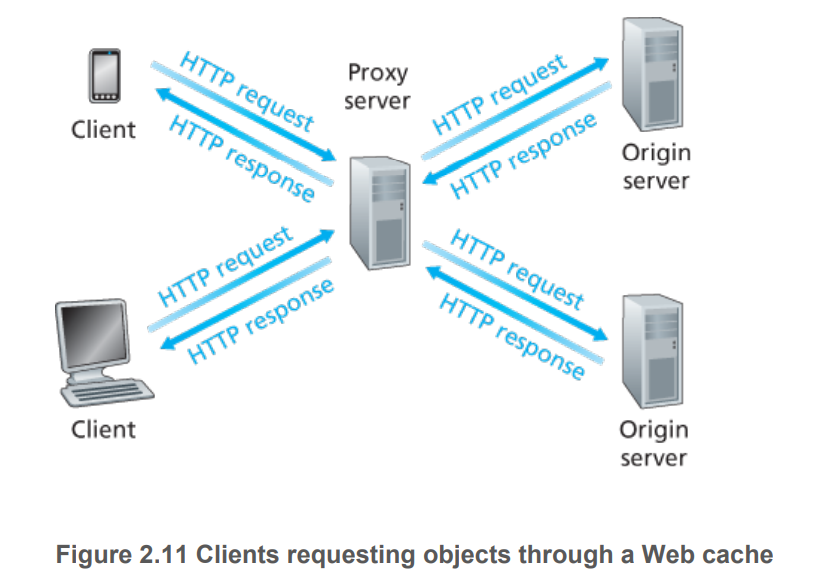
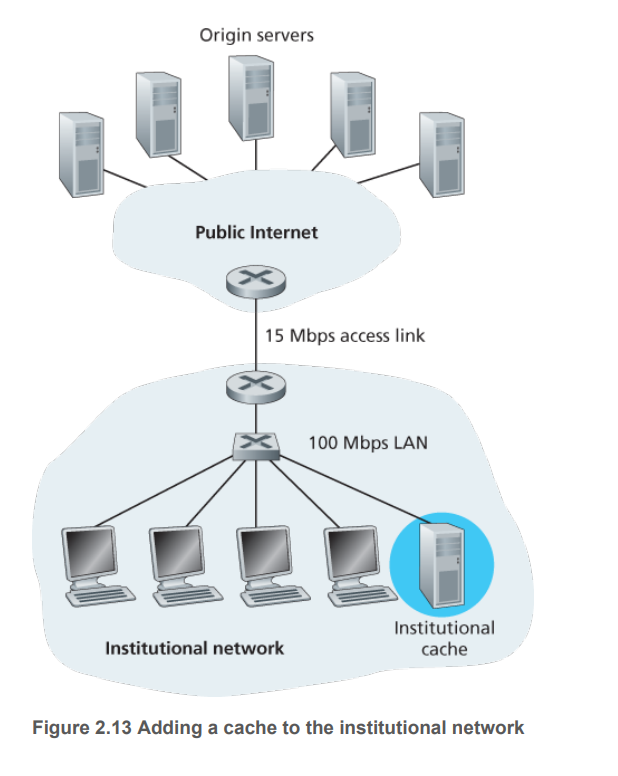
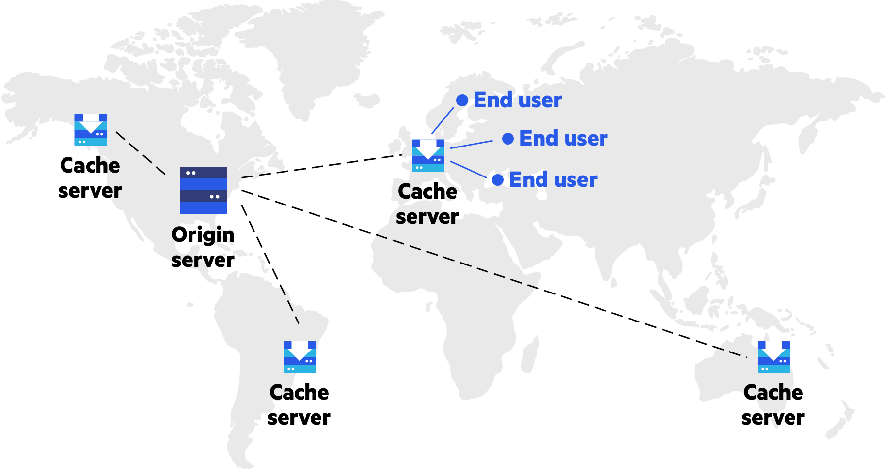

# Web Cache

https://zhuanlan.zhihu.com/p/44789005

https://developer.mozilla.org/en-US/docs/Web/HTTP/Caching

缓存的种类有很多,其大致可归为两类：私有与共享缓存。共享缓存存储的响应能够被多个用户使用。私有缓存只能用于单独用户。**本文将主要介绍浏览器与代理缓存，除此之外还有网关缓存、CDN、反向代理缓存和负载均衡器等部署在服务器上的缓存方式**，为站点和 web 应用提供更好的稳定性、性能和扩展性。

## 浏览器缓存 另见本笔记的 "../浏览器存储信息" 文件夹

## 代理缓存
In computer networking, a proxy server is a server application or appliance that acts as an intermediary for requests from clients seeking resources from servers that provide those resources.

## 网关缓存

## CDN
https://www.imperva.com/learn/performance/cdn-caching/#:~:text=Caching%20is%20at%20the%20heart,optimized%20for%20accelerated%20content%20distribution.

Caching is at the heart of content delivery network (CDN) services. Similar to how browser caching stores files on a hard drive, where they can be more rapidly accessed, a CDN moves your website content to powerful proxy servers optimized for accelerated content distribution.

Proxy cache servers are the building blocks of a CDN’s network data centers, which are strategically situated around the globe. These points of presence (PoP) are selected based on traffic patterns of individual regions.

## 反向代理缓存
A reverse proxy (or surrogate) is a proxy server that appears to clients to be an ordinary server. Reverse proxies forward requests to one or more ordinary servers that handle the request.

- Encryption / SSL acceleration: when secure web sites are created, the Secure Sockets Layer (SSL) encryption is often not done by the web server itself, but by a reverse proxy that is equipped with SSL acceleration hardware. Furthermore, a host can provide a single "SSL proxy" to provide SSL encryption for an arbitrary number of hosts; removing the need for a separate SSL Server Certificate for each host, with the downside that all hosts behind the SSL proxy have to share a common DNS name or IP address for SSL connections. This problem can partly be overcome by using the SubjectAltName feature of X.509 certificates.
- Load balancing: the reverse proxy can distribute the load to several web servers, each web server serving its own application area. In such a case, the reverse proxy may need to rewrite the URLs in each web page (translation from externally known URLs to the internal locations).
- Serve/cache static content: A reverse proxy can offload the web servers by caching static content like pictures and other static graphical content.
