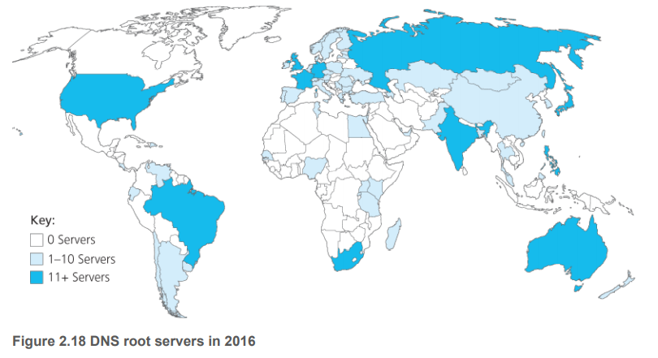
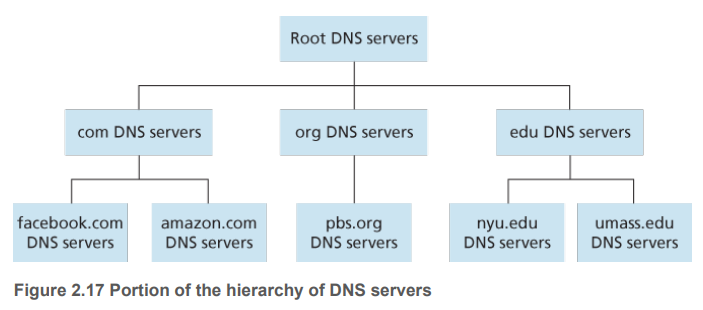
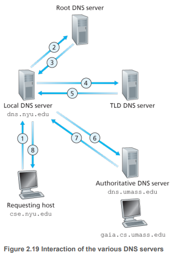
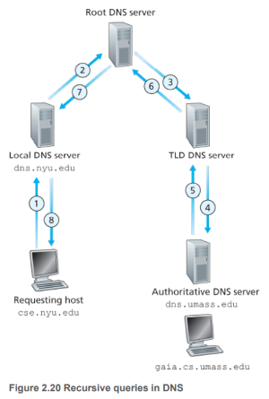
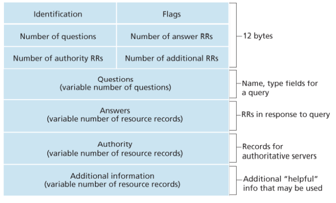

# DNS -- Domain name System

存在意义：为了让人们记住网址，而不是记住IP地址。

DNS提供了一种解析域名的服务。

1. The DNS is a distributed database implemented in a hierarchy of DNS servers, and 
2. The DNS is an application-layer protocol that allows hosts to query the distributed database. 
3. The DNS protocol **runs over UDP and uses port 53.**

典型问题，浏览器输入网址敲击回车会发生什么？
1. The user machine runs the client side of the DNS application.
2. The browser extracts the hostname, `www.someschool.edu`, from the URL and passes the hostname to the client side of the DNS application.
3. The DNS client sends a **query** containing the hostname to a DNS server.
4. The DNS client eventually receives a reply, **which includes the IP address for the hostname**.
5. Once the browser receives the IP address from DNS, it can initiate **a TCP connection** to the HTTP server process located at port 80 at that IP address.

## A Distributed, Hierarchical Database

没有任何一台DNS服务器拥有所有的映射（从host name到IP address的映射）。




DNS服务器：
1. **Root DNS servers.** 
全球有400多个，被13个组织分管。看Figure 2.18。

2. **Top-level domain (TLD) servers.** 
例如，com, org, net, edu, gov, 还有所有过架的顶级域名服务器，例如uk, fr, ca, and jp. Verisign Global Registry Services和Educause这两家公司，分别维护着com和edu这两个顶级域名。

3. **Authoritative DNS servers.**
Every organization with publicly accessible hosts (such as Web servers and mail servers) on the Internet must provide publicly accessible DNS records that map the names
of those hosts to IP addresses. 

Most universities and large companies implement and maintain
their own primary and secondary (backup) authoritative DNS server.

4. 还有一类是**local DNS server**. 这个是ISP负责管理的。当一个主机连接到一个ISP，ISP提供给主机一个或者多个local DNS servers的IP地址，一般通过DHCP（网络层会讨论）。local DNS server一般距离host特别近，甚至直接放在企业的局域网里面。



## DNS Query
DNS查询有两种方法，一种是递归查询，一种是迭代查询。Figure 2.19就是实际的网络中，从host到local DNS server的查询是递归查询，其它查询是迭代查询。



### 递归查询 Recursive Query


### 迭代查询 Iterative Query
`www.amazon.com`
1. host直接找上root server，root server返回com域名服务器的地址。
2. host找上com域名服务器，com域名服务器返回amazon.com域名服务器的地址。
3. host找上amazon.com域名服务器，amazon.com域名服务器返回www.amazon.com的IP地址。

### 实际上的DNS查询
假设host `cse.nyu.edu`想要查询`gaia.cs.umass.edu`的IP地址，

NYU的local DNS server for `cse.nyu.edu`叫做`dns.nyu.edu`，

authoritative DNS server for `gaia.csumass.edu`叫做`dns.umass.edu`.


## DNS Caching
 In a query chain, when a
DNS server receives a DNS reply (containing, for example, a mapping from a hostname to an IP
address), it can cache the mapping in its local memory.


## DNS Records
The DNS servers that together implement the DNS distributed database store resource records (RRs),
including RRs that provide hostname-to-IP address mappings. Each DNS reply message carries one or
more resource records.

A resource record is a four-tuple that contains the following fields
```
(Name, Value, Type, TTL)
```


- **TTL** is the time to live of the resource record; it determines when a resource should be removed from a
cache.
- **Type**
    - Type A: Name is a hostname and Value is the IP address for the hostname. 
    - Type NS: Name is a domain (such as foo.com ) and Value is the hostname of an authoritative DNS server that knows how to obtain the IP addresses for hosts in the domain.  Value是一个授权DNS服务器，这个服务器知道去哪里找foo.com的IP.
    - Type CNAME
    - Type MX


If a DNS server is authoritative for a particular hostname, then the DNS server will contain a Type A
record for the hostname. (Even if the DNS server is not authoritative, it may contain a Type A record in
its cache.) If a server is not authoritative for a hostname, then the server will contain a Type NS record
for the domain that includes the hostname; it will also contain a Type A record that provides the IP
address of the DNS server in the Value field of the NS record. 


## DNS Message


