# Transmission Control Protococol (TCP)

## Reference
https://github.com/wolverinn/Waking-Up

## Introduction
TCP: 一种面向连接的、可靠的、基于字节流的传输层通信协议。

1. **面向连接**。所谓的连接，指的是客户端和服务器的连接，在双方互相通信之前，TCP 需要三次握手建立连接，而 UDP 没有相应建立连接的过程。
2. **可靠性**。TCP 花了非常多的功夫保证连接的可靠，这个可靠性体现在哪些方面呢？一个是**有状态**，另一个是**可控制**。
   1. TCP 会精准记录哪些数据发送了，哪些数据被对方接收了，哪些没有被接收到，而且保证数据包按序到达，不允许半点差错。这是**有状态**。
   2. 当意识到丢包了或者网络环境不佳，TCP会根据具体情况调整自己的行为，控制自己的发送速度或者重发。这是**可控制(流量控制，拥塞控制)**。
   3. 相应的，UDP 就是无状态, 不可控的。
3. **面向字节流**。UDP 的数据传输是基于数据报的，这是因为仅仅只是继承了 IP 层的特性，而 TCP 为了维护状态，将一个个 IP 包变成了字节流，ACK确认的时候是以字节为单位确认的。

音频、视频、在线游戏流量通常使用UDP传输。 实时视频流和音频流应用程序旨在处理偶尔丢失、错误的数据包，因此只会发生质量轻微下降，而避免了重传数据包带来的高延迟。 UDP对应的：

- 域名系统（DNS），其中查询阶段必须快速，并且只包含单个请求，后跟单个回复数据包

## TCP 报文格式
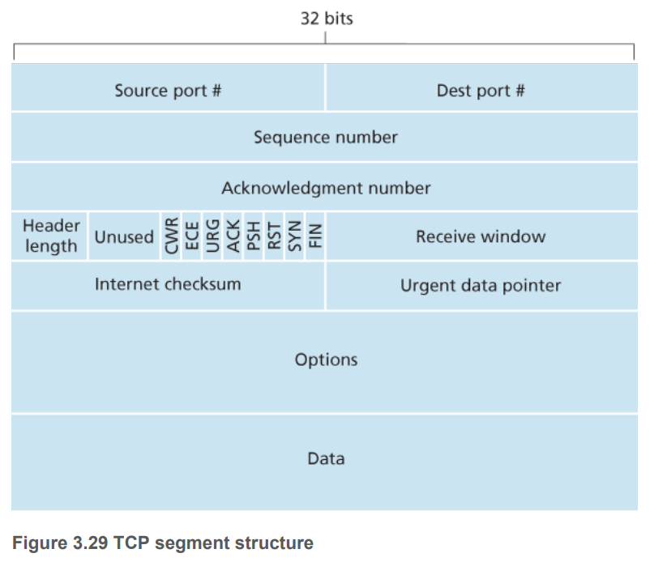

## TCP 三次握手

### 握手Connection Establishment

对应到 TCP 的三次握手，也是需要确认双方的两样能力: 发送的能力和接收的能力。

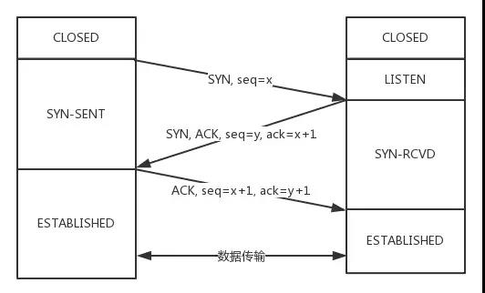

1. 从最开始双方都处于CLOSED状态。然后服务端开始监听某个端口，进入了LISTEN状态。
2. 然后客户端主动发起连接，报文标志位SYN设为1，sequence number随机选择为x, 自己变成了SYN-SENT状态。
3. 服务端接收到，返回SYN和ACK=x+1，sequence number随机选择为y，自己变成了SYN-REVD。
4. 客户端再发送ACK给服务端，自己变成了ESTABLISHED状态；服务端收到ACK之后，也变成了ESTABLISHED状态。

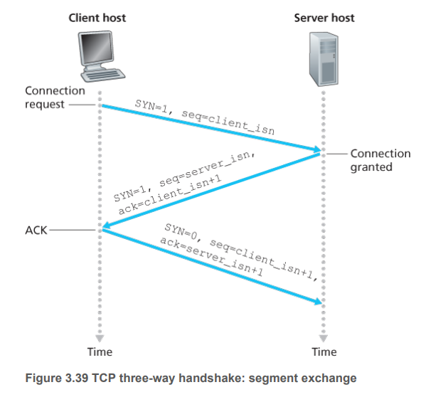

#### 为什么只有一次不行
因为客户端要确认服务端存不存在。
客户端是主动向服务器发送请求的一方。

#### 为什么两次不行
因为服务端需要确认客户端的接收能力。

如果不这么做，后果是什么？

假设现在只有两次握手，
如果客户端不具备接收能力，那服务端传数据的时候，就会造成浪费，然后客户端没收到，要求重传，继续浪费。

还有个问题：
1. 现在客户端发一个SYN想要握手，但是这个包滞留在了网络中没有到达，TCP以为是丢包了，然后重传，
2. 服务端回复进行第二次握手，建立了连接，
3. 问题出在连接关闭以后，如果刚刚滞留的包到达了服务端，服务端收到后进行第二次握手，
4. 但是客户端实际上是不想进行这次握手的，也就是不需要服务端建立连接传数据，这时候就造成了连接资源的浪费。

#### 为什么不是四次
确认之确认问题。

#### SYN flood -- denial-of-service-attack

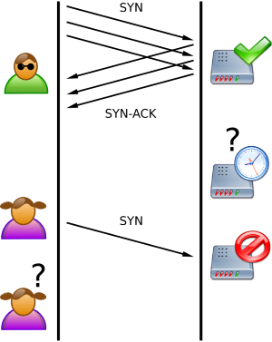

可以看一下RFC:

https://tools.ietf.org/html/rfc4987

Countermeasures:
1. Filtering
2. Increasing backlog
3. Reducing SYN-RECEIVED timer
4. Recycling the oldest half-open TCP
5. SYN cache
6. SYN cookies
7. Hybrid approaches
8. Firewalls and proxies

## 四次挥手 Connection Termination

### 为什么需要四次这么多?

因为服务端在接收到FIN, **往往不会立即返回FIN, 必须等到服务端所有的报文都发送完毕了，才能发FIN**。因此先发一个ACK表示已经收到客户端的FIN，延迟一段时间才发FIN。这就造成了四次挥手。

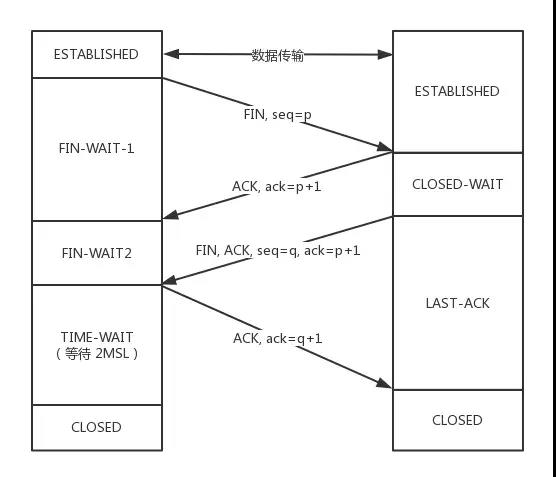

1. 刚开始双方处于ESTABLISHED状态。
2. 客户端要断开了，向服务器发送 FIN 报文。
3. 发送后客户端变成了FIN-WAIT-1状态。注意, 这时候客户端同时也变成了half-close(半关闭)状态，即无法向服务端发送报文，只能接收。
4. 服务端接收后向客户端确认，变成了CLOSED-WAIT状态。
5. 客户端接收到了服务端的确认，变成了FIN-WAIT2状态。
6. 随后，服务端向客户端发送FIN，自己进入LAST-ACK状态，
7. 客户端收到服务端发来的FIN后，自己变成了TIME-WAIT状态，然后发送 ACK 给服务端。
8. 注意了，这个时候，客户端需要等待足够长的时间，具体来说，是 2 个 MSL(Maximum Segment Lifetime，报文最大生存时间), 在这段时间内如果客户端没有收到服务端的重发请求，那么表示 ACK 成功到达，挥手结束，否则客户端重发 ACK。
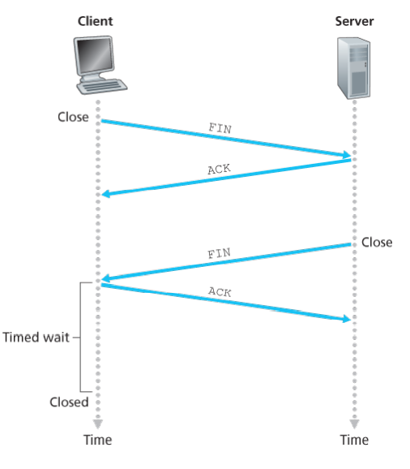

### 为什么是四次挥手而不是三次？
如果是三次挥手会有什么问题？

等于说服务端将ACK和FIN的发送合并为一次挥手，因为服务器收到客户端断开连接的请求时，可能还有一些数据没有发完，这时先回复ACK，表示接收到了断开连接的请求。等到数据发完之后再发FIN，断开服务器到客户端的数据传送。

### 等待2MSL的意义

如果不等待会怎样？

如果不等待，客户端直接跑路，当服务端还有很多数据包要给客户端发，且还在路上的时候，若客户端的端口此时刚好被新的应用占用，那么就接收到了无用数据包，**造成数据包混乱**。所以，最保险的做法是等服务器发来的数据包都过了报文最大生存时间，再启动新的应用。

照这样说一个 MSL 不就不够了吗，为什么要等待 2 MSL?
   - 1 个 MSL 确保四次挥手中主动关闭方最后的 ACK 报文最终能达到对端
   - 1 个 MSL 确保对端没有收到 ACK 重传的 FIN 报文可以到达

2MSL就是一个发送和一个回复所需的最大时间。如果直到2MSL，Client都没有再次收到FIN，那么Client推断ACK已经被成功接收，则结束TCP连接。

### 如果第二次挥手时服务器的ACK没有送达客户端，会怎样？

客户端没有收到ACK确认，会重新发送FIN请求。


## Go Back N (GBN) protocol
发送方可以一次发送多个packets，
发送方的滑动窗口。

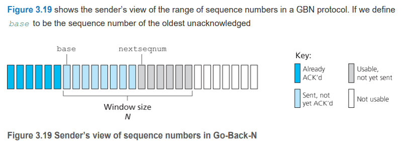

其中包含四大部分:
- 已发送且已确认
- 已发送但未确认
- 未发送但可以发送
- 未发送也不可以发送

```
发送窗口大小 N = min(delay x bandwidth, available receiver buffer size)
```

**发送端行为：**
1. 事件：invocation from above.如果还能有“未发送但可以发送”的packets就发送，如果没有了，就先buffer下来或者有同步机制来告诉upper layer to call `rdt_send()`(reliable data transmission) only when the window is not full.
2. 事件：接收到ACK. An acknowledgement for a packet with sequence number n will be taken to be a cumulative acknowledgement,然后重启timer.
3. 事件：超时。发送端会把所有“已发送但未确认”的packets全部再发送一遍。

**接收端行为：**
1. 发送cumulative ACK，如果收到连续的包。
2. Discards out-of-order packets.

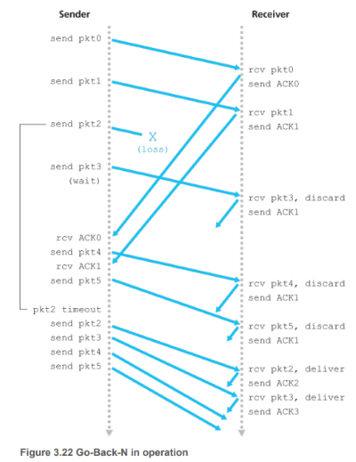

想个问题，GBN策略里面，需要多少个sequence number才能保证这个策略完美运行呢？先讲答案：
```
Minimum sequence number = sender window size + 1
```
可以看看下一节的Figure 3.2.7来思考一下。

## Selective Repeat (SR) 选择性重传策略
GBN策略会重新发送很多不必要的包，

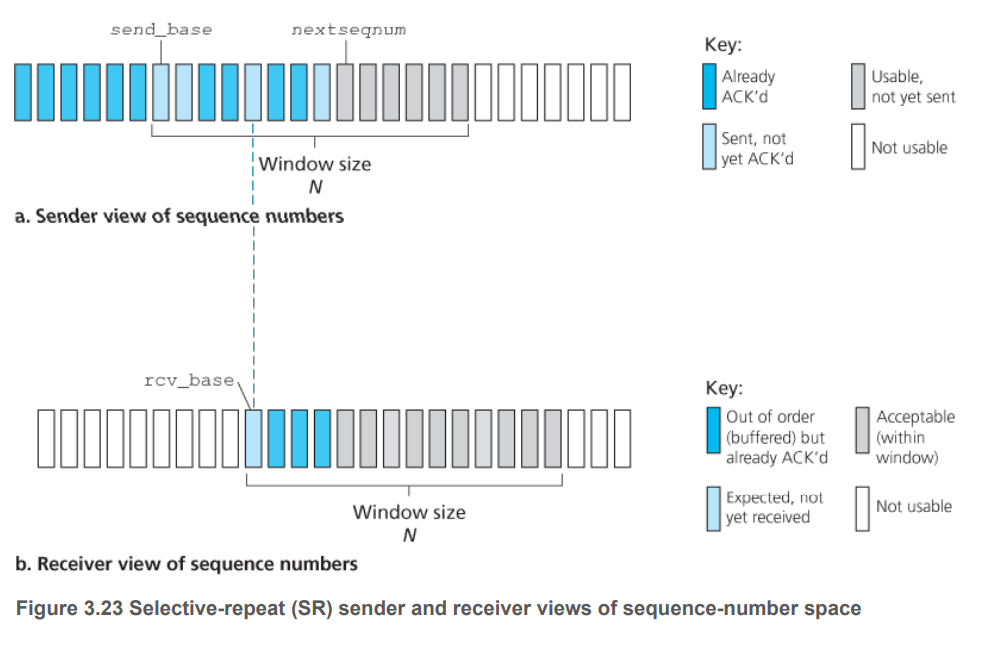

```
发送窗口大小 N = min(delay x bandwidth, available receiver buffer size)
```

**一般来说，发送窗口大小 = 接收窗口大小**

**发送端行为：**
1. 事件：Data received from above. 如果还有“未发送但可发送”的packets就发送出去，如果没有了，就buffer下来。
2. 事件：超时。每个packet都有自己的logical timer, since **only a single packet will be transmitted on timeout**. A single hardware timer can be used to mimic the operation of multiple logical timers.
3. ACK received. 如果恰好ACK等于send_base，窗口就会继续滑动到“已发送但是未确认”的地方，如果ACK大于send_base，就标识相应的packet已经接收。

**接收端行为：**
1. 如果接收到的packets序列号在接收窗口范围内，如果没有接收过，就buffer下来，如果序列号等于rcv_base，接收窗口会滑动到已经确认完的包的后面。
2. 如果接收到的packets序列号是在接收窗口之前的，必须要继续发确认（尽管之前我们已经发送确认了），否则会造成死锁（因为发送出去的ACK可能会丢包）。
3. 其他的包请忽略。

选择性重传策略，需要至少多少个sequence number？
```
至少需要SWS + RWS = 2SWS
```
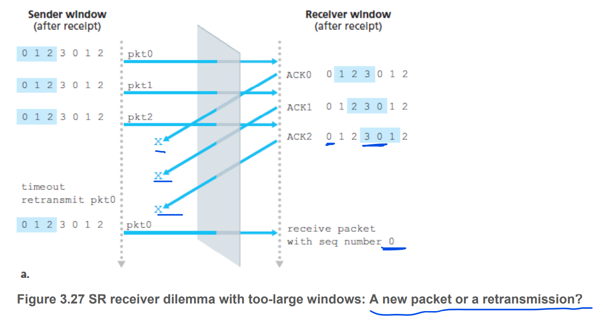

## TCP是用GBN还是SR
都用。

## Flow Control 流量控制
这里，我们都假设接收端丢掉out-of-order packets.

看TCP segment structure里面有个字段是receive window. 这是接收端用于告诉发送端，我有多少available buffer, 用RcvBuffer表示。

```
LastByteRead: 上一个已经递交给upper layer的字节。
LastByteRcvd: 上一个接收到的字节。
LastByteRecvd - LastByteRead <= RcvBuffer
接收窗口大小 rwnd = RcvBuffer - [LastByteRcvd - LastByteRead]
```

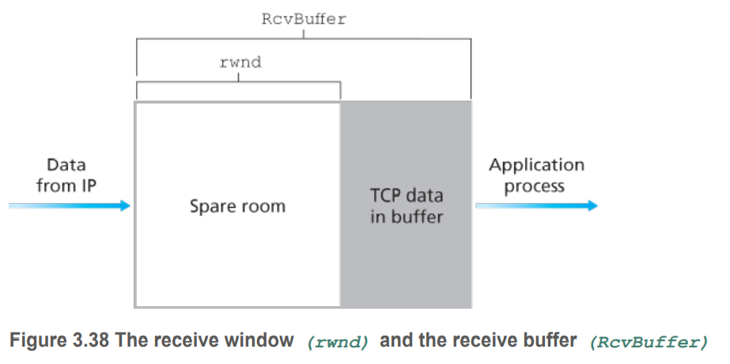

```
发送端 LastByteSent - LastByteAcked <= rwnd
```

但是有一点要注意，如果接收窗口为0了，发送端不发，就会造成死锁。所以，即使接收窗口为0了，发送端会继续发包，每个包1个字节。

## Congestion Control 拥塞控制

发送者们怎么控制自己的发送速率从而不会overwhelm the network.

拥塞控制的两个种类：
1. 端对端的拥塞控制(End-to-end congestion control). 丢包或者超时作为网络是否拥堵的标志。
2. Network-assisted congestion control. IP and TCP may also optionally implement network-assisted congestion control.  Direct feedback may be sent from a network router to the sender. This form of notification typically takes the form of a choke packet (essentially saying, “I’m congested!”).


我们主要介绍端对端的拥塞控制。


先列举几个要点：
- **拥塞窗口 Congestion Window (cwnd)**
- **慢启动阈值(Slow Start Threshold, ssthresh)**

Three components of TCP congestion-control algorithm: 
- **慢启动 (Slow Start)**
- **拥塞避免 (Congestioin voidance)**
- **快速重传(Fast Retransmit)和快速恢复(Fast Recovery)**

```
发送窗口 = LastByteSent - LastByteAcked <= min{cwnd, rwnd}
```


### 慢启动 Slow Start
当TCP连接刚建立的时候，`cwnd`的初始值被设置为一个MSS (maximum segment size). 这样平均发送速率就是MSS/RTT.

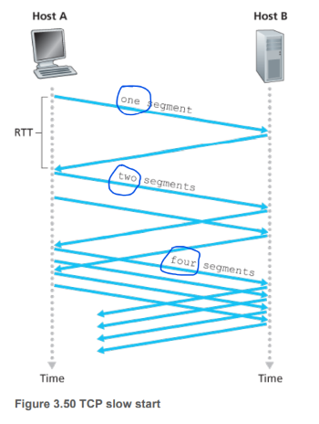

The TCP send rate starts slow **but grows exponentially**
during the slow start phase.

这个慢开始阶段什么时候结束呢？

- 情况1：开始超时的时候，发送者会记录当前的`慢启动阈值ssthresh = cwnd /  2`，然后`cwnd`再次被初始化为1，然后慢启动重新开始，当`cwnd`到达刚刚的`慢启动阈值ssthresh`时，慢启动就会结束，开始进入`拥塞避免阶段`。

- 情况2：如果连续收到三个重复的ACKs，就会马上进行**快速重传(fast retransmit)**，进入**快速恢复阶段(fast recovery state)**.

### 拥塞避免阶段 Congestion Avoidance mode
从慢启动进入这个阶段，拥塞窗口不再指数增长，而是线性增长(linear increase). 

总的做法是每个RTT时间都把cwnd扩大一个MSS.具体怎么实现，一个比较通用的方法就是：每当发送者接收到1个ACK，就把`cwnd`增加`MSS/cwnd`. 举个例子：
```
MSS = 1460 bytes
cwnd = 14600 bytes
现在10个segments呗一下子发出去了，接到1个ACK, cwnd = cwnd + 1460
接到10个ACKs，cwnd就变成了1460 + 14600 = 16060 bytes.
```

那拥塞避免阶段什么时候结束呢？

- 情况1：遇到超时的时候，ssthresh设置为`cwnd / 2`, cwnd被重新设置为`1 MSS`，进入慢开始阶段;
- 情况2：遇到三个重复ACKs的时候，进入**快速恢复状态**.


吃饱饭了可以看看这个图。

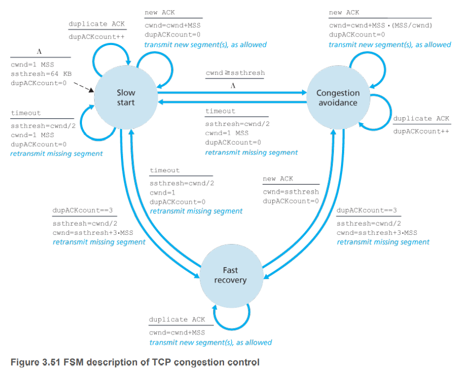

### 快速恢复 (fast recovery)

Fast recovery is a recommended, but not required. The newer version of TCP, TCP Reno, incorporated fast recovery.

回顾一下，什么情况下进入快速恢复状态？
- 收到三个重复ACK的时候，从Slow start或者Congestion avoidance状态进入快速恢复状态`cwnd = ssthresh + 3 MSS`；
- 如果现在已经再快速恢复状态了，如果还是收到重复ACK，则还是保持当前状态， `cwnd = cwnd + 1 MSS`。

说了那么多，到底快速回复阶段如何进行**快速重传**？

快速重传与**超时重传**是相对的概念。

快速重传是指，不必等到超时，接收到duplicate ACKs，就可以马上重新发送。


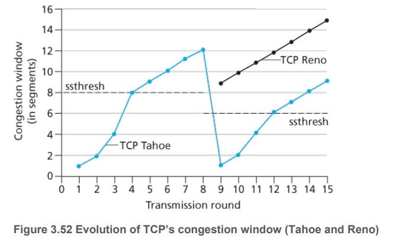

一开始Reno和Tahoe的行为是一样的，但是拥堵发生的时候Reno的ssthresh = ssthresh + 1 MSS, 然后开始线性增长。Tahoe的ssthresh = cwnd / 2, 进入慢开始状态。


