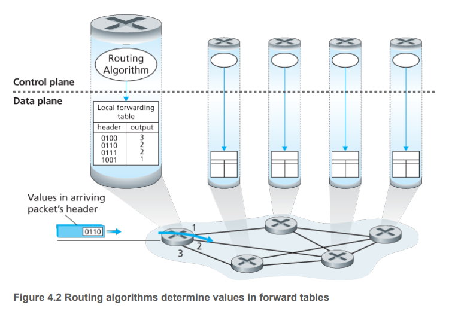
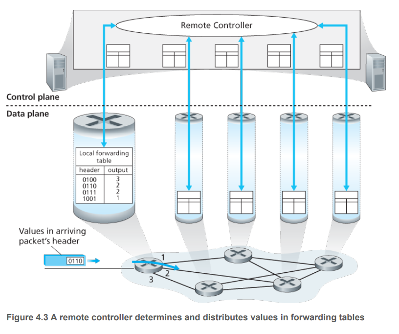

# Network Layer 网络层

传输层为应用层提供了TCP的可靠传输服务和UDP的不可靠的数据报服务。

这样上两层就为计算机网络的应用提供了process-to-process communication，为用户提供了host-to-host communication.

网络层能为传输层提供什么服务呢？

The Internet’s network layer provides a single service, known as **best-effort service**. 

关键词：
- data plane functions
- traditional IP forwarding
- generalized forwarding
- control plane functions
- routing algorithms and protocols
- OSPF
- BGP
- SDN
- forwarding table

## Overview

### Forwarding and Routing: The Data and Control Planes
网络层的角色十分简单：把packets从发送端，送到接收端。

有两个重要的功能：
1. Forwarding. 当一个包到达路由器的时候，路由器必须把这个包放到合适的输出接口。Forwarding is the most common but important function implemented in the data plane.这个是由forwarding table（路由表）决定的。

2. Routing. 网络层必须决定这个packet通过何种路径到达接收端。

The terms forwarding and routing are often used interchangeably by authors discussing the network layer.

Forwarding是路由器自己的决定。

Routing是network-wide process的决定。

### Control Plane: The Traditional Approach
forwarding table一开始是如何确定下来的。好问题。

This is a crucial issue, one that exposes the important interplay between forwarding (in data plane) and routing (in control plane). 

Routing algorithm (路由算法)决定了路由器的forwarding table (路由表)。

如图所示。

### Control Plane: The SDN Approach
前面提到的方法也是传统方法，路由器生产商把路由功能在自己的产品中实现。

最近也有另一种方法，如图所示。

Figure 4.3 shows an alternate approach in which a physically separate (from the routers), remote controller computes and distributes the forwarding tables to be used by each and every router. 

The control-plane approach shown in Figure 4.3 is **at the heart of software-defined networking (SDN)**, where the network is “software-defined” because the controller that computes forwarding tables and interacts with routers is implemented in software. 

### Network Service Model
The Internet’s network layer provides a single service, known as **best-effort service**. 

With best-effort service, packets are neither guaranteed to be received in the order in which they were sent, nor is their eventual delivery even guaranteed.

