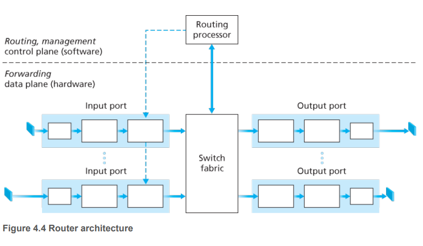
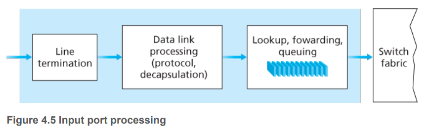
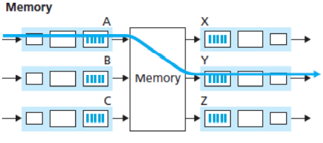
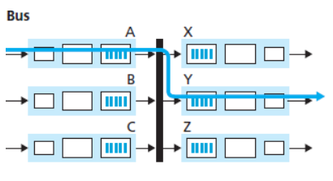
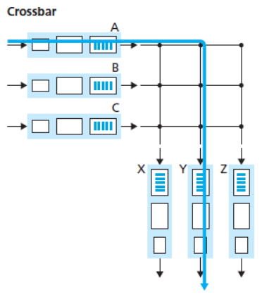

# Router

A high-level view of a generic router architecture is shown in Figure 4.4. Four router components can be
identified:

- Input ports.
- Output ports.
- Switching fabric.
- **Routing processor.** The routing processor performs control-plane functions. 

In traditional routers, it executes the routing protocols (which we’ll study in Sections 5.3 and 5.4), maintains routing tables and attached link state information, and computes the forwarding table for the router. 

In SDN routers, the routing processor is responsible for communicating with the remote controller in order to (among other activities) receive forwarding table entries computed by the remote controller, and install these entries in the router’s input ports. The routing processor also performs the network management functions that we’ll study in Section 5.7.

A router’s input ports, output ports, and switching fabric **are almost always implemented in hardware**.

While the **data plane operates at the nanosecond time scale**, a router’s control functions—executing the routing protocols, responding to attached links that go up or down, communicating with the remote controller (in the SDN case) and performing management functions—operate at the **millisecond or second timescale**. 

- **Destination-based forwarding.**
一辆车进入一个环岛，指路人根据这辆车的目的地来告诉它应该从哪里下环岛。

- **Generalized forwarding.**
一辆车进入一个环岛，指路人不仅要根据这辆车的目的地，而且要根据其他因素，比如这辆车的大小，这辆车的出发地等等。

## Input Port Processing and Destination-Based Forwarding

Line-termination function and Data link processing 实现了该input link的物理层和数据链路层。

The lookup means that the router uses the forwarding table to look up the output port to which an arriving packet will be forwarded via the switching fabric.

The forwarding table is copied from the routing processor to the line cards over a separate bus indicated by the dashed line from  the routing processor to the input line cards in Figure 4.4. 

在图4.4中，每个input link都有一个line card，应该会有指针指向路由表。

我们假设最简单的情况，一个packet去往哪个output port是由这个packet的destination决定的，例如

| Destination Address Prefix | Link Interface |  
|----------------------------|----------------|
| 11001000 00010111 00010    |        0       |
| 11001000 00010111 00011000 |        1       |
| 11001000 00010111 00011    |        2       |
| Otherwise                  |        3       |

Given the existence of a forwarding table, lookup is conceptually simple—hardware logic just searches through the forwarding table looking for the longest prefix match. 

Once a packet’s output port has been determined via the lookup, the packet can be sent into the
switching fabric.

## Switching
这个功能可以有三种实现方式。

- Switching via memory.

1. 处理器把packet从input link复制到memory.
2. 查找路由表找到对应的output link.
3. 把packet从memory复制到output link.

- Switching via a bus.

packet直接从input port送往output port，不需要处理器的介入。

- Switching via an interconnection network.

## Output Port Processing

## Where Does Queuing Occur?

## Packet Scheduling

### FIFO

### Priority Queue

### Round Robin and Weighted Fair Queuing (WFQ)
