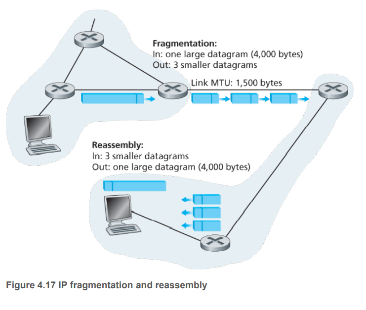

# IPv4 and IPv6 (Internet Protocol)

## IPv4 datagram format

1. Version number -- 4 bits.

2. Header length -- 4 bits. 但是大多数IP包都没有options，所以一般IP包的header都是20字节。

3. Type of service (TOS) -- 例如需要区分real-time datagrams (such as those used by an IP telephony application) 和 non-real-time-traffic (for example, FTP).

4. Datagram length -- 16 bits. header加上data总长度。理论上最大是65535字节，一般是1500字节，which allows an IP datagram to fit in the payload field of a maximally sized Ethernet frame.

5. Identifier, flags, fragmentation offset. 这几个字段与IP fragmentation有关，后面会讲解。有趣的是，IPv6不允许fragmentation.

6. Time-to-live (TTL). 这个字段保证了数据包不会永久地被发送，例如一个路由的回环。**当这个包被发送一次的时候，他的值就会减一。**

7. Upper layer protocol. 当一个包被发到终点的时候，这个属性就会被派上用场。例如，如果值为6，这个data portion就会被传递到TCP，如果值为17，数据就会被传给UDP.

8. Header checksum. **如果路由器发现checksum不对，就会把包丢掉。值得注意的是，因为TTL会改变，所以checksum必须被重新计算，再写回包里面。**
    - 为什么传输层和网络层都要算checksum?
        - 第一，网络层只算header的checksum.
        - 第二，TCP/UDP和IP不一定在同一个协议栈。
        - 第三，TTL会改变，所以网络层有必要再计算一次checksum.

9. Source and destination IP addresses.

10. Options.

11. Data (payload). **思考一个问题，如果我有不同的TCP连接，那么IP层如何把datagram交付给不同的TCP连接呢**？这里面的payload就包含了整个TCP/UDP数据包，TCP数据包里面有port number，就能交付给对应的TCP连接。

## IPv4 Datagram Fragmentation
在讲数据链路层的时候，我们会知道，不是所有数据链路层的协议都能传递网络层想统大小的包，例如Ethernet frames可以携带1500 bytes数据，一些wide-area links只能携带不超过576 bytes. 在数据链路层能传输的最大数据帧叫 maximum transmission unit (MTU).

当一个路由器接收到一个包，这个包很大，路由器就会把这个**分割成小包**。然后发出去，重新组装包的任务就交给了end system，这也是为了让网络层的协议变得简洁。

Fragment the payload in the IP datagram into two or more smaller IP datagrams, encapsulate each of these smaller IP datagrams in a separate link-layer frame; and send these frames over the outgoing link. Each of these smaller datagrams is referred to as a **fragment**.

- 发送端会给一个数据包加上identification number，每发一个包这个数就加一。当一个路由器需要把这个包分割的时候，每个分割后的包，还是会使用这个包原来的identification number.

- 接收端如何知道所有fragments的正确顺序呢？offset属性是用来识别某个fragment的顺序。
- 接收端如何知道已经接收到最后一个fragments？最后一个包flag属性是0，其他的包flag属性是1.

## IPv4 Addressing

