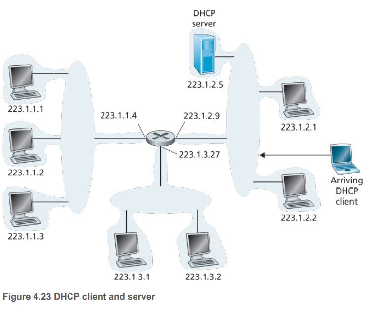

# IPv4 and IPv6 (Internet Protocol)

## IPv4 datagram format


1. Version number -- 4 bits.

2. Header length -- 4 bits. 但是大多数IP包都没有options，所以一般IP包的header都是20字节。

3. Type of service (TOS) -- 例如需要区分real-time datagrams (such as those used by an IP telephony application) 和 non-real-time-traffic (for example, FTP).

4. Datagram length -- 16 bits. header加上data总长度。理论上最大是65535字节，一般是1500字节，which allows an IP datagram to fit in the payload field of a maximally sized Ethernet frame.

5. Identifier, flags, fragmentation offset. 这几个字段与IP fragmentation有关，后面会讲解。有趣的是，IPv6不允许fragmentation.

6. Time-to-live (TTL). 这个字段保证了数据包不会永久地被发送，例如一个路由的回环。**当这个包被发送一次的时候，他的值就会减一。**

7. Upper layer protocol. 当一个包被发到终点的时候，这个属性就会被派上用场。例如，如果值为6，这个data portion就会被传递到TCP，如果值为17，数据就会被传给UDP.

8. Header checksum. **如果路由器发现checksum不对，就会把包丢掉。值得注意的是，因为TTL会改变，所以checksum必须被重新计算，再写回包里面。**
    - 为什么传输层和网络层都要算checksum?
        - 第一，网络层只算header的checksum.
        - 第二，TCP/UDP和IP不一定在同一个协议栈。
        - 第三，TTL会改变，所以网络层有必要再计算一次checksum.

9. Source and destination IP addresses.

10. Options.

11. Data (payload). **思考一个问题，如果我有不同的TCP连接，那么IP层如何把datagram交付给不同的TCP连接呢**？这里面的payload就包含了整个TCP/UDP数据包，TCP数据包里面有port number，就能交付给对应的TCP连接。


## IPv4 Datagram Fragmentation
在讲数据链路层的时候，我们会知道，不是所有数据链路层的协议都能传递网络层想统大小的包，例如Ethernet frames可以携带1500 bytes数据，一些wide-area links只能携带不超过576 bytes. 在数据链路层能传输的最大数据帧叫 maximum transmission unit (MTU).


当一个路由器接收到一个包，这个包很大，路由器就会把这个**分割成小包**。然后发出去，重新组装包的任务就交给了end system，这也是为了让网络层的协议变得简洁。

Fragment the payload in the IP datagram into two or more smaller IP datagrams, encapsulate each of these smaller IP datagrams in a separate link-layer frame; and send these frames over the outgoing link. Each of these smaller datagrams is referred to as a **fragment**.


- 发送端会给一个数据包加上identification number，每发一个包这个数就加一。当一个路由器需要把这个包分割的时候，每个分割后的包，还是会使用这个包原来的identification number.

- 接收端如何知道所有fragments的正确顺序呢？offset属性是用来识别某个fragment的顺序。
- 接收端如何知道已经接收到最后一个fragments？最后一个包flag属性是0，其他的包flag属性是1.


## IPv4 Addressing

### Overview
host通常只要一个link接入网络，the boundary between the host and the physical link is called an **interface**. The boundary between the router and any one of its links is also called an **interface**. **An IP address is technically associated with an interface, rather than the host or router containing that interface**.

### IP Address
1. 32 bits long (4 bytes).
2. dotted-decimal notaion (点分十进制). 每个字节使用一个点隔开。

### IP地址的种类
|    Class      | Prefix code | Start Address | End Address     | CIDR | Default Subnet mask |
|---------------|-------------|---------------|-----------------|------|---------------------|
|    Class A    | 0           | 0.0.0.0       | 127.255.255.255 | /8   | 255.0.0.0           |
|    Class B    | 10          | 128.0.0.0     | 191.255.255.255 | /16  | 255.255.0.0         |
|    Class C    | 110         | 192.0.0.0     | 223.255.255.255 | /24  | 255.255.255.0       |      
| D (Broadcast) | 1110        | 224.0.0.0     | 239.255.255.255 | /4   | Undefined           |
| E (Preserved) | 1111        | 240.0.0.0     | 255.255.255.255 | /4   | Undefined           |

像这样，只划分Class A, B and C这三类地址，就组成了二级IP地址，IP地址被分为了两部分：网络号+主机号。例如，A类地址表示前8位是网络号，剩下的24位用来表示主机号。

但是这样进行划分，会有很多问题。
1. IP地址利用率低。每一个A类地址网络可以连接的主机数超过1000万，每一个B类地址网络可以连接的主机数超过6万，有的单位申请到了一个B类地址网络，但是所连接的主机数并不多，但是又不想申请一个C类地址网络，因为C类地址网络只能连接100多个主机。
2. 给每一个物理网络分配一个网络号，造成路由表过大。
3. 两级IP地址不够灵活。某企业需要紧急组网，但是只能等互联网管理机构分配IP地址。

**解决方法：subnet划分子网，或子网寻址，或子网路由选择**。


### 划分子网与子网掩码 Subnetting

#### 划分子网的基本思路
1. 一个单位需要将自己的大网络划分不一样的物理网络方便进行管理，可将所属的物理网络进行子网划分。本单位以外的网络看不见本单位是由多少个子网组成，因为这个单位对外仍然表现为一个网络。
2. IP地址 = 网络号 + 子网号 + 主机号 网络号就是ABC这几类IP，子网号是剩余的位中，取前几位作为网络号，剩余的位作为主机号。
3. 从其他网络发送给本单位某台主机的IP数据包,仍然是根据IP数据包的目的网络号找到连接在本单位网络上的路由器,此路由器收到这个数据报后,再根据子网号找到目的子网,再交付给目标主机。那我怎么找目的子网呢?后面会讲子网掩码。

举个例子。


B类网络145.13.0.0,网络号为前16位,再使用额外8位作为子网号,主机号使用剩下的8位。


#### 子网掩码

我们知道IP数据包里面是不能看出source IP和destination IP是属于哪个网络的。我们需要用子网掩码(subnet mask)来解决这个问题。


**问题来了,那这个子网掩码是保存在哪里的?**
保存在路由表，例如：

| Destination Network |   Subnet mask   |   Next hop   | 
|---------------------|-----------------|--------------|
|    128.30.33.0      | 255.255.255.128 | interface 0  | 
|    128.30.33.128    | 255.255.255.128 | interface 1  | 
|    128.30.36.0      | 255.255.255.0   | interface 2  | 

路由器收到一个packet，目标地址是128.30.33.138.

与路由表第一条记录比较：
```
128.30.33.138 & 255.255.255.128 = 128.30.33.128 与 128.30.33.0不一致
```
与路由表第二条记录比较：
```
128.30.33.138 & 255.255.255.128 = 128.30.33.128 与 128.30.33.128一致
```
于是转发到interface 1.


### CIDR (Classless Inter-Domain Routing) 无类别路由 (超网 supernetworking)

CIDR消除了传统的A类、B类和C类地址固定分类以及按定长子网掩码来划分子网的做法，可以更有效地分配和利用IPv4的地址空间。

CIDR的作用：
1. 按需分配IP地址：根据每个子网的主机数确定其主机号和网络号的比特数。
2. 路由聚合：将连续的多个小规模的网络地址合并为一个网络地址，从而可将路由表中的多条路由聚合为一条路由。

例如，/8表示前8位是网络号，/24表示前24位是网络号。

#### 最长前缀匹配 Longest-prefix matching
使用CIDR时，路由表中的每个项目由“网络前缀”和“下一跳地址”组成。在查找路由表时可能会得到不止一个匹配结果。

应当从匹配结果中选择句有最长网络前缀的路由：最长前缀匹配。


The ISP (Fly-By-Night-ISP) advertises to the outside world that it should be sent any datagrams whose first 20 address bits match 200.23.16.0/20. 这个网络外的路由器不需要知道这个地址快200.23.16.0/20里面其实还有8个自网络。This ability to use a single prefix to advertise multiple networks is often referred to as **address aggregation (also route aggregation or route summarization)**.


如果现在Organization 0想要转移到ISPs-R-Us的网络内呢？如图所示。那么ISPs-R-Us就会跟外界网络说：请发给我属于这两个网络的包：199.31.0.0/16和200.23.16.0/23. 当ISPs-R-Us接收到包的时候，会按照**最长的网路前缀**去匹配。

#### 如何获得一个超网 Obtaining a Block of Address
一般向ISP申请，那么ISP的大网络又是从哪申请的？ICANN (Internet Corporation for Assigned Names and Numbers) 是个全球性的组织，管理IP地址和DNS根服务器。


### DHCP (Dynamic Host Configuration Protocol) Obtaining a Host Address
获得了a block of addresses后，这就需要为路由器和主机分配IP了。当然可以由管理员手动分配，但是一般是使用DHCP协议完成的。**DHCP allows a host to obtain (be allocated) an IP address automatically**. DHCP可以配置成这样：同一台主机接入这个网络时，每次都是获得相同的IP地址，也可以每次都分配给这台主机一个临时的IP地址。

DHCP还有其他功能：
- 让主机知道他的子网掩码；
- 让主机知道他的第一跳路由(often called the default gateway默认网关)；
- 让主机知道他的local DNS server的IP地址。

这个协议有时候又叫plug-and-play协议,或者zeroconf协议.

DHCP is a client-server protocol. 最简单的情况下，每一个子网都会有一个DHCP服务器，如果没有，a DHCP relay agent (typically a router) that knows the address of a DHCP server for that network is needed. 我们下面的讨论都是基于一个有DHCP服务器的子网来进行的。



DHCP有四个步骤。下图中的yiaddr表示(your Internet address)将要分配给新来的主机的IP.

1. **DHCP server discovery**.
2. **DHCP server offer(s)**.
3. **DHCP request**.
4. **DHCP ACK**.


- **DHCP server discovery**. 新来的主机会发UDP包(端口67) DHCP discover message(附带transaction id)，来使用广播地址255.255.255.255和一个"this host" source IP address of 0.0.0.0. 
- **DHCP server offer(s)**. DHCP server也会使用广播地址，发UDP包(端口68) DHCP offer message，**由于同一个子网上还可能存在多个DHCP服务器**，为了区分这个message是哪个server发的，会加上一个transaction id.这个报文还有the proposed IP address for the client, the network mask and an IP address lease time -- the amount of time for which the IP will be valid.
- **DHCP request**. 新来的主机会选择一个offer message附带上configuration parameters来回复一个DHCP request message. 告诉相应服务器，我选择了你给我的IP.
- **DHCP ACK**. The server responds to the DHCP request message with a DHCP ACK message, confirming the requested parameters.

**如此看来，DHCP的短板也是明显的，因为更换IP地址，就会使得TCP连接无法维持。在后面从章节（数据链路层），我们会讲解mobile IP -- an extension to the IP infrastructure that allows a mobile node to use a single permanent address as it moves between subnets.**


### 特殊的IP地址

- 0.0.0.0表示默认路径地址(一般每个路由表都包含一条默认路径)
- 网络识别号全为0的IP地址,表示本网络的这个主机
- 主机识别号全为0的IP地址,表示这个网络
- 主机识别号全为1的IP地址,表示向指定网络的定向广播
- 127.X.X.X是回传地址,用于本机器上的测是和进程间通信

#### 广播地址 255.255.255.255 
当一个主机发送一个包255.255.255.255，这个子网的所有主机都会收到这个包，路由器有可能会传播这个包到隔壁的网络，但一般不会。

#### 私有地址 intranet
- Class A: 10.0.0.0 - 10.255.255.255
- Class B: 172.16.0.0 - 172.31.255.255
- Class C: 192.168.0.0 - 192.168.255.255

私有地址可以被许多子网重用。

私有地址不能用于互联网通信，对外必须转换为公有的IP地址。

### 网络地址转换 Network Address Translation (NAT)
IPv4一方面是不够用的,另一方面,如果一个人家里或者公司需要很多设备,不可能向运营商申请一大批IP地址,只需要申请一个IP地址,然后以这个IP地址为公有地址,向互联网发起通信就行,子网内的设备,都使用私有IP地址.

上文讲到,我们规定了很多IP地址,是私有地址,在一个子网中,可以使用私有地址进行通信,但是在互联网中,必须使用公有的IP地址进行通信.

那问题很自然就出来了,NAT是怎么做到,所有设备都需要唯一IP的互联网上进行通信呢?


首先有一个NAT-Enabled Router,里面有NAT translation table,里面存者私有地址到公有地址的映射表,所有从该子网发出的包,都以138.76.29.7(port=5001)身份发出,所有发往该子网的包,都是以138.76.29.7(port=5001)为目标地址.使得整个子网对外表现得像一个设备.

看上图.子网内一个主机10.0.0.1(port=3345)想要与外界128.119.40.186(port=80)进行通信,发出的包经过NAT-Enabled Router时,被记录下来,这个包发出求的时候的source IP就被换成了138.76.29.7(port=5001). 当服务器收到并答复的时候,NAT-Enabled Router就根据这个NAT translation table找到10.0.0.1(port=3345),再将收到的包交付给内网里面的主机10.0.0.1(port=3345).


