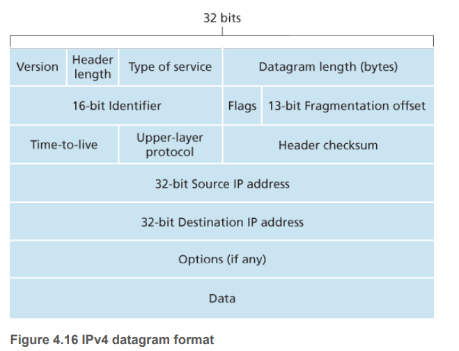

# IPv6

IPv4不够用了，回顾一下IPv4的报文结构。

## IPv6 Datagram Format
IPv6有几个新特性。
1. **Expanded addressing capabilities**. IP地址的长度长达128位(IPv4是32位)。除了单播和多播地址，IPv6还有anycast address that allows a datagram to be delivered to any one of a group of hosts.
2. **A streamlined 40-byte header**. 头部固定长度为40字节，使得路由器能够更快地处理报文。自然也就没有了options这个field.
3. **Flow labeling**. IPv6 has an elusive definition of a flow. RFC 2460 states that this allows “labeling of packets belonging to particular flows for which the sender requests special handling, such as a non-default quality of service or real-time service.” For example, audio and video transmission might likely be treated as a flow. On the other hand, the more traditional applications, such as file transfer and e-mail, might not be treated as flows. It is possible that the traffic carried by a high-priority user (for example, someone paying for better service for their traffic) might also be treated as a flow. What is clear, however, is that the designers of IPv6 foresaw the eventual need to be able to differentiate among the flows, even if the exact meaning of a flow had yet to be determined.
4. 没有了Fragmentation/reassembly. 这项任务完全可以由End System(host)来完成，从而减轻了路由器的负担，如果IPv6数据包太大，路由器会给sender发送一个"Packet Too Big" ICMP error message.
5. 没有了Header checksum. 
    - 传输层和数据链路层已经有checksum了。
    - checksum在TTL field变化的时候还要重新计算，很费事。
    - 快速处理和转发datagram才是网络层的中心任务。
    

下面讲解IPv6报文的结构。
1. **Version -- 6 bits**. 在这个字段写个6表示IPv6, 但写个4并不代表IPv4. 后面会transition from IPv4 to IPv6会讲解。
2. **Traffic class -- 8 bits**. 像IPv4的TOS field, 用来表示datagram的优先级。
3. **Flow label -- 20 bits**. This field is used to identify a flow of datagrams.
4. **Payload length -- 16 bits**. 
5. **Next header -- 8 bits**. 像IPv4的Upper layer protocol.
6. **Hop limit -- 8 bits**. 

## Transition from IPv4 to IPv6
问题自然而然就来了，IPv6如何向后兼容IPv4 (backward-compatible).

这个问题书上也没有讲得特别清楚。特别说是这个tunneling技术，他的IPv4路由器又怎么能寻址IPv6呢？

The approach to IPv4-to-IPv6 transition that has been most widely adopted in practice involves tunneling [RFC 4213]. 

Suppose two IPv6 nodes (in this example, B and E in Figure 4.27) want to interoperate using IPv6 datagrams but are connected to each other by intervening IPv4 routers.

We refer to the intervening set of IPv4 routers between two IPv6 routers as a tunnel, as illustrated in Figure 4.27. With tunneling, the IPv6 node on the sending side of the tunnel (in this example, B) takes the entire IPv6 datagram and puts it in the data (payload) field of an IPv4 datagram. This IPv4 datagram
is then addressed to the IPv6 node on the receiving side of the tunnel (in this example, E) and sent to the first node in the tunnel (in this example, C). The intervening IPv4 routers in the tunnel route this IPv4 datagram among themselves, just as they would any other datagram, blissfully unaware that the IPv4 datagram itself contains a complete IPv6 datagram. The IPv6 node on the receiving side of the tunnel eventually receives the IPv4 datagram (it is the destination of the IPv4 datagram!), determines that the IPv4 datagram contains an IPv6 datagram (by observing that the protocol number field in the IPv4 datagram is 41 [RFC 4213], indicating that the IPv4 payload is a IPv6 datagram), extracts the IPv6 datagram, and then routes the IPv6 datagram exactly as it would if it had received the IPv6 datagram from a directly connected IPv6 neighbor.

