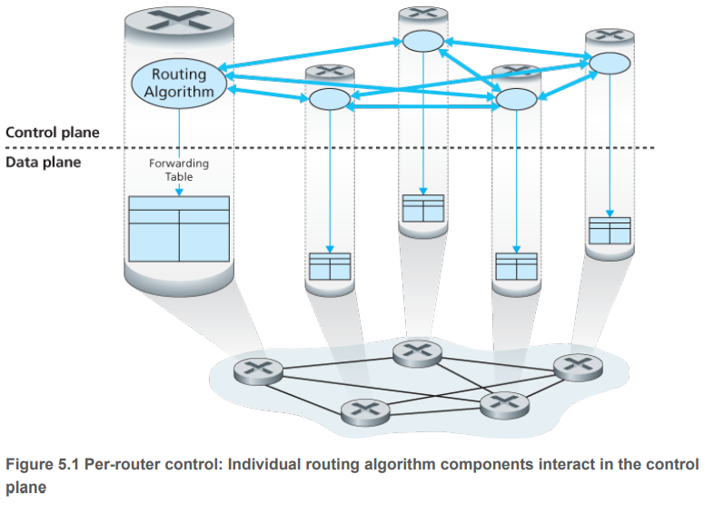
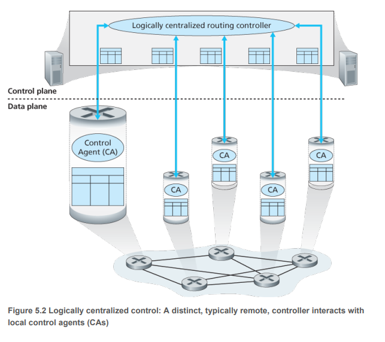
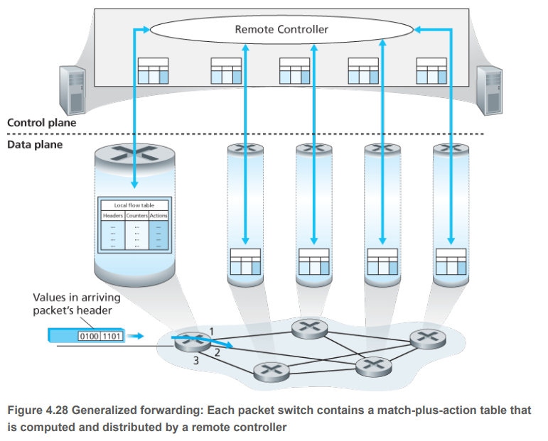
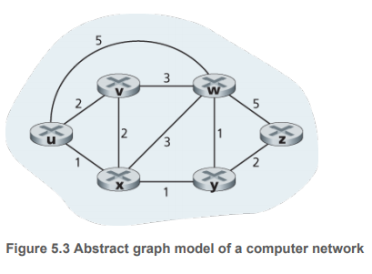
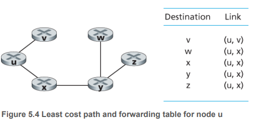
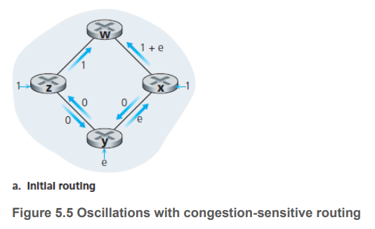
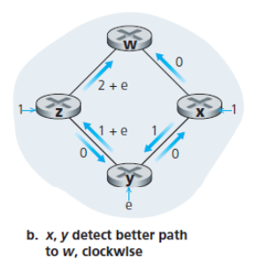
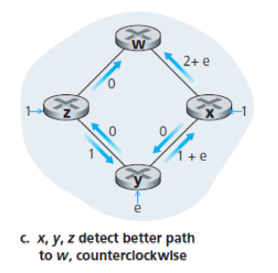
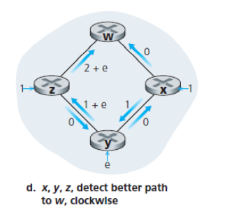

# Control Plane
- Traditional Routing Algorithms
- OSPF 
- BGP
- Software-Defined Networking
- ICMP (Internet Control Message Protocol)
- SNMP (Simple Network Management Protocol)

## Overview
这一章节，我们将学习forwarding table和flow table是怎么计算、维持和更新的。

- **Per-router control**.下图展示了路由算法是运行在每个路由器中的。这种方法在互联网中已经使用了几十年。后面讲到的OSPF和BGP协议都是基于这种方法的。



- **Logically centralized control**. 下图展示的是Software-Defined Networking方法，由remote controller来计算flow table (在这种方法里面路由表叫做flow table). Controller跟每个路由器中的control agent (CA)对话，来配置管理路由器的flow table.



谷歌，微软，中国电信，中国联通，AT&T都采用了这样的技术。

Recall that Section 4.2.1 characterized destination-based forwarding as the two steps of looking up a destination IP address (“match”), then sending the packet into the switching fabric to the specified output port (“action”). 

Let’s now consider a significantly more general **“match-plus-action” paradigm**, where the “match” can be made over multiple header fields associated with different protocols at different layers in the protocol stack. The “action” can **include forwarding the packet** to one or more output ports (as in destination-based forwarding), load balancing packets across multiple outgoing interfaces that lead to a service (as in **load balancing**), rewriting header values (as in **NAT**), purposefully blocking/dropping a packet (as in a **firewall**), sending a packet to a special server for further processing and action (as in DPI), and more.



# Routing Algorithms
这个小节的目标是找一个好的路由路径，是的我们的包能够以最小的代价穿过网络到达目的地。实际上还有别的约束，比如说Y公司的包就不要通过Z公司的路由器转发了。

我们先确定数据结构，再讲算法。

网络是一个带权无向图(Weighted undirected graph)。



用G=(N, E)表示图，其中N表示节点(nodes)的集合，E表示边(edges)的集合，边用N中的某对节点来表示。节点表示路由器，边表示链路，边的权重表示通过这条链路的代价，取决于这条链路的带宽和物理长度。

我们的目标是找最小代价路径(least-cost path). 

其实看到这里读者一定很好奇Logically centralized control是怎么计算路由表的？暴力计算所有路径是其中一种方法，因为这种方案拥有整个网络的完整信息。

一般来说，我们可以把路由算法分成两类：centralized or decentralized.

- A **centralized routing algorithm**使用complete, global knowledge about the network来计算least-cost path. 这个计算可以在controller进行，or could be replicated in the routing component of each router. **关键是是否拥有全局信息**。这样的算法我们通常又叫做**Link-State (LS) algorithms**.
- **Decentralized routing algorithm**. **The calculation is carried out in an iterative, distributed manner by the routers**. 每个路由器只有自己直接相连的边的信息，通过迭代，与邻居交换信息，就能逐步得到最小代价路径。我们后面会讲解**distance-vector (DV) algorithm**.

另一种分类方法就是**静态路由算法与动态路由算法**。**静态**算法通常适用于路由器基本不会有变化的网络，通常是人工配置。**动态**算法会随着网络负载和拓扑的变化而变化。这也通常会导致routing loops and route oscillation.

也可以根据是否负载敏感来区分。load-sensitive中，链路的当前带宽也表明了当前链路的拥挤情况。load-**in**sensitive algorithm的例子有RIP, OSPF和BGP,因为这里link cost并不直接表明当前的拥堵情况。

## Link-State (LS) Routing Algorithm

在LS算法中，网络的拓扑和链路代价都是知道的。实际应用中，这是每个节点都广播自己的link-state packets to all other nodes in the network,某个节点发送哦的link-state packets是包含着自己与邻居之间链路的代价（状态）。

迪杰斯特拉算法(Dijkstra)是由荷兰计算机科学家狄克斯特拉于1959年提出的，迪杰斯特拉算法主要特点是从起始点开始，采用贪心算法的策略，每次遍历到始点距离最近且未访问过的顶点的邻接节点，直到扩展到终点为止。

Notations:
- D(v): cost of the least-cost path from the source node to destination v as of this iteration of the algorithm.
- p(v): previous node (neighbor of v) along the current least-cost path from the source to v.
- N': subset of nodes; v is in N' if the least-cost path from the source to v is definitively known.

算法包含初始化和循环两部分，循环次数等于网络节点数，算法输出是从source node u 出发，到达任意节点的最短路径。

```
Initialization:
    N' = {u}
    for all nodes v
        if v is a neighbor of u
            D(v) = c(u, v)  // cost from u to v
        else
            D(v) = infinity

Loop
    // 找到当前从N'集合中任意节点出发，与外界代价最小的邻居w
    find w not in N' such that D(w) is a minimum    
    
    // 将邻居w加到集合N'
    add w to N' 

    // 更新w到达它所有邻居的代价（这些邻居不能是N'中的邻居）
    update D(v) for each neighbor v of w and not in N':
        D(v) = min(D(v), D(w) + c(w, v))

Until N' = N
```


|   Iteration    | N'     | D(v), p(v) | D(w), p(w) | D(x), p(x) | D(y), p(y) | D(z), p(z) |
|----------------|--------|------------|------------|------------|------------|------------|
| Initialization | u      | 2, u       | 5, u       | 1, u       | Infinity   | Infinity   |
| 1              | ux     | 2, u       | 4, x       |            | 2, x       | Infinity   |
| 2              | uxy    | 2, u       | 3, y       |            |            | 4, y       |
| 3              | uxyv   |            | 3, y       |            |            | 4, y       |
| 4              | uxyvw  |            |            |            |            | 4, y       |
| 5              | uxyvwz |            |            |            |            |            |

如上表，到v的最短路径为uv; 到w最短路径为uxyw, 到x最短路径为ux,到y最短路径为uxy,到z最短路径为uxyz.于是我们就能轻易得出，下一跳路由表，如图Figure 5.4

再过一遍算法过程。初始化的时候，把u作为起点加入集合N', 计算从u出发到其所有邻居的代价，记录到当前最小的代价是到邻居x，只需要代价1. 开始进入循环，将当前所记录到的邻居x加入到集合N'中，更新x到其所有邻居的代价（这些邻居不在集合N'中），u->x->v的距离为1+2，比原来的2要大，不更新；u->x->w的距离为1+3，比原来的5要小，更新最短路径为u->x->w, 距离为4；u->x->y的距离为1+1，比原来的正无穷要小，更新最短路径为u-x->y, 距离为2.

现在我们实际上已经得到了表中的前两行数据：Initialization和1. 在D(v)=2, D(w)=4, D(y)=2, D(z)=Infinity中，最小的是D(v)和D(y)，随便选一个，例如我们选择y继续进行计算。将y加入集合N',更新y->w，y->z, y->v的距离...



算法时间复杂度分析：V是节点数，E是边的数量。首先这个循环是需要进行V次，每次循环要对当前不在集合的邻居进行更新，第i次迭代就要查看V-i个邻居，这么看来时间复杂度应该就是O(V^2). 但是算法导论说用优先队列可以优化成O((V+E)logE)，用斐波那契最小堆还能优化成O( E + VlogV ).

### 路由震荡 Route Oscillation

在讲DV算法前，我们讲讲路由震荡。下图的网络拓扑，link costs是等于这条链路的负载，在这个例子中，link costs不是对称的，c(u, v) = c(v, u)当且仅当这两个方向的负载时相等的。



图a中，
- node z originates a unit of traffic destined for w.
- node x originates a unit of traffic destined for w.
- node y injects an amount of traffic equal to e, also destined for w. 

图a根据链路负载标注了链路代价。
图a就是我们用来跑LS算法的图，LS算法结束的时候，节点z会选择顺时针方向发送，节点y会选择顺时针发送，节点x也会选择顺时针发送，因为顺时针方向的负载最小。于是如果真这么走了，链路负载就会发生变化，变成了图b.



那现在，逆时针方向的负载才是最小的，那我们跑LS算法之后，所有节点的路由表又会发生变化。





那我们怎么弄才能避免路由震荡呢(which can occur in any algorithm, not just an LS algorithm that uses a congestion or delay-based link metric)？ 
- One solution would be to mandate that link costs not depend on the amount of traffic carried -- an unacceptable solution since one goal of routing is to avoid highly congested (for example, high-delay) links. 
- Another solution is to ensure that not all routers run the LS algorithm at the same time. 


## Distance-Vector (DV) Routing Algorithm
这个算法在现实中被广泛应用。LS algorithm使用全局信息，但是DV algorithm is iterative, asynchronous and distributed.

- **Distributed**. 每个节点从一个或多个邻居接收信息，然后进行计算，然后将结果返回给邻居。
- **Iterative**. 每个节点一旦从邻居接收到新信息就会运行算法，知道没有新信息。有趣的是，the algorithm is also self-terminating -- there is no signal that the computation should stop; it just stops.
- **Asynchronous**. It does not require all of the nodes to operate in lockstep with each other.


不着急，我们先来讨论一下least-cost paths. Let dx(y) be the cost of the least-cost path from node x to node y.

接下来时著名的Bellman-Ford equation.

dx(y) = minv{x(x, v) + dv(y)}

其中， minv会包括所有x的邻居，用v来表示x的邻居。很明显，从x的任意邻居v出发，取最短路径到y，这个代价在加上从x到v的代价，再取这些代价的最小值，那就是从x到y的最小值。

```
Initialization:
    for all destinations y in N:
        Dx(y) = c(x, y)     // 如果
```


