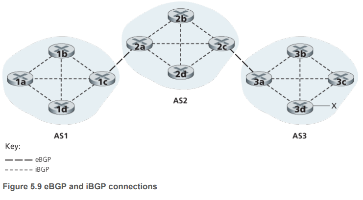

# Routing Among the ISPs: BGP (Border Gateway Protocol)

为了在不同autonomous systems (ASs)之间路由，我们需要一个 **inter-autonomous system routing protocol**. 那不同的ASs之间通信，也得用想统的inter-AS routing protocol.实际上，全互联网都是跑一个叫BGP (Border Gateway Protocol)的协议。

BGP决定了不同的ASs之间是如何路由的。In BGP, packets are not routed to a specific destination address, but instead to CIDRized prefixes, with each prefix representing a subnet or a collection of subnets.

**Thus, a router’s forwarding table will have entries of the form (x, I), where x is a prefix (such as 138.16.68/22) and I is an interface number for one of the router’s interfaces.**

BGP有两个任务：
- Obtain prefix reachability information from neighboring ASs. BGP允许每个subnet向全互联网宣告自己的存在。

- Determine the "best" routes to the prefixes. 一个路由器会知道到达同一个prefix的不同路径。 To determine the best route, the router will locally run a BGP route selection procedure.

下面我们慢慢看BGP是怎么完成这两项任务。

## Advertising BGP Routing Information

如图5.8, AS3有网络前缀x. 每个路由器，要么是gateway router，要么是internal router. Gateway router是一个AS中直接与其他ASs相连的路由器。

先举一个不那么准确但是很直观的例子。AS3怎么告诉AS2和AS1自己存在呢？首先，AS3给AS2发一个BGP message "AS3 x"，然后AS2再把这个message发送给AS1，但是这次message就是"AS2 AS3 x".这样子发送的话，AS1还能知道怎么找到AS3 (通过AS2找到AS3即可).

现在讲真正是怎么操作的。In BGP, pairs of routers exchange routing information over **semi-permanent TCP connections using port 179**. 

Each such TCP connection, along with all the BGP messages sent over the connection, is called a **BGP connection**. 

Furthermore, a BGP connection that spans two ASs is called an external BGP (eBGP) connection, and a BGP session between routers in the same AS is called an internal BGP (iBGP)
connection. 如下图5.9所示，看图例。

现在重新讲上文的例子。AS3怎么告诉AS2和AS1自己存在呢？首先，router a3给router 2c发"AS3 x"这是个eBGP message, 然后router 2c给AS2里面所有路由器（包括router 2a）都发一个iBGP message "AS3 x"，接着router 2a给router 1c发eBGP message "AS2 AS3 x"，最后router 1c给AS1所有路由器都发送iBGP message "AS2 AS3 x".

这样操作的结果就是，一个AS要到目的AS，可能会有不同的路径。

## Determining the Best Routes
先介绍一些术语。In BGP jargon, a prefix along with its attributes is called a **route**. Two of the more important attributes are AS-PATH and NEXT-HOP. 

- The **AS-PATH** attribute contains the list of ASs through which the advertisement has passed, as we’ve seen in our examples above. To generate the AS-PATH value, when a prefix is passed to an AS, the AS adds its **ASN (AS Number, globally unique)** to the existing list in the AS-PATH. 如下图，从AS1到子网x，可以有AS-PATH "AS2 AS3"，也可以有AS-PATH "AS3".

- The **NEXT-HOP** is the **IP address** of the router interface that begins the AS-PATH. 还是搞个那个例子"IP of router a2; AS2 AS3; x"和"IP of router 3d; AS3; x".

### BGP Hot Potato Routing
这个算法，是BGP完整的路由里面可能会发生的一个步骤。

我们终于要开始讲BGP路由算法了，我们讲解最简单的算法 -- **hot potato routing**.

还是刚刚的例子：假设一个包从router 1b出发，到AS3. AS1到AS3有两条路，第一条是"AS1 AS2 AS3",第二条是"AS1 AS3". 假设每一跳的代价都是1.

从当前的AS1走出去，有两条路，一个是到router 2a (到AS2)，另一个是到router 3d (到AS3). Router 1b就会咨询它的intra-AS routing information to find the least-cost intra-AS path to NEXT-HOP router 2a and the least-cost intra-AS path to NEXT-HOP router 3d.发现前者是2 hops, 后者是3 hops. 前者代价小，于是选择先到NEXT-HOP router 2a (AS2). 从这一个步骤，我们可以理解这个算法为什么叫"hot potato"？中文其实是“烫手山芋”，以最快的速度丢给下一个ISP.这是一个selfish algorithm.

### BGP Route-Selection algorithm
那么完整的BGP路由是怎么发生的呢？

现在的任务就是从当前gate way router规划一条路线，要经过哪些ISP，才能到达目的ISP. 这个算法的输入是所有已经学习到的，从当前路由器出发，到目的ISP的路径，输出就是代价最小路径。

BGP会按顺序执行下面的elimination rules，直到只剩下一条路径：
1. 选择拥有highest local preference value的路径。有可能有很多条路径都有这个最大值。local preference是路径(route)的其中一个attribute. The local preference of a route could have been set by the router or could have been learned from another router in the same AS. The value of the local preference attribute is a **policy decision (后面会讲)** that is left entirely **up to the AS’s network administrator**. 
2. 最短路径。The route with the **shortest AS-PATH** is selected.  If this rule were the only rule for route selection, then BGP would
be using a **DV algorithm** for path determination, where the distance metric uses the number of **AS hops** rather than the number of router hops.
3. 如果还不行。**Hot potato routing** is used, that is, the route with the closest NEXT-HOP router is selected.
4. If more than one route still remains, the router uses **BGP identifiers** to select the route.

## IP-anycast Service

在讲任播(anycast)之前，先讲解单播，多播，广播的概念。

### 单播 Unicast
In computer networking, unicast is a one-to-one transmission from one point in the network to another point; that is, one sender and one receiver, each identified by a network address.

Internet Protocol unicast delivery methods such as Transmission Control Protocol (TCP) and User Datagram Protocol (UDP) are typically used.

### 多播 Multicast

### 广播 Broadcast

### 任播 Anycast
BGP除了是用作inter-AS routing protocol，还经常用来实现IP-anycast service, which is commonly used in DNS. 还记得IPv4提过anycast address这个概念吗？

为什么要提出IP-anycast这个概念呢？
- 很多应用需要在不同服务器放同样的内容，这些服务器放在不同地方；
- 让每个用户发请求的时候，我们是让距离用户最近的服务器回复的。

例如，a CDN may replicate videos and other objects on servers in different countries. Similarly, the DNS system can replicate DNS records on DNS servers throughout the world.

看图中的文字。

## Routing Policy

- ABC是backbone provider networks. ABC directly send traffic to each other, and provide full BGP information to their customer network.
- **All traffic entering an ISP access network must be destined for that network**.
- **All traffic leaving an ISP access network must have originated in that network**.
- W and Y are clearly access ISPs. X is a **multi-homed access ISP**，也叫stub AS，也不会给别人当free rider.
- 总而言之，ISP不想给别的ISP当free rider.

AS被分为以下三类：
1. Stub AS: an AS that has only a single connection to one other AS; such an AS will only carry local traffic.
2. Multihomed AS: an AS that has connections to more than one other AS, but refuses to carry transit traffic.
3. Transit AS: an AS that has connections to more than one other AS, and is designed to carry both transit and local traffic.

这里谁是谁不重要,看题目意思.

这里由于w和x都是在P的地址范围内,所以对于Q来说,没有必要知道P的内网细节,就保存一个目的地址P就行,所有要发到w和x的包都发到P就行了.

但是对于R来说,R也会告诉Q,自己能发东西到X,为什么呢?因为X首先是R的customer,其次X不在R的地址范围内, Q接收到R的这个Advertise后就会根据最长匹配(跟P那条路由比较)规则,把发往X的包都发给R.
