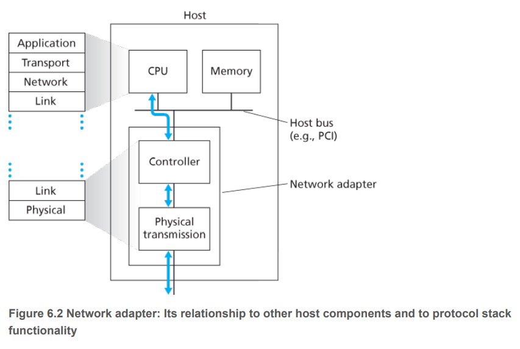

# Link Layer

- 在这一章节里面，任意跑link-layer protocol的设备都叫一个**node**. Nodes include hosts, routers, switches and WIFI access points. 

- We will also refer to the communication channels that connect adjacent nodes along the communication path as **links**.

- Over a given link, a transmitting node encapsulates the datagram in a **link-layer frame** and transmits the frame into the link.

## The Services provided by the Link Layer
- Framing.
- Link access.
- Reliable delivery. A link-layer reliable delivery service is often used for links that are prone to high error rates, such as a wireless link. 
- Error detection and correction.

## Where Is the Link Layer Implemented?

回想网络层的章节，我们说the link layer is implemented in a router's line card.

For the most part, the link layer is implemented in a **network adapter**, also sometimes known as a **network interface card (NIC)**.

## Error Detection and Correction Techniques

- Parity Checks
- Checksumming Methods
- Cyclic Redundancy Check (CRC)
