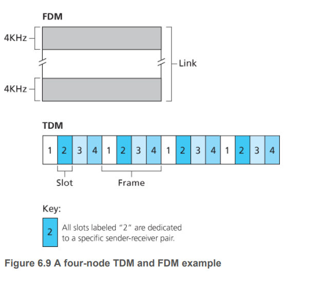
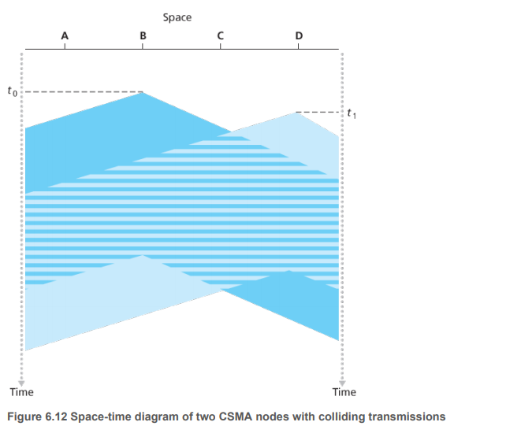
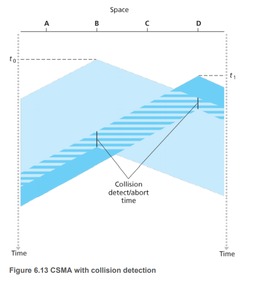

# Multiple Access Links and Protocols

Two types of network links:

1. **Point-to-point link.** 信道两端都只有一个人。很多协议都是为point-to-point link设计的，例如Point-to-point protocol (PPP) and high-level data link control (HDLC).
2. **Broadcast link.** 可以同时有多个发送者与多个接收者。

广播信道会有什么问题？

碰撞！当两个人同时发的时候，就会发生碰撞。这个协调工作就是由multiple access protocol来完成的。

我们可以把multiple access protocol来分成三类：
1. Channel partitioning protocols.
2. Random access protocols.
3. Taking-turns protocols.

我们会一一介绍。

Ideally, a multiple access protocol for a broadcast channel of rate R bps should have the following desirable characteristics:

1. 当只有一个发送者发送的时候，这个发送者吞吐量为R bps.
2. 当M个节点都有数据要发送，每个节点有R/M bps的吞吐量，但是这并不意味着所有节点没事每个都有R/M bps的发送速率，这个R/M bps是一个平均发送速率。
3. 这个协议是decentralized的。
4. 这个协议实现起来代价小。

## Channel Partitioning Protocols

1. TDM and FDM.

2. CDMA assigns a different code to each node. Each node then uses its unique code to encode the data bits it sends.

## Random Access Protocols
发送者总是利用最大发送速率，碰撞的时候就随机等待一段时间再发送。
### ALOHA

### CSMA/CD (Carrier Sense Multiple Access with collision detection)

两个重要原则：
1. Listen before speaking. 这是carrier sensing.
2. If someone else begins talking at the same time, stop talking. 这是collision detection.

水平方向是传输介质，竖直方向是时间。在时间t0, B检测到没有人发东西，于是往广播信道里面发送了信号，然后信号开始向两边扩散。D在t1时刻，也没有检测到有人在发东西，（因为B发的信号还没到），于是阴影部分，两个人的信号发生了碰撞。

在这里面，两条短的实竖线表示检测到了碰撞。

在分析CSMA/CD协议前，let us now summarize its operation from the perspective of an adapter (in a node) attached to a broadcast channel:
1. The adapter从网络层收到一个包，于是封装成一个frame, 放到adapter buffer里面。
2. 当检测到信道空闲，开始发送，如果信道不空闲，等到空闲再发送，
3. 当发送的时候，检测到从别的地方来的信号能量，就会终止自己的发送，如果一直没有检测到，就当作发送完成了。
4. 如果是终止发送，adapter会随机等待一段时间，再回到步骤2.

那到底怎么选这个随机的等待时间才合理呢？太短待会又碰撞了，太长就浪费时间浪费信道资源。有一个**binary exponential backoff**算法，当一个adapter遇到第n次碰撞的时候，会在下面的时间随机选一个{0, 1, 2, 4, ..., 2^(n-1)}.

## Taking-Turns Protocols

1. Polling protocol. 有一个master node, polls each of the nodes in a **round-robin fashion**. 好处就是没有碰撞了。坏处就是，首先，有polling delay，就算只有一个node需要发数据，master还是要问问别的nodes有没有许局要发，其次，如果master node死机了，那么整个网络都完蛋。802.15协议和蓝牙协议都是polling protocols的例子。

2. Token-passing protocol. 这里没有master node. 整个网路都维护一个token，这是一个small special-purpose frame. 当一个node持有这个token的时候，它才可以发数据，然后把token再传递给别人，然后别人再发数据。但是这么做也有缺点，如果持有token的node死机了，那...

##

