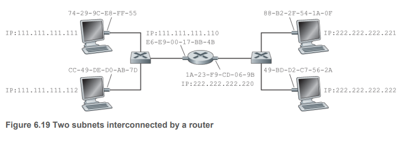

# Switched Local Area Networks

如图，两个服务器，一个路由器，四个交换机。交换机工作在Link-layer，并不认识什么IP地址和路由算法，它使用Link-layer address来发送link-layer frame.

## Link-Layer Addressing and ARP (Address Resolution Protocol)
一个很自然的问题，为什么路由器已经有IP地址了，也还是有一个link-layer地址？我们后面会讲，先剧透一下，ARP会提供一种方法：把IP地址翻译成link-layer addresses.

### Mac addresses (physical address, LAN address, link-layer address)
实际上link-layer address是在host, router and switch的adapter上，adapter也叫network interfaces网卡. 如果一个host或者router有多个网卡，就意味着有多个IP地址和link-layer地址。**一定要注意，交换机是没有link-layer addresses associated with their interfaces that connect to hosts and routers.这是因为，交换机的工作是把包发给目标主机，This is because the job of the link-layer switch is to carry datagrams between hosts and routers; a switch does this job transparently, that is, without the host or router having to explicitly address the frame to the intervening switch.看下图6.16**

Mac地址的长度为6字节。Mac地址是永久分配的，但是现在我们也可以通过软件来修改，我们接下来的讨论都假设Mac地址是固定的。

每张网卡的Mac地址都是不一样的，网卡在不同厂家生产，如何保证不一样吗？IEEE是管理Mac地址哦那关键的机构，厂家得花钱买。

当一个网卡想要发一个frame给另一个网卡，这个网卡会在frame里面放进目标Mac地址然后发出去。有时候发送者会广播这个frame，用的是Mac广播地址FF-FF-FF-FF-FF-FF.

### Address Resolution Protocol (ARP)

#### Why both IP address and Mac address
1. LAN是会有不同network-layer协议的，并不一定是IP协议，如果一个适配器只有IP地址，而没有中立的Mac地址，适配器就很难直持不同的网络层协议（例如IPX or DECnet).
2. 如果只用IP地址，这个就会被存在适配器的RAM里面，然后每次重启设备都要重新配置IP地址。

我们先讲讲为什么会有将IP地址翻译成link-layer地址的需求。我们看图6.17

为了方便,我们假设交换机广播所有frames. 后面我们会更详细地讲交换机怎么运作.

如果**主机C现在要发东西给主机A**,主机C当然是会带上自己IP和目标IP,当然也会带上自己的Mac地址和目标Mac地址,但他有怎么知道目标Mac地址呢?

这时候ARP模块就起作用了,ARP模块是在主机C里面实现的,他会告诉你目标IP的Mac地址是什么. 这有点像DNS服务,把域名翻译成IP地址，**但ARP协议不同，他只会翻译同一个子网下的IP地址到Mac地址的映射**. 

每个host和router都会在自己的内存里面存了一张**ARP table**.

好了,回到刚刚的问题.主机C要发东西给主机A,现在主机C要去自己的ARP table查主机A的Mac地址,找到,那就好办,要是找不到呢?

先引入一个属于ARP packet. An ARP packet has several fields, including the sending and receiving IP and MAC addresses. Both ARP query and response packets have the same format. The purpose of the ARP query packet is to **query all the other hosts and routers on the subnet to determine the MAC address corresponding to the IP address that is being resolved**.

现在主机C就会进行广播找人,使用广播地址FF-FF-FF-FF-FF-FF作为目标地址. 由于是广播地址,所有接到这个包的人,都会再广播一遍. 只要有一个设备他的ARP Table里面有主机C的Mac地址,就会回复一个response ARP packet, 但这不能是一个广播,只能是回复给主机C. 请详细思考这个问题.

### Sending a Datagram off the Subnet
问题又来了,那我如果要把包发到外网怎么办?我总不能还知道外网的某个主机的Mac地址吧. 我们看图6.19

左边为子网1, 111.111.111.xxx/24. 
右边为子网2, 222.222.222/24.

我们想想子网1的主机111.111.111.111怎么发一个包到子网2的主机222.222.222.222? 实际上会先发到自己的网关路由器,也就是111.111.111.110这时候的目标Mac地址就是E6-E9-00-17-BB-4B. 然后你的网关路由器就会根据路由表去找要从哪个interface发出去, 然后会选择从222.222.222.220发出求,这个包就会从这个接口的ARP Table找到目标主机222.222.222.222的Mac地址,然后作为目标Mac地址.

## Ethernet

维基百科:

以太网（英語：Ethernet）是一种计算机局域网技术。 IEEE組織的IEEE 802.3标准制定了以太网的技术标准，它规定了包括物理层的连线、电子信号和介质访问控制的内容。 以太网是目前应用最普遍的局域网技术，取代了其他局域网标准如令牌环、FDDI和ARCNET。

以太网的标准拓扑结构为总线型拓扑，但目前的快速以太网（100BASE-T、1000BASE-T标准）为了减少冲突，将能提高的网络速度和使用效率最大化，使用交换机（Switch hub）来进行网络连接和组织。如此一来，以太网的拓扑结构就成了星型；但在逻辑上，以太网仍然使用总线型拓扑和CSMA/CD（Carrier Sense Multiple Access/Collision Detection，即载波多重访问/碰撞侦测）的总线技术。

以太网发展史:

The original Ethernet LAN was invented in the mid-1970s by Bob Metcalfe and David Boggs. The original Ethernet LAN used a **coaxial bus** to interconnect the nodes. **Bus topologies** for Ethernet actually persisted throughout the 1980s and into the mid-1990s. Ethernet with a bus topology is a broadcast LAN — all transmitted frames travel to and are processed by all adapters connected to the bus. Recall that we covered Ethernet’s CSMA/CD multiple access protocol with binary exponential backoff in Section 6.3.2.

By the late 1990s, most companies and universities had replaced their LANs with Ethernet installations using a **hub-based star topology**. In such an installation the hosts (and routers) are directly connected to **a hub with twisted-pair copper wire**. **A hub is a physical-layer device** that acts on individual bits rather than frames. When a bit, representing a zero or a one, arrives from one interface, the hub simply recreates the bit, boosts its energy strength, and transmits the bit onto all the other interfaces. Thus, Ethernet with a hub-based star topology is also a broadcast LAN—whenever a hub receives a bit from one of its interfaces, it sends a copy out on all of its other interfaces. In particular, if a hub receives frames from two different interfaces at the same time, a **collision occurs** and the nodes that created the frames must retransmit.

In the early 2000s Ethernet experienced yet another major evolutionary change. Ethernet installations continued to use a star topology, **but the hub at the center was replaced with a switch**. 最终集线器被交换机所取代.

我们会详细讲交换机为什么碰撞会少一点. 交换机还是一个 bona-fide store-and-forward packet switch.

### Ethernet Frame Structure

- **Data field (46 - 1500 bytes)**. The maximum transmission unit
(MTU) of Ethernet is 1,500 bytes. This means that if the IP datagram exceeds 1,500 bytes, then the host has to fragment the datagram. The minimum size of the data field is 46 bytes. This means that if the IP datagram is less than 46 bytes, the data field has to be “stuffed” to fill it out to 46 bytes.
- **Destination address (6 bytes)**. 
- **Source address (6 bytes)**.
- **Type field (2 bytes)**. The type field permits Ethernet to multiplex network-layer protocols. 
- **Cyclic redundancy check (CRC) (4 bytes)**.
- **Preamble (8 bytes)**. Each of the first 7 bytes of the preamble has a value of 10101010; the last byte is 10101011. The first 7 bytes of the preamble serve to “wake up” the receiving adapters and to synchronize their clocks to that of the sender’s clock. Why should the clocks be out of synchronization? Keep in mind that adapter A aims to transmit the frame at 10 Mbps, 100 Mbps, or 1 Gbps, depending on the type of Ethernet LAN.

## Link-Layer Swithes

### Forwarding and Filtering

### Self-Learning

### Properties of Link-Layer Switching

### Switches Versus Routers

## Virtual Local Area Networks (VLANS)
