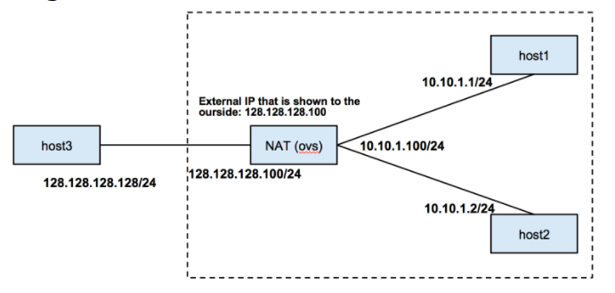
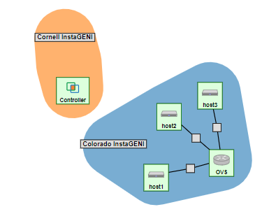

# OpenFlow NAT Router

In this tutorial you will learn how to build a router for a network with a private address space that needs a **one-to-many NAT** (IP Masquerade) using **OpenFlow**. We will use the following network topology for this experiment. You will also learn how to **take advantage of kernel L3 routing while using OVS**.

## Setup the topology

