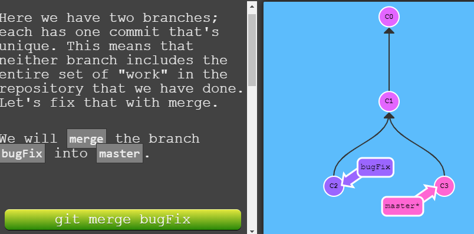
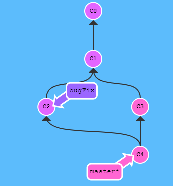
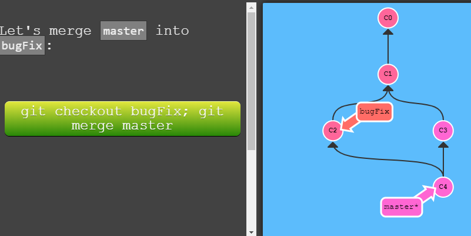
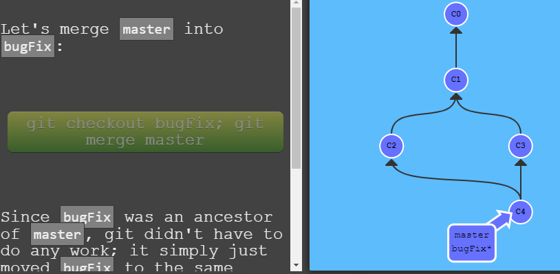
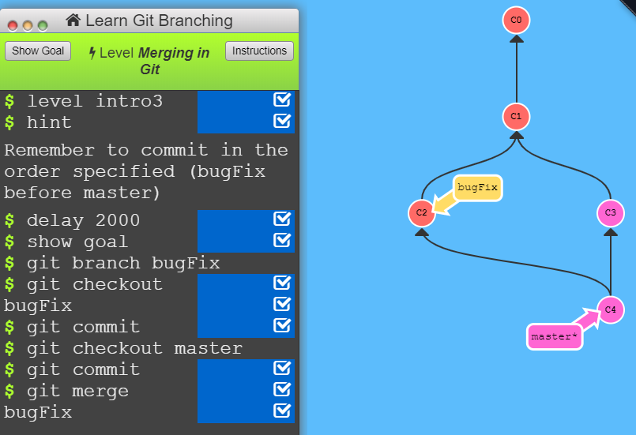
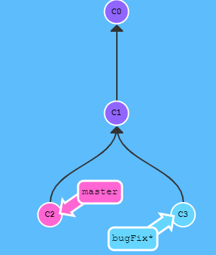
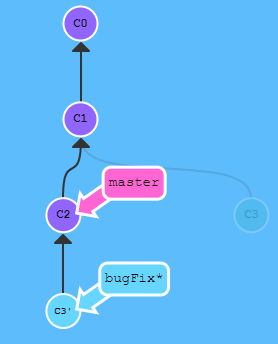
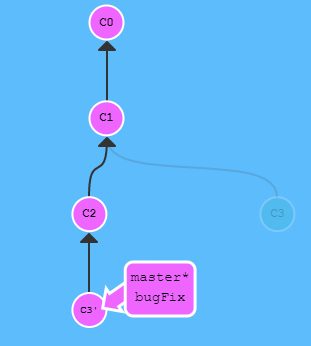
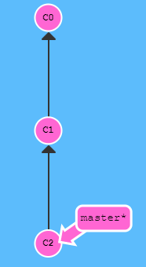
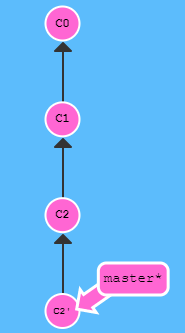

# Git Basics


https://learngitbranching.js.org/

https://www.liaoxuefeng.com/wiki/896043488029600


## Introduction
Push data to remote repository.
1. git add 
2. git commit
3. git push

Pull data from remote repository.
1. git stash
2. git pull
3. git stash pop
4. 本地冲突处理

## Git Branches
Branches in Git are incredibly lightweight as well. They are simply pointers to a specific commit -- nothing more. 

This is why many Git enthusiasts chant the mantra:

`
branch early, and branch often
`


```
$ git branch BranchName
```

如果现在git commit,这个刚刚开的branch不会跟着master走。

That's because we weren't "on" the new branch, which is why the asterisk (*) was on master.

*星号star sign代表什么？代表当前工作的branch吗？

这样搞
```
$ git checkout <name>
```

## Git Merging
Now we need to learn some kind of way of **combining the work from two different branches together**.

This will allow us to branch off, develop a new feature, and then combine it back in.

### git merge
背景：把开发好的新的feature分支合并到dev分支。
```
$ git checkout dev
$ git merge feature
```

Merging in Git creates a special commit that has two unique parents. 

A commit with two parents essentially means "I want to include all the work from this parent over here and this one over here, and the set of all their parents."

#### We will merge the branch bugFix into master.


```
$ git merge bugFix
```



// TODO
How about confliction? 冲突了怎么办？
#### We will merge the branch bugFix into master.


Since bugFix was an ancestor of master, git didn't have to do any work; it simply just moved bugFix to the same commit master was attached to.

```
git checkout bugFix;
git merge master;
```

Now all the commits are the same color, which means each branch contains all the work in the repository! Woohoo!



#### Practice
1. Make a new branch called `bugFix`
2. Checkout the `bugFix` branch with `git checkout bugFix`
3. Commit once
4. Go back to `master` with `git checkout`
5. Commit another time
6. Merge the branch `bugFix` into `master` with `git merge`

```
$ git branch checkout
$ git checkout branch
$ git commit

$ git checkout master
$ git commit
$ git merge bugFix
```



## git rebase



We would like to move our work from bugFix directly onto the work from master. That way it would look like these two features were developed sequentially, when in reality they were developed in parallel.

```
$ git rebase master
```



```
$ git rebase bugFix
```




## Head
HEAD is the symbolic name for the currently checked out commit -- it's essentially what commit you're working on top of.

HEAD always points to the most recent commit which is reflected in the working tree. Most git commands which make changes to the working tree will start by changing HEAD.

Normally HEAD points to a branch name (like bugFix). When you commit, the status of bugFix is altered and this change is visible through HEAD.

```
$ git checkout commit_hash
```
类似checkout branch

## git log
In the real world you won't have a nice commit tree visualization next to your terminal, so you'll have to use `git log` to see hashes.

## Relative commits

### Moving upwards one commit at a time with ^
```
$ git checkout master^
```
Head就回到了master的parent.

### Moving upwards a number of times with ~\<num>
```
$ git checkout head~4
```

## Branch forcing
// TODO 啥意思

You can directly reassign a branch to a commit with the -f option. So something like:
```
$ git branch -f master HEAD~3
```
moves (by force) the master branch to three parents behind HEAD.

## Reversing changes in Git
Reversing changes in Git has both a low-level component (staging individual files or chunks) and a high-level component (how the changes are actually reversed).

There are two primary ways to undo changes in Git -- one is using `git reset` and the other is using `git revert`.

### git reset
`git reset` reverts changes by moving a branch reference backwards in time to an older commit. In this sense you can think of it as "rewriting history;" git reset will move a branch backwards as if the commit had never been made in the first place.
```
$ git reset HEAD~1
```

### git revert
While resetting works great for local branches on your own machine, its method of "rewriting history" doesn't work for remote branches that others are using.

In order to reverse changes and share those reversed changes with others, we need to use `git revert`.



```
$ git revert HEAD
```



A new commit plopped down below the commit we wanted to reverse. That's because this new commit C2' introduces changes -- it just happens to introduce changes that exactly reverses the commit of C2.

With reverting, you can push out your changes to share with others.

## git cherry-pick
Copy a series of commits below your current location (HEAD).

This could be accomplished through a rebase (which we have already learned), but let's see how cherry-pick performs.
```
$ git cherry-pick C2 C4
```

只提取C2和C4的更改，C3不提取？

## git rebase -i HEAD~3
用UI来拖拽调整commit的顺序。


