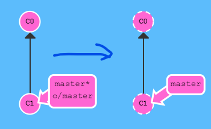

# Git Remotes

Remote repositories have a bunch of great properties

1. Remotes serve as a great backup! Local git repositories have the ability to restore files to a previous state (as you know), but all that information is stored locally. By having copies of your git repository on other computers, you can lose all your local data and still pick up where you left off.
2. Remotes make coding social! Now that a copy of your project is hosted elsewhere, your friends can contribute to your project (or pull in your latest changes) very easily.

## git clone
```
$ git clone 
```



## git fetch
we will learn how to fetch data from a remote repository -- the command for this is conveniently named git fetch.

```
$ git fetch
```

从远程仓库获取数据。

## git pull
In fact, the workflow of fetching remote changes and then merging them is so common that git actually provides a command that does both at once! That command is git pull.

