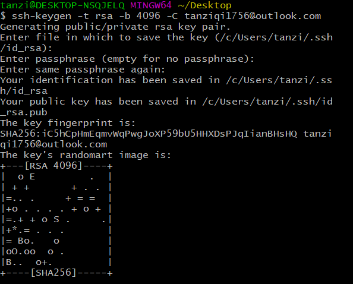
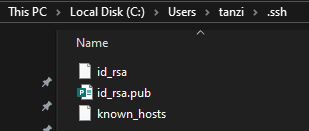
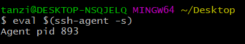
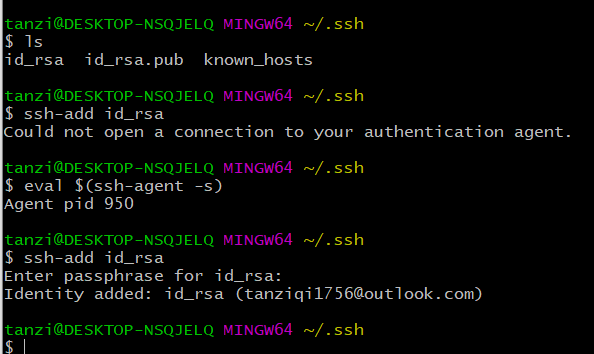
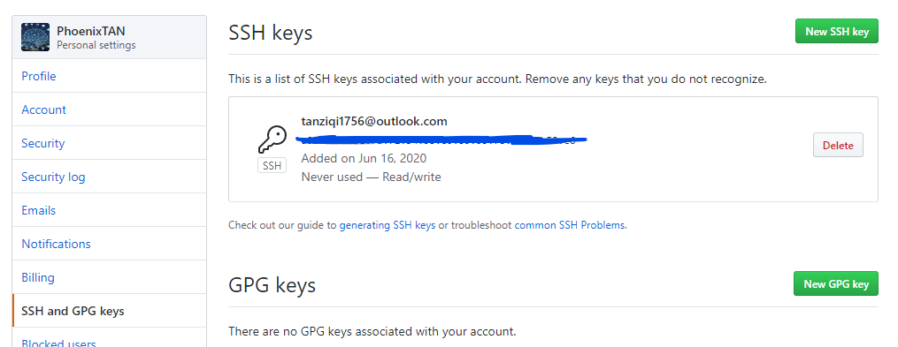
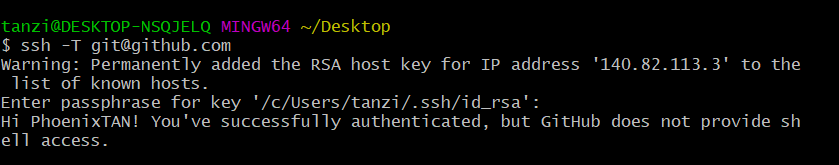
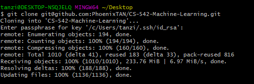

# Connecting to GitHub with SSH

https://help.github.com/en/github/authenticating-to-github/connecting-to-github-with-ssh

## Generating a new SSH key and adding it to the ssh-agent

### Generating a new SSH key
1. Open Git Bash.
2. Paste the text below, substituting in your GitHub email address.
```
$ ssh-keygen -t rsa -b 4096 -C "your_email@example.com"
```

This creates a new ssh key, using the provided email as a label.

```
> Generating public/private rsa key pair.
```

3. When you're prompted to "Enter a file in which to save the key," press Enter. This accepts the default file location.

```
> Enter a file in which to save the key (/c/Users/you/.ssh/id_rsa):[Press enter]
```
4. At the prompt, type a secure passphrase. For more information, see "Working with SSH key passphrases".
```
> Enter passphrase (empty for no passphrase): [Type a passphrase]
> Enter same passphrase again: [Type passphrase again]
```



### Adding your SSH key to the ssh-agent


git for windows
```
$ eval $(ssh-agent -s)
```


Add your SSH private key to the ssh-agent.
```
$ ssh-add ~/.ssh/id_rsa
```


Please do this in the same terminal.



## Adding a new SSH key to your GitHub account

1. Copies the contents of the id_rsa.pub file to your clipboard

2. New SSH key.


## Testing your SSH connection


## git clone with SSH


