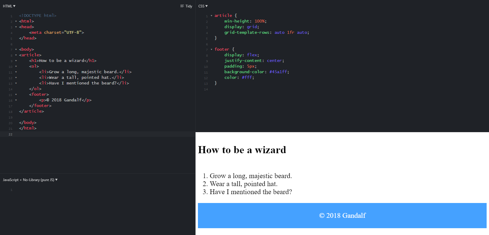

# HTML and CSS Question

Ziqi

---

## HTML 语义化标签(Sementic tags)是什么，为什么需要？

https://developer.mozilla.org/en-US/docs/Glossary/Semantics
1. 交给浏览器解析并显示给用户。
    accessibility 阅读模式 盲人模式 产品面向什么人群

    Web Accessibility (A11Y) refers to best practices for keeping a website usable despite physical and technical restrictions.
2. 给搜索引擎提供方便。

具体有哪些？
```html
<article>
<aside>
<details>
<figcaption>
<figure>
<footer>
<header>
<main>
<mark>
<nav>
<section>
<summary>
<time>
```

### \<article>
The HTML \<article> element represents a self-contained composition in a document, page, application, or site, which is intended to be independently distributable or reusable (e.g., in syndication). 

Examples include: 
- a forum post, 
- a magazine or newspaper article, 
- or a blog entry.

### \<aside>
The HTML <aside> element represents a portion of a document whose content is only indirectly related to the document's main content. Asides are frequently presented as sidebars or call-out boxes.


### \<footer>


## 引入CSS的方法有哪些？link和imort有哪些区别？
1. HTML文档嵌入式使用style标签。
```html
<style type="text/css">

</style>
```
2. HTML标签内部使用style属性。
```html
<span style="color:blue">超酷的互联网</span>
```
3. 外部式。
index.html
```HTML
<head>
<link href="style.css" rel="stylesheet" type="text/css" />
</head>
```

style.css
```CSS
span{
    color: red;
    font-size: 20px;
}
```

或者使用import.
```html
<style>
    @import style.css
</style>

```

**import和link的区别**
1. link是XHTML标签，除了加载CSS外，还可以定义RSS等其他事务；@import属于CSS范畴，只能加载CSS.
link是html引擎先读，然后读出来的css交给css引擎去处理。
2. link引用CSS时，在页面载入时同时加载；@import是浏览器解析CSS的时候执行的，所以是不知道什么时候执行的。
W3C的规范。

知道为什么闪烁：
所以会出现一开始没有css样式，闪烁一下出现样式后的页面(网速慢的情况下).

异步加载：遇到这个async就异步加载，html继续加载，不会block.

html, css, javascript三个不同引擎

## 伪类是什么？什么时候会用到？
CSS 伪类 是添加到选择器的关键字，指定要选择的元素的特殊状态。

例如，:hover 可被用于在用户将鼠标悬停在按钮上时改变按钮的颜色。

具体有哪些？
看W3C
https://www.w3schools.com/css/css_pseudo_classes.asp


## 伪元素是什么？什么时候会用到？
例子：首字下沉，首行缩进
虚元素注意是两个冒号
```css
p::first-letter{
    color: #ff0000;
    font-size: xx-large;
}
```

before

after

## 把竖着排列的元素变横有哪些方法？
1. div是块状元素，默认按列排，使用
```css
div {
    width: 200px;
    float: left;
}
```
让其元素从左到右排，应该需要规定一个宽度。

或者使得内部块状元素变成inline-block.

2. display: flex; justify-content


## 让一个元素左对⻬、右对⻬有哪些方法？
1. text-align: left
2. left: 0
3. float: left | right

float可以用来布局，但是不是用来布局，float相当于用文字环绕图片。
例如：给image的css设置成float:right.

## 让一个元素水平居中、垂直居中有哪些方法？
1. 对于块状元素，相对定位，绝对定位配合使用。子容器使用margin.
2. 使用margin: auto
3. text-align

居中是container的size固定，然后用flex居中

```css
display: flex;
justify-content: center;
align-items: center;
```

```html
<!DOCTYPE html>
<html>
    <head>
        <meta charset="UTF-8">
        <style type="text/css">
            .container {
                border: 1px solid black;
            }
            .center {
                margin: auto;
                width: 50%;
                border: 3px solid green;
                padding: 10px;

                text-align: center;
            }
            .vertical {
                padding: 70px 0;
                border: 1px solid red;
                text-align: center;
            }
            .vertical2 {
                line-height: 200px;
                height: 200px;
                border: 3px solid green;
                text-align: center;
            }
            .vertical2 p {
                line-height: 1.5;
                display: inline-block;
                vertical-align: middle;
            }
        </style>
    </head>

    <body>
        <div class="container">
            <div class="center">
                div 元素水平居中
            </div>
        </div>
        
        <div class="container">
            <div class="vertical">
                div 元素垂直居中
            </div>
        </div>

        <div class="container">
            <div class="vertical2">
                div 元素垂直居中
            </div>
        </div>

        <div class="container">
            <div class="vertical2">
                <p>
                    第一行第一行第一行第一行第一行第一行第一行第一行第一行第一行
                </p>
            </div>
        </div>

    </body>
</html>


```
4. 垂直居中 - 使用 position 和 transform
用得最多
```css
.center { 
    height: 200px;
    position: relative;
    border: 3px solid green; 
}
 
.center p {
    margin: 0;
    position: absolute;
    top: 50%;
    left: 50%;
    transform: translate(-50%, -50%);
}
```


## 哪些CSS属性会继承？那些不会？
https://www.w3.org/TR/CSS21/propidx.html

https://www.jianshu.com/p/34044e3c9317

例如：
1. 可以继承

\<p>标签的颜色属性，其内部的\<span>标签\<em>标签可以继承。

2. 不可以继承
    1. 宽度
    2. 定位布局


## css的尺寸单位有哪些，每个的应用场景是什么？
1. px. pixel.

2. em: 当前元素的font-size = 1em.

3. %: 当前元素字体的百分比，屏幕的百分比。

常用的
pm em 
rem 
vmin 
vmax


## 如何做一个底栏能够一直在底部的(sticky-footer)?
```html
<html>
    <head>
        <meta charset="UTF-8">
        <style type="text/css">
            #footbar {
                position: fixed;
                bottom: 10px;
                right: 50%;
                
                border: 3px solid #73AD21;
            }
        </style>
    </head>

    <body>
        <footer id="footbar">
            I am footer part.
        </footer>
    </body>
</html>
```

搜一下
sticky 
跟fixed跟相似

## media-query是什么？有什么用？
@meida
made it possible to define different style rules for different media types.

具体能query干什么

## line-height有什么用？跟height有什么区别？
```html
<html>
    <head>
        <meta charset="UTF-8">
        <style type="text/css">
            div {
                height: 100px;
                width: 200px;
                border: 3px solid black;
            }

            p {
                font-size: 20px;
                line-height: 40px;
            }
        </style>
    </head>

    <body>
        <div>
            <p>
                hellooooooooooooooooooooooooooooooooooooo <br />
                hellooooooooooooooooooooooooooooooooooooo <br />
            </p>
        </div>
    </body>
</html>
```


## display都有哪些属性？使用场景分别是什么？
display: none | inline | block | inline-block | flex

https://www.w3schools.com/cssref/pr_class_display.asp

list-item
table
inline-table
inline-flex

## position都有哪些属性？使用场景分别是什么？
position: relative | absolute | fixed

默认: static

relative: The element is positioned relative to its normal position, so "left:20px" adds 20 pixels to the element's LEFT position

absolute: The element is positioned relative to its first positioned (not static) ancestor element.

## css中，百分比的使用，是谁的百分比？
这个百分比是一个相对值，取决于具体情况。
比如：
1. 相对于屏幕。
2. 相对于父容器。
3. 相对于当前元素。

position相对于谁。

https://www.zhihu.com/question/36079531


```html
<!DOCTYPE html>
<html>
    <head>
        <meta charset="UTF-8">
        <style type="text/css">
            .screen {
                width: 70%;
                border: 1px solid black;
            }
            .container {
                width: 500px;
                height: 500px;
                border: 1px solid black;
            }
            .cube {
                width: 50%;
                height: 70%;
                border: 1px solid red;
            }
            p {
                font-size: 12px;
                line-height: 300%;
            }
        </style>
    </head>

    <body>
        <div class="screen">
            相对于整个屏幕的百分比
        </div>

        <div class="container">
            父容器
            <div class="cube">
                子容器
            </div>
        </div>
        <div>
            <p>
                行高百分比 <br />
                行高百分比 <br />
                行高百分比 <br />
            </p>
        </div>

    </body>
</html>
```


## html中的\<meta name="viewport">标签有什么用？
Setting the viewport to make your website look good on all devices:
```html
<meta name="viewport" content="width=device-width, initial-scale=1.0">
```

针对移动端的，对桌面浏览器没有作用

The **width=device-width** part sets the width of the page to follow the screen-width of the device (which will vary depending on the device).

The **initial-scale=1.0** part sets the initial zoom level when the page is first loaded by the browser.

## Js有哪些引入方法？放在head里面跟body里面有什么区别？放在body的开头跟结尾有什么区别？
1. 放在任意位置。
2. 使用script.
```html
<script src="script.js"></script>
```

区别：
- 浏览器解析html是从上到下的。
如果把javascript放在head里的话，则先被解析,但这时候body还没有解析，所以会返回空值。一般都会绑定一个监听，当全部的html文档解析完之后，再执行代码：
```javascript
   windows.οnlοad=function(){
       //这里放入执行代码
   }
```
- head 部分中的脚本: 需调用才执行的脚本或事件触发执行的脚本放在HTML的head部分中。当你把脚本放在head部分中时，可以保证脚本在任何调用之前被加载。

放第三方的库。

- body 部分中的脚本: 当页面被加载时执行的脚本放在HTML的body部分。放在body部分的脚本通常被用来生成页面的内容。


async

搜一下
CDN


