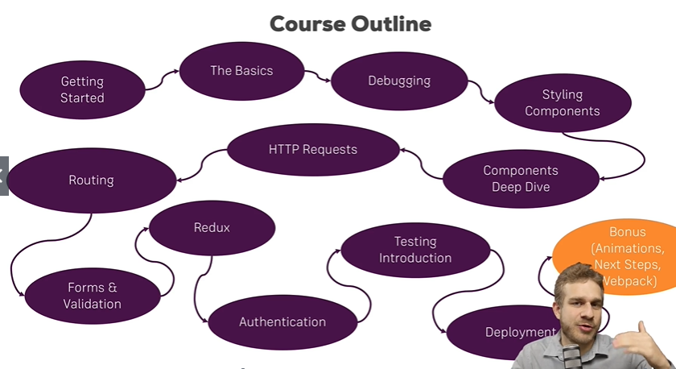

# React (web framework) Introduction

https://www.udemy.com/course/react-the-complete-guide-incl-redux/

https://reactjs.org/

React (also known as React.js or ReactJS) is an open-source JavaScript library for building user interfaces.

**React apps run in the browser. They don't run on the server.**


```
<script src="https://cdnjs.cloudflare.com/ajax/libs/react/16.13.1/umd/react.production.min.js"></script>

<script src="https://cdnjs.cloudflare.com/ajax/libs/react-dom/16.13.1/umd/react-dom.production.min.js"></script>
```

## Two kinds of applications

- Single Page Applications: 整个HTML文件在用户第一次访问服务器的时候，就返回整个HTML文件，整个HTML文件以及里面的组件Components都由React(Javascript)管理。

- Multi-page Applications: 返回多个HTML pages, 例如，在example.com里面，会有example.com/user， 我们还是可以用React，但是只是create little widgets.


## Syllabus



## 安装
1. 安装node.js for npm.
2. create-react-app
3. 第三方库Radium, styled-components, prop-types.
    1. Radium: CSS
    2. styled-components: CSS
    3. prop-types: 设置应该传输的类型
    4. Axios: http request.
    5. Redux: state management library.
    