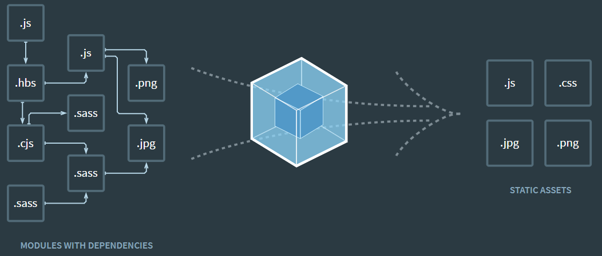

# Webpack

Webpack is an open-source JavaScript module bundler. It is made primarily for JavaScript, but it can transform front-end assets like HTML, CSS, and images if the corresponding loaders are included. webpack takes modules with dependencies and generates static assets representing those modules.

