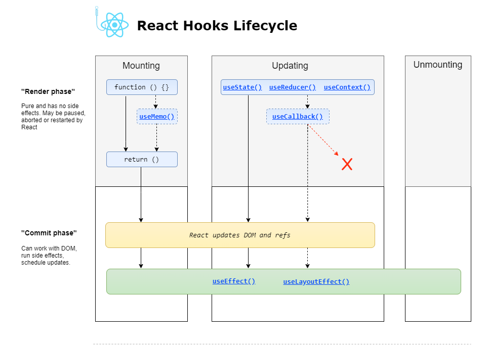
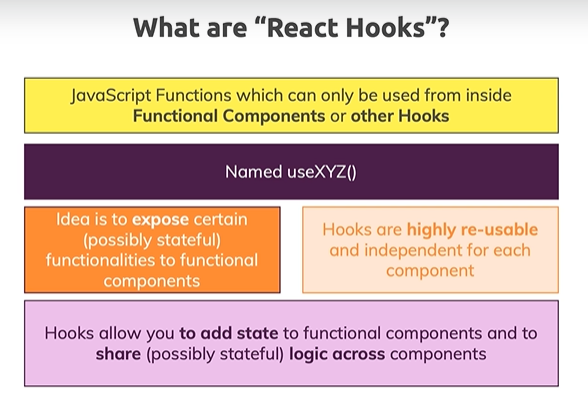

# React Hooks



## Introduction
- Basic Hooks
    - useState
    - useEffect
    - useContext

- Additional Hooks
    - useReducer
    - useCallback
    - useMemo
    - useRef
    - useImperativeHandle
    - useLayoutEffect
    - useDebugValue

Now how do you recognize react hooks?

**React hooks are JavaScript functions** named like this starting with a lowercase use and then your function name something like Use state and so on.



## useState
```javascript
import React, {useState} from 'react';

import Card from '../UI/Card';
import './IngredientForm.css';

const IngredientForm = React.memo(props => {

  const [inputState, changeState] = useState({title: '', amount: ''});
  // useState的参数可以是object，也可以是其他数据类型
  // useState总是返回一个长度为2的数组，
  // 第一个元素是current state
  // 第二个元素是一个函数，这个函数可以更新当前的state
  /*
    const inputState = state[0];
    const changeState = state[1];
  */

  const submitHandler = event => {
    event.preventDefault();
    // ...
  };

  return (
    <section className="ingredient-form">
      <Card>
        <form onSubmit={submitHandler}>
          <div className="form-control">
            <label htmlFor="title">Name</label>
            <input 
              type="text" 
              id="title" 
              value={inputState.title} 
              // 这里把state修改了，这样改是不对的
              // 这样就会用title把原来的整个state替代了
              // 所以要title和amount一起更新
              // 但这样又不是完全正确的，因为不能保证现在的inputState就是最近一次的state
              // 有可能是an older state
              /*
                onChange={event => changeState({
                  title: event.target.value,
                  amount: inputState.amount
                }) } 
              */
              // 这样写，告诉React我们想要用the lastest state
              // 但这样写还有warning，因为event要传给changeState
              // why
              // the outer event will be locked in for the first keystroke,
              // which means that for a subsequent keystrokes we don't use the new keystroke event but the previous one,
              // which of course is then reused and which causes this error.
              /*
                onChange={event => changeState((prevInputState) => ({
                    title: event.target.value,
                    amount: prevInputState.amount
                  })
                )} 
              */
              // 怎么解决?
              onChange={event => {
                const newTitle = event.target.value;
                changeState((prevInputState) => ({
                  title: newTitle,
                  amount: prevInputState.amount
                  })
                )
              }} 
              // 其实并不需要更新两个state
              // 一开始的时候state does not have to be an object
              // we can use multiple states. 这样每次就不用所有都更新了
            />
          </div>
          <div className="form-control">
            <label htmlFor="amount">Amount</label>
            <input 
              type="number" 
              id="amount" 
              value={inputState.amount} 
              onChange={event => {
                const newAmount = event.target.value;
                changeState((prevInputState) => ({
                  title: prevInputState.title,
                  amount: newAmount
                  })
                )
              }} 
            />
          </div>
          <div className="ingredient-form__actions">
            <button type="submit">Add Ingredient</button>
          </div>
        </form>
      </Card>
    </section>
  );
});

export default IngredientForm;

```

## 特别注意!! No nested hook
只能在functional component的最外层使用useState这样的hook,不能再在函数里面useState().
conditional statement和loop里面也不行。
```javascript
const submitHandler = event ={ 
    useState(); // This is wrong
    event.preventDefault();
    // ...
}
```

The Event interface's `preventDefault()` method tells the user agent that if the event does not get explicitly handled, its default action should not be taken as it normally would be.

详细看Practice Section 26的代码！

## useCallback
```javascript
const filteredIngredientsHandler = useCallback(filteredIngredients => {
    setUserIngredients(filteredIngredients);
  }, []);
```

useCallback() caches the function for every re-render cycle.

## useRef
用来实时获取当前某个标签的value.
```javascript
import React, {useRef} from 'react';

const inputRef = useRef();

<input ref={inputRef} value={}>
```

因为在setTimeout里面要读取input的话，在开始计时的一瞬间，就把当前的input锁定了。

## useEffect() to clean up
可以用useEffect去clean up `setTimeout`.
```javascript
useEffect( () => {
      console.log('[cockpit] useEffect');

      // HTTP Request...
      const timer = setTimeout(
        () => {
          alert('Saved data to cloud!');
        }, 2000);

        return () => {
          clearTimeout(timer);
          console.log('[cockpit] cleanup work in useEffect');
        };  // this function will run after every render cycle
        // To be more precise, it runs BEFORE the main useEffect function runs,
        // but after the (first) render cycle!
    }, [props.persons]);
    // this useEffect() only will be executed when the [props,persons] changed
```
这样子就直接clear了计时器，不会弹窗了。

## React batches state updates

例如
```javascript
const clearError = () => {
    setError(null);     // 这个是useState里面的updateState函数


    setIsLoading(false);// 这个是useState里面的updateState函数
}
```
这两个set不会分别引起两次re-render cycle，React batches state updates.

https://github.com/facebook/react/issues/10231#issuecomment-316644950

React batches all setStates done during a React event handler, and applies them just before exiting its own browser event handler.

## useReducer
```javascript
const [state, dispatch] = useReducer(reducer, initialArg, init);

const initialState = {count: 0};

function reducer(state, action) {
  switch (action.type) {
    case 'increment':
      return {count: state.count + 1};
    case 'decrement':
      return {count: state.count - 1};
    default:
      throw new Error();
  }
}

function Counter() {
  const [state, dispatch] = useReducer(reducer, initialState);
  return (
    <>
      Count: {state.count}
      <button onClick={() => dispatch({type: 'decrement'})}>-</button>
      <button onClick={() => dispatch({type: 'increment'})}>+</button>
    </>
  );
}

```

## useContext to avoid Prop Chain
Section 7.
Section 26 Practive
```javascript
const AuthContext = React.createContext({
    isAuth: false,
    login: () => ()
});

useContext(AuthContext);

```

## useMemo for optimization
Section 7.
类似useCallback.

- useCallback caches a function.
- useMemo caches a component.

React.Memo()也可以cache a component.

## Custom Hooks
比如做一个http hook.
```javascript
const useHttp = () => {

}
```
我们有useEffect，我们可以自定义一个useXXX.


