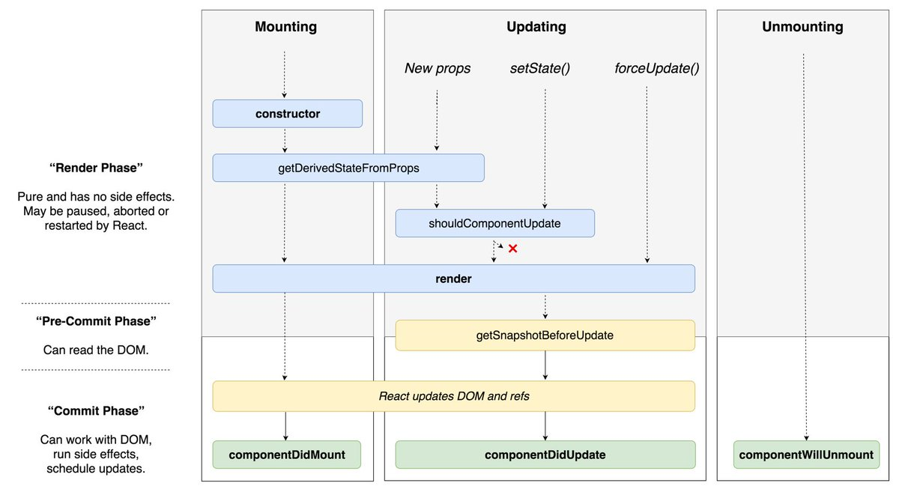
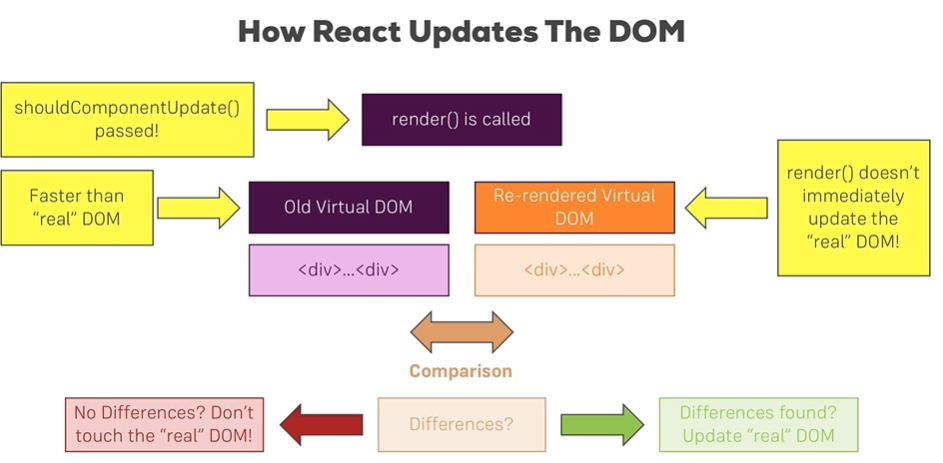

# Component Deep Dive



## A better project structure
多建点Component模块，不要都堆砌在App.js里面。

在src里面建立几个文件夹：
- assets：放images的
- containers: 放大块容器的
- Components
- Cockpit

## Stateless and Stateful Components

## class-based vs functional components


The naming can be confusing but "Lifecycle Hooks" have absolutely nothing to do with "React Hooks".

## Component Lifecycle

Only avaliable in Class-based Components! 
但是Functional components也有等价的life cycle.


### Component Lifecycle -- Creation


getDerivedStataFromProps(props, state)里面不要做异步操作。
componentDidMount() 会有Side Effect.

不要同步地call setState here.

Why does it renders twice?
```javascript
class App extends Component {
  constructor(props) {
      super(props);   // 如果自定义constructor，这一句一定要有
      console.log('[App.js] constructor');
      // 初始化你的state
      // 如果写在外面(modern syntax)，是自动在constructor里面做了
      this.state = {
          content: "this is my state"
      }
  }

  static getDerivedStateFromProps(props, state) {
    console.log('[App.js] getDerivedStateFromProps', props);
    return state;
  }

  render() {
    console.log('[App.js] render');
    return (
      <div className="App">
        Hello
      </div>
    );
  }

  componentDidMount() {
    console.log('[App.js] componentDidMount');
  }
}
```

因为strict mode会把constructor执行两次。
```javascript
ReactDOM.render(
  <>
    <App />
  </>,
  document.getElementById('root')
);
```

```
[App.js] constructor
[App.js] getDerivedStateFromProps
[App.js] render
[App.js] componentDidMount
```

### Component Lifecycle -- Update (props change and state change)


点击toggle Name，展开三个Person标签。
```
[App.js] getDerivedStateFromProps
[App.js] render
[Persons.js] rendering...
[Person.js] rendering...
[Person.js] rendering...
[Person.js] rendering...
```

在输入框里面输入，文字随着输入框变化而变化。
```
[App.js] getDerivedStateFromProps
[App.js] render
[Persons.js] shouldComponentUpdate
[Persons.js] rendering...
[Person.js] rendering...
[Person.js] rendering...
[Person.js] rendering...
[Persons.js] getSnapshotBeforeUpdate
[Persons.js] componentDidUpdate
```

## Functional Component Lifecycle

特别注意，Functional Component的名字要`大写`,即使是函数名，首字母要**大写**。

`useEffect()` will be executed every render cycle.

```javascript
import React, {useEffect} from 'react';
const Cockpit = ( props ) => {
    
    useEffect( () => {
      console.log('[cockpit] useEffect');
      // HTTP request
    });

    return <div>Hello</div>;
}
export default Cockpit;
```
**其实re-render是在更新virtual DOM, React是会去检查是否需要真的更新real DOM.**

如果我们想在第一次render Cockpit的时候发送HTTP request，而不是每次re-render都会发，那要怎么做呢？
```javascript
useEffect( () => {
      console.log('[cockpit] useEffect');

      // HTTP Request...
      setTimeout(
        () => {
          alert('Saved data to cloud!');
        }, 2000);
    }, []);
    // this useEffect() only will be executed when the [] changed
}
// useEffect(()=>{});
```

我想在某些事情出发的时候执行呢？
```javascript
useEffect( () => {
      console.log('[cockpit] useEffect');

      // HTTP Request...
      setTimeout(
        () => {
          alert('Saved data to cloud!');
        }, 2000);
    }, [props.persons]);
    // this useEffect() only will be executed when the [props,persons] changed
}
// useEffect(()=>{});
```

当然能你可以用很多个`useEffect()`.

## Cleaning up 

```javascript
useEffect( () => {
      console.log('[cockpit] useEffect');

      // HTTP Request...
      const timer = setTimeout(
        () => {
          alert('Saved data to cloud!');
        }, 2000);

        return () => {
          clearTimeout(timer);
          console.log('[cockpit] cleanup work in useEffect');
        };  // this function will run after every render cycle
        // To be more precise, it runs BEFORE the main useEffect function runs,
        // but after the (first) render cycle!
    }, [props.persons]);
    // this useEffect() only will be executed when the [props,persons] changed

```

## Optimize shouldComponentUpdate()
一个render()执行的时候，会从root tag开始一直往下更新，这时候，root的孩子就不需要再更新一次。
```javascript
shouldComponentUpdate(nextProps, nextState) {
    console.log('[Persons.js] shouldComponentUpdate');
    // 记得之前更新persons的时候，是重新deep copy了一个再更新的
    // 所以，这里两个指针，是比较所指向的内容一不一样
    if (nextProps.persons !== this.props.persons) {
      return true;
    }
    return false;
}
```

**Chrome里面有个很有用的可视化工具(F12->More tools->render)，用来查看是否重新在real DOM里面加载了东西，会闪一下。**

## Optimizing Functional Component with React.memo()
好了，如果只需要更新孩子标签，不需要更新父标签，怎么做？

```javascript
export default React.memo(Cockpit);   
// 如果props和state都不变，就不会re-render
```

## When should you optimize? 什么时候该优化？
那我们需要对每个class-based component加个shouldComponentUpdate()，对每个functional component都加一个React.memo()吗？

`其实并不是。`

1. 总有很多元素，父元素更新的时候，也要跟着更新。
2. shouldComponentUpdate()和React.memo()也是需要运行时间的。

## React.PureComponent v.s. React.Component
这个实际上实现了`shouldComponentUpdate()`，检查了props里面的所有内容是否变化，如果变化了就更新。

## How does React update the DOM? 

render()被执行的时候，并不是直接更新real DOM.



## Higher Order Componment (hoc) 怎么在component里面一次返回多个tag?
返回一个数组就行，这个数组里面的每个tag都要有一个key.

还有一个trick,就是套一个空标签.
```javascript
<>
</>
```
或者
```javascript
<Aux>

</Aux>
```
在Aux.js里面，
```javascript
const Aux = (props) => {
  return props.children;
}

export default Aux;
```

### 别的方法 React.Fragment
直接用React.Fragment取代Aux就行。

### 别的方法 withClass.js
withClass.js
```javascript
import React from 'react';

const withClass = props = {
  <div className={props.classes}>
    {props.children}
  </div>
};

export default withClass;

// 别的地方
import './App.css'
return (
  <withClass classes={App}>

  </WithClass>
);

```

### 别的方法
Use a function `withClass` that returns a functional component.
This function has two arguments -- Component and className.

```javascript
<Aux>
  // 真正的内容
<\Aux>
export default withClass(App, classes.App);
```

## setState要注意的地方 Setting state correctly
why?
不要再setState里面对某个State的属性自增，例如：
```javascript
this.setState( {
  persons: persons,
  changeCounter: this.state.changeCounter + 1
});
```
这里面的this.state不一定是紧接着的上一个state，也有可能是an older state.

这才是正确打开方式：
```javascript
this.setStat( (prevState, props) => {
  return {
    persons: persons,
    changeCounter: prevState.changeCounter + 1
  };
});
```
这就能保证prevState是紧接着的上一个state.


## Using PropTypes
How do we improve the way we are receiving props.
```
$ npm install --save prop-types
```

```javascript
import PropTypes from 'prop-types';

class Person extends Component {
  render() {
    console.log('[Person.js] rendering...');
    return (
      <div className={classes.Person}>
        <p onClick={this.props.click}>
          I'm {this.props.name} and I am {this.props.age} years old!
        </p>
        <p>{this.props.children}</p>
        <input
          type="text"
          onChange={this.props.changed}
          value={this.props.name}
        />
      </div>
    );
  }
}

// 设置应该传输的类型
Person.propTypes = {
  click: PropTypes.func,
  name: PropTypes.string,
  age: PropTypes.number,
  changed: PropTypes.number
};
```

## ref property in JSX
现在我们在页面里面pass了三个Person标签，我怎么选中第三个标签然后focus呢？
在vallina javascript里面我们可以getElementById(),但在React里面我们要怎么做呢？

### ref in class-based component
```javascript
class Person extends Component {
  componentDidMount() {
    this.inputElement.focus();
  }
  render() {
    console.log('[Person.js] rendering...');
    return (
      <div className={classes.Person}>
        <p onClick={this.props.click}>
          I'm {this.props.name} and I am {this.props.age} years old!
        </p>
        <p>{this.props.children}</p>
        <input
          type="text"
          ref = { (inputEl) => {this.inputElement = inputEl} }
          onChange={this.props.changed}
          value={this.props.name}
        />
      </div>
    );
  }
}
```

也可以用constructor.
```javascript
class Person extends Component {
  constructor(props) {
    super(props);
    this.inputElementRef = React.createRef();
  }
  componentDidMount() {
    this.inputElementRef.current.focus();
    // "current" property gives you access to your current reference.
  }
  render() {
    console.log('[Person.js] rendering...');
    return (
      <div className={classes.Person}>
        <p onClick={this.props.click}>
          I'm {this.props.name} and I am {this.props.age} years old!
        </p>
        <p>{this.props.children}</p>
        <input
          type="text"
          // ref = { (inputEl) => {this.inputElement = inputEl} }
          ref={this.inputElementRef}
          onChange={this.props.changed}
          value={this.props.name}
        />
      </div>
    );
  }
}
```

### ref in Functional Component
```javascript
import React, {useEffect, useRef} from 'react';

const Cockpit = ( props ) => {

    const toggleBtnRef = React.useRef(null);
    // 看这里
    useEffect( () => {
      toggleBtnRef.current.click();
    });

    useEffect( () => {
      console.log('[cockpit] useEffect');

      // HTTP Request...
      const timer = setTimeout(
        () => {
          alert('Saved data to cloud!');
        }, 2000);

        return () => {
          clearTimeout(timer);
          console.log('[cockpit] cleanup work in useEffect');
        };  
    }, [props.persons]);
   
    useEffect( () => {
      console.log('[Cocopit] 2nd useEffect');
      return () => {
        console.log('[cockpit] cleanup work in useEffect');
      }; 
    });

    const assignedClasses = [];
    let btnClass = '';
    if (props.showPersons) {
        btnClass = classes.Red;
    }

    if ( props.personsLength <= 2 ) {
      assignedClasses.push( classes.red ); // classes = ['red']
    }
    if ( props.personsLength <= 1 ) {
      assignedClasses.push( classes.bold ); // classes = ['red', 'bold']
    }

    return (
        <div className={classes.Cockpit}>
            <h1>{props.title}</h1>
            <p className={assignedClasses.join( ' ' )}>This is really working!</p>
            <button
                ref={toggleBtnRef}
                className={btnClass}
                onClick={props.clicked}>Toggle Persons</button>
        </div>
    );
};
```

## Use Context API to avoid Prop Chain

Component里面有Component，props一层一层往里面传，但是到很深的层次才会真正用到这个props，这就很浪费资源了，怎么避免呢？


文件目录
- src
  - context：自己建一个
    - auth-context.js

```javascript
import React from 'react';
const authContext = React.createContext(    
  {
    authenticated: false,
    login: () => {}
  }
);
export default authContext;
```
`createContext()`里面设置一个object，然后可以设置默认值。

```javascript
// App.js里面
import AuthContext from './context/auth-context.js';

// ...
return (
      <div className={classes.App}>
        <button onClick={()=>{this.setState({showCockpit: false})}}>Remove Cockpit</button>
        // 看这里
        <AuthContext.Provider 
          value={{
              authenticated: this.state.Authenticated,
              login: this.loginHandler
            }}>
        { this.state.showCockpit ? 
        <Cockpit
          title={this.props.appTitle}
          showPersons={this.state.showPersons}
          personsLength={this.state.persons.length}
          clicked={this.togglePersonsHandler}
        /> : null}
        {persons}
        </AuthContext.Provider>
      </div>
    );
// ...

// Person.js里面
import AuthContext from './context/auth-context.js';
class Person extends Component {
  render() {
    console.log('[Person.js] rendering...');
    return (
      <Aux>
        <AuthContext.Consumer>
          {
            (context) => {
              context.authenticated ? <p>Authenticated!</p> : <p>Please authenticate!</p>
            }
          }
        </AuthContext.Consumer>
        <p onClick={this.props.click}>
          I'm {this.props.name} and I am {this.props.age} years old!
        </p>
        <p>{this.props.children}</p>
        <input
          type="text"
          onChange={this.props.changed}
          value={this.props.name}
        />
      </Aux>
    );
  }
}

```

### 如果我想在\<AuthContext>的外面用这个context来发http请求呢

#### class-based component
```javascript
class Person extends Component {
  static contextType = AuthContext;
  componentDidMount() {
    console.log(this.context.authenticated);
    // 发送http请求
  }
}
```
`contextType`是关键字？

#### functional component -- useContext
```javascript
import React, {useEffect, useRef, useContext} from 'react';
import AuthContext from './context/auth-context.js';

const cockpit = props => {
  const authContext = useContext(AuthContext);
}
```
