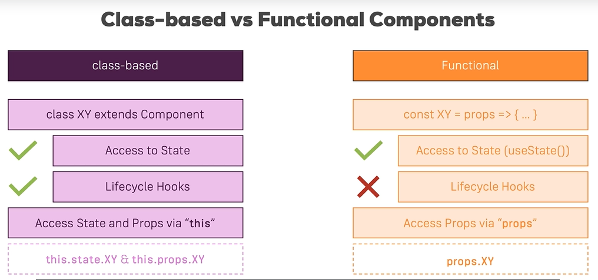
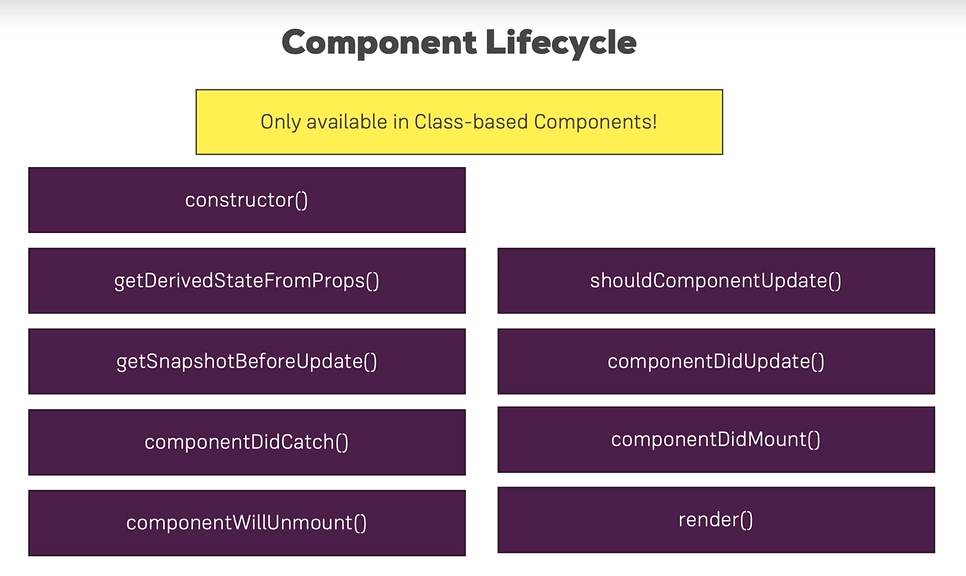
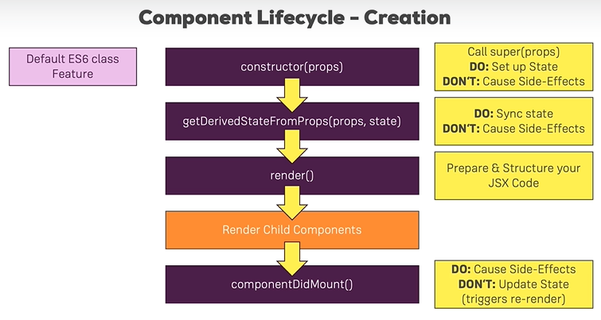
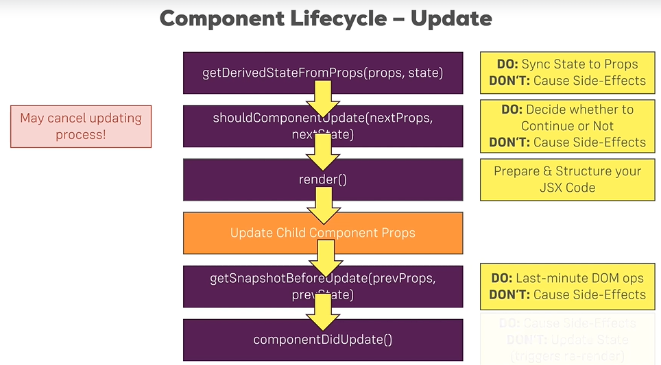

# Component Deep Dive

## A better project structure
多建点Component模块，不要都堆砌在App.js里面。

在src里面建立几个文件夹：
- assets：放images的
- containers: 放大块容器的
- Components
- Cockpit

## Stateless and Stateful Components

## class-based vs functional components


The naming can be confusing but "Lifecycle Hooks" have absolutely nothing to do with "React Hooks".

## Component Lifecycle

Only avaliable in Class-based Components! 
但是Functional components也有等价的life cycle.



### Component Lifecycle -- Creation




getDerivedStataFromProps(props, state)里面不要做异步操作。
componentDidMount() 会有Side Effect.

不要同步地call setState here.

Why does it renders twice?
```javascript
class App extends Component {
  constructor(props) {
      super(props);   // 如果自定义constructor，这一句一定要有
      console.log('[App.js] constructor');
      // 初始化你的state
      // 如果写在外面(modern syntax)，是自动在constructor里面做了
      this.state = {
          content: "this is my state"
      }
  }

  static getDerivedStateFromProps(props, state) {
    console.log('[App.js] getDerivedStateFromProps', props);
    return state;
  }

  render() {
    console.log('[App.js] render');
    return (
      <div className="App">
        Hello
      </div>
    );
  }

  componentDidMount() {
    console.log('[App.js] componentDidMount');
  }
}
```

因为strict mode会把constructor执行两次。
```javascript
ReactDOM.render(
  <>
    <App />
  </>,
  document.getElementById('root')
);
```

### Component Lifecycle -- Update



