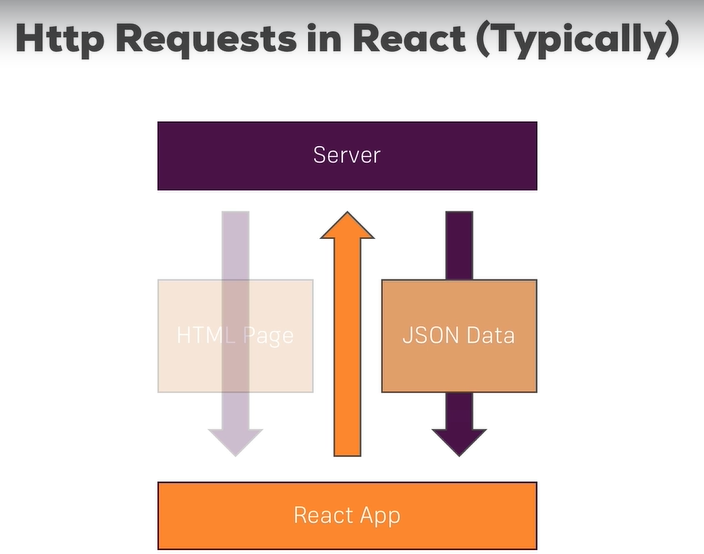

# Reaching out to Web

## Http Request in React



Ajax is the short for "Asynchronous JavaScript and XML".

javascript: XMLHttpRequest

Axios第三方js库
```
$ npm install axios
```

https://jsonplaceholder.typicode.com/posts

- get request
```javascript
import axios from 'axios';

axios.get('https://jsonplaceholder.typicode.com/posts')
        .then( response => {
            const posts = response.data.slice(0,4);
            const updatedPosts = posts.map(post=>{
                return {
                    ...post,
                    author: 'Max'
                }
            });
            this.setState({posts: updatedPosts});
            console.log(response);
        });
```


- get with id
```javascript
axios.get('https://jsonplaceholder.typicode.com/posts/' + this.props.id)
                .then(response=> {
                    console.log(response);
                    this.setState({loadedPost: response.data})
                });
```
- post request
```javascript
const data = {
            title: this.state.title,
            body: this.state.content,
            author: this.state.author
        };
        axios.post('https://jsonplaceholder.typicode.com/posts', data)
        .then(response=>{
            console.log(response);
            // status: 201
        });
```

- delete request
```javascript
axios.delete('https://jsonplaceholder.typicode.com/posts/' + this.props.id)
        .then(response => {
            console.log(response);
        });
```

## Adding Interceptors to Execute Code Globally
index.js
```javascript
import React from 'react';
import ReactDOM from 'react-dom';
import './index.css';
import App from './App';
import registerServiceWorker from './registerServiceWorker';

import axios from 'axios';

// global base url
axios.defaults.baseURL = "https://jsonplaceholder.typicode.com";
axios.defaults.headers.common['Authorization'] = 'AUTH TOKEN';
axios.defaults.headers.post['Content-Type'] = 'application/json';

// 这个全局可见
axios.interceptors.request.use( request => {
    console.log(request);
    // Edit request config
    return request;
}, error => {
    console.log(error);
    return Promise.reject(error);
});

axios.interceptors.response.use( response => {
    console.log(response);
    // Edit request config
    return response;
}, error => {
    console.log(error);
    return Promise.reject(error);
});

ReactDOM.render( <App />, document.getElementById( 'root' ) );
registerServiceWorker();
```

## Remove Interceptors
```javascript
let myInterceptor = axios.interceptors.request.use(function () {/*...*/});
axios.interceptors.request.eject(myInterceptor);
```

## instance of Axios

```javascript
import axios from 'axios';

const instance = axios.create({
    baseURL: 'https://jsonplaceholder.typicode.com'
});

instance.defaults.headers.common['Authorization'] = 'AUTH TOKEN FROM INSTANCE';

// instance.interceptors.request...

export default instance;
```
然后在别的地方把这个instance import.


