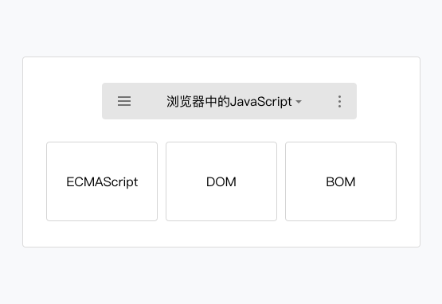
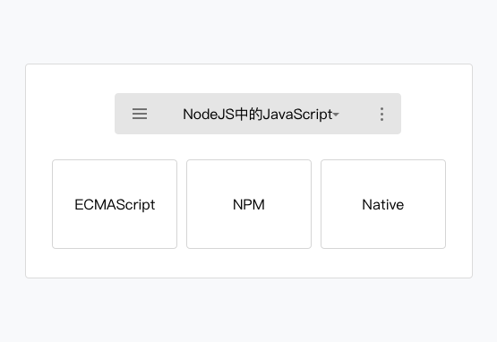
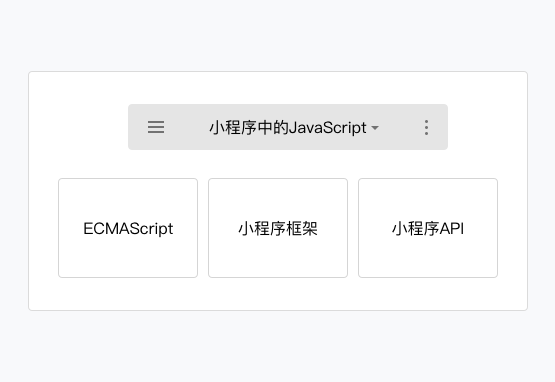

# 小程序代码组成
https://developers.weixin.qq.com/ebook?action=get_post_info&docid=000ace6c9603786b008636f2e56c0a
## WXML

WeiXin Markup Language，是小程序框架设计的一套标签语言，结合小程序的基础组件、事件系统，可以构建出页面的结构。

### 标签

text, view, image, block
```html
<!--一个简单的文本标签 -->
<text>hello world</text>

<!-- view 中包含了 text 标签 -->
<view>
  <text>hello world</text>
</view>
<image class="userinfo-avatar" src="./image/a.png" ></image>

<block>
  <view> view1 </view>
  <view> view2 </view>
</block>
```

### 数据绑定

```html
<!--pages/wxml/index.wxml-->
<text>当前时间：{{time}}</text>
```

保存后工具刷新，模拟器并没有显示出当前的时间，这是因为我们并没有给 time 设置任何初始值，请打开 `pages/wxml/index.js` 文件，在 data 的大括号中加入：`time: (new Date()).toString()`。

```js
// pages/wxml/index.js
Page({
  /**
   * 页面的初始数据
   */
  data: {
    time: (new Date()).toString()
  },
})
```

### 逻辑语法
```html
<text>{{ a === 10? "变量 a 等于10": "变量 a 不等于10"}}</text>
```

#### 条件逻辑
WXML 中，使用 `wx:if="{{condition}}"` 来判断是否需要渲染该代码块：
```html
<view wx:if="{{condition}}"> True </view>
```

使用 `wx:elif` 和 `wx:else` 来添加一个 `else` 块：
```html
<view wx:if="{{length > 5}}"> 1 </view>
<view wx:elif="{{length > 2}}"> 2 </view>
<view wx:else> 3 </view>
```

因为 `wx:if` 是一个控制属性，需要将它添加到一个标签上。如果要一次性判断多个组件标签，可以使用一个 `<block/>` 标签将多个组件包装起来，并在上边使用 `wx:if` 控制属性。

```html
<block wx:if="{{true}}">
  <view> view1 </view>
  <view> view2 </view>
</block>
```

#### 列表渲染 (循环逻辑)

在组件上使用 `wx:for` 控制属性绑定一个数组，即可使用数组中各项的数据重复渲染该组件。默认数组的当前项的下标变量名默认为 `index`，数组当前项的变量名默认为 `item`

```html
<!-- array 是一个数组 -->
<view wx:for="{{array}}">
  {{index}}: {{item.message}}
</view>
```
```js
<!-- 对应的脚本文件
Page({
  data: {
    array: [{
      message: 'foo',
    }, {
      message: 'bar'
    }]
  }
})
-->
```

使用 `wx:for-item` 指定数组当前元素的变量名，使用 `wx:for-index` 指定数组当前下标的变量名：
```html
<view wx:for="{{array}}" wx:for-index="idx" wx:for-item="itemName">
  {{idx}}: {{itemName.message}}
</view>
```

类似 `block wx:if` ，也可以将 `wx:for` 用在 `<block/>` 标签上，以渲染一个包含多节点的结构块。例如：

```html
<block wx:for="{{[1, 2, 3]}}">
  <view> {{index}}: </view>
  <view> {{item}} </view>
</block>
```

如果列表中项目的位置会动态改变或者有新的项目添加到列表中，并且希望列表中的项目保持自己的特征和状态（如 `<input/>` 中的输入内容， `<switch/>` 的选中状态），需要使用 `wx:key` 来指定列表中项目的唯一的标识符。

`wx:key` 的值以两种形式提供：

字符串，代表在 `for` 循环的 `array` 中 `item` 的某个 `property`，该 `property` 的值需要是列表中唯一的字符串或数字，且不能动态改变。

保留关键字 `this` 代表在 `for` 循环中的 `item` 本身，这种表示需要 `item` 本身是一个唯一的字符串或者数字，如：

当数据改变触发渲染层重新渲染的时候，会校正带有 `key` 的组件，框架会确保他们被重新排序，而不是重新创建，以确保使组件保持自身的状态，并且提高列表渲染时的效率。

代码清单2-14 使用 `wx:key` 示例（WXML）
```html
<switch wx:for="{{objectArray}}" wx:key="unique" > {{item.id}} </switch>
<button bindtap="switch"> Switch </button>
<button bindtap="addToFront"> Add to the front </button>


<switch wx:for="{{numberArray}}" wx:key="*this" > {{item}} </switch>
<button bindtap="addNumberToFront"> Add Number to the front </button>
```

```js
Page({
  data: {
    objectArray: [
      {id: 5, unique: 'unique_5'},
      {id: 4, unique: 'unique_4'},
      {id: 3, unique: 'unique_3'},
      {id: 2, unique: 'unique_2'},
      {id: 1, unique: 'unique_1'},
      {id: 0, unique: 'unique_0'},
    ],
    numberArray: [1, 2, 3, 4]
  },
  switch: function(e) {
    const length = this.data.objectArray.length
    for (let i = 0; i < length; ++i) {
      const x = Math.floor(Math.random() * length)
      const y = Math.floor(Math.random() * length)
      const temp = this.data.objectArray[x]
      this.data.objectArray[x] = this.data.objectArray[y]
      this.data.objectArray[y] = temp
    }
    this.setData({
      objectArray: this.data.objectArray
    })
  },
  addToFront: function(e) {
    const length = this.data.objectArray.length
    this.data.objectArray = [{id: length, unique: 'unique_' + length}].concat(this.data.objectArray)
    this.setData({
      objectArray: this.data.objectArray
    })
  },
  addNumberToFront: function(e){
    this.data.numberArray = [ this.data.numberArray.length + 1 ].concat(this.data.numberArray)
    this.setData({
      numberArray: this.data.numberArray
    })
  }
})
```

#### 模板
WXML提供模板（template），可以在模板中定义代码片段，然后在不同的地方调用。使用 `name` 属性，作为模板的名字。然后在 `<template/>` 内定义代码片段，如：
```html
<template name="msgItem">
  <view>
    <text> {{index}}: {{msg}} </text>
    <text> Time: {{time}} </text>
  </view>
</template>
```

使用 is 属性，声明需要的使用的模板，然后将模板所需要的 data 传入。
```html
<!--
item: {
  index: 0,
  msg: 'this is a template',
  time: '2016-06-18'
}
-->


<template name="msgItem">
  <view>
    <text> {{index}}: {{msg}} </text>
    <text> Time: {{time}} </text>
  </view>
</template>


<template is="msgItem" data="{{...item}}"/>

<!-- 输出
0: this is a template Time: 2016-06-18
-->
```

#### 引用
`WXML` 提供两种文件引用方式`import`和`include`。

`import` 可以在该文件中使用目标文件定义的 `template，如：`

在 `item.wxml` 中定义了一个叫 `item`的 `template` ：
```html
<!-- item.wxml -->
<template name="item">
  <text>{{text}}</text>
</template>
```

在 index.wxml 中引用了 item.wxml，就可以使用 item模板：
```html
<import src="item.wxml"/>

<template is="item" data="{{text: 'forbar'}}"/>
```

例如：C 引用 B，B 引用A，在C中可以使用B定义的 template，在B中可以使用A定义的 template ，但是C不能使用A定义的template.

`include` 可以将目标文件中除了 `<template/>` `<wxs/>` 外的整个代码引入，相当于是拷贝到 `include` 位置。
```html
<!-- index.wxml -->
<include src="header.wxml"/>

<view> body </view>

<include src="footer.wxml"/>
```

#### 共同属性

所有wxml 标签都支持的属性称之为共同属性。

|属性名	|类型	|描述	|注解|
|-------|-------|------|----|
|id	|String	|组件的唯一标识	|整个页面唯一
|class	|String	|组件的样式类	|在对应的 WXSS 中定义的样式类
|style	|String	|组件的内联样式	|可以动态设置的内联样式
|hidden	|Boolean	|组件是否显示	|所有组件默认显示
|data-*	|Any	|自定义属性	|组件上触发的事件时，会发送给事件处理函数
|bind*/catch*	|EventHandler	|组件的事件


## WXSS

WXSS（WeiXin Style Sheets）是一套用于小程序的样式语言，用于描述WXML的组件样式，也就是视觉上的效果。

WXSS与Web开发中的CSS类似。为了更适合小程序开发，WXSS对CSS做了一些补充以及修改。

- 项目公共样式：根目录中的app.wxss为项目公共样式，它会被注入到小程序的每个页面。
- 页面样式：与app.json注册过的页面同名且位置同级的WXSS文件。
- 其它样式：其它样式可以被项目公共样式和页面样式引用。

在小程序开发中，开发者不需要像Web开发那样去优化样式文件的请求数量，只需要考虑代码的组织即可。样式文件最终会被编译优化，具体的编译原理我们留在后面章节再做介绍。

### 尺寸单位 responsive pixel (rpx)

在WXSS中，引入了rpx（responsive pixel）尺寸单位。引用新尺寸单位的目的是，适配不同宽度的屏幕，开发起来更简单。

### WXSS引用
在CSS中，开发者可以这样引用另一个样式文件：`@import url('./test_0.css')`

这种方法在请求上不会把`test_0.css`合并到`index.css`中，也就是请求`index.css`的时候，会多一个`test_0.css`的请求。

在小程序中，我们依然可以实现样式的引用，样式引用是这样写：
```css
@import './test_0.wxss'
```
由于WXSS最终会被编译打包到目标文件中，用户只需要下载一次，在使用过程中不会因为样式的引用而产生多余的文件请求。

## JavaScript 脚本

在大部分开发者看来，ECMAScript和JavaScript表达的是同一种含义，但是严格的说，两者的意义是不同的。ECMAScript是一种由Ecma国际通过ECMA-262标准化的脚本程序设计语言， **JavaScript 是 ECMAScript 的一种实现**。

理解 JavaScript 是 ECMAScript 一种实现后，可以帮助开发者理解**小程序中的 JavaScript同浏览器中的 JavaScript 以及 NodeJS 中的 JavaScript 是不相同的**。

### 浏览器中的JavaScript



浏览器中的JavaScript 是由 ECMAScript 和 BOM（浏览器对象模型）以及 DOM（文档对象模型）组成的，Web前端开发者会很熟悉这两个对象模型，它使得开发者可以去操作浏览器的一些表现，比如修改URL、修改页面呈现、记录数据等等。

### NodeJS中的JavaScript


NodeJS中的JavaScript 是由 ECMAScript 和 NPM 以及Native模块组成，NodeJS的开发者会非常熟悉 NPM 的包管理系统，通过各种拓展包来快速的实现一些功能，同时通过使用一些原生的模块例如 FS、HTTP、OS等等来拥有一些语言本身所不具有的能力。

### 小程序中的JavaScript


小程序中的 JavaScript 是由ECMAScript 以及小程序框架和小程序 API 来实现的。同浏览器中的JavaScript 相比没有 BOM 以及 DOM 对象，所以类似 JQuery、Zepto这种浏览器类库是无法在小程序中运行起来的，同样的缺少 Native 模块和NPM包管理的机制，小程序中无法加载原生库，也无法直接使用大部分的 NPM 包。

### 模块化
浏览器中，所有 JavaScript 是在运行在同一个作用域下的，定义的参数或者方法可以被后续加载的脚本访问或者改写。

同浏览器不同，小程序中可以将任何一个JavaScript 文件作为一个模块，通过module.exports 或者 exports 对外暴露接口。

### 脚本的执行顺序
浏览器中，脚本严格按照加载的顺序执行。

```html
<html>
<head>
  <!-- a.js
  console.log('a.js')
   -->
  <script src ="a.js"></script>
  <script>
    console.log('inline script')
  </script>

  <!-- b.js
  console.log('b.js')
   -->
  <script src ="b.js"></script>
</head>
</html>
```
以上代码的输出是：
```
a.js
inline script
b.js
```

而在小程序中的脚本执行顺序有所不同。小程序的执行的入口文件是 app.js 。并且会根据其中 require 的模块顺序决定文件的运行顺序。

app.js
```js
var a = require('./a.js')
console.log('app.js')
var b = require('./b.js')
```

a.js
```js
console.log('a.js')
```

b.js
```js
console.log('b.js')
```

输出结果：
```
a.js

app.js

b.js
```

当 app.js 执行结束后，小程序会按照开发者在 app.json 中定义的 pages 的顺序，逐一执行。


### 作用域
同浏览器中运行的脚本文件有所不同，小程序的脚本的作用域同 NodeJS 更为相似。

在文件中声明的变量和函数只在该文件中有效，不同的文件中可以声明相同名字的变量和函数，不会互相影响。