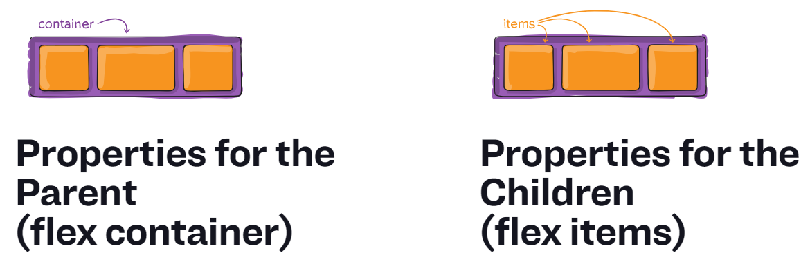
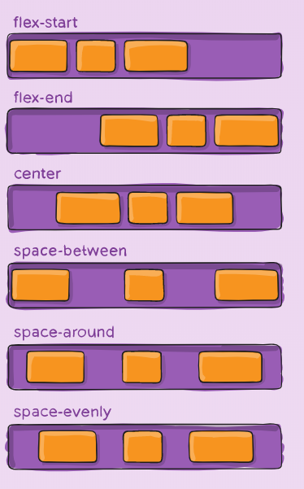

# A Complete Guide to Flexbox

https://css-tricks.com/snippets/css/a-guide-to-flexbox/

## Basicis & Terminology



### display
This defines a flex container. 
It enables a flex context for all its **direct children**.

### order
The order CSS property sets the order to lay out an item in a flex or grid container. Items in a container are sorted by **ascending order value** and then by their source code order.

Note: order is only meant to affect the visual order of elements and not their logical or tab order. order **must not** be used on non-visual media such as speech.

### flex-direction
The flex-direction CSS property sets how flex items are placed in the flex container defining the main axis and the direction (normal or reversed).

```css
.container {
    flex-direction: row | row-reverse | column | column-reverse;
}
```

### flex-warp
The flex-wrap CSS property sets whether flex items are forced onto one line or can wrap onto multiple lines. If wrapping is allowed, it sets the direction that lines are stacked.

```css
.container {
  flex-wrap: nowrap | wrap | wrap-reverse;
}
```

- nowrap: 
    The flex items are laid out in a single line which may cause the flex container to overflow. 
- wrap: 
    The flex items break into multiple lines.
- wrap-reverse:
    Behaves the same as wrap but cross-start and cross-end are permuted.

### flex-flow
This is a shorthand for the flex-direction and flex-wrap properties.

### flex-grow | flex-shrink | flex-basis

- flex-grow: 
This defines the ability for a flex item to grow if necessary.

- flex-shrink: 
This defines the ability for a flex item to shrink if necessary.

- flex-basis: 
This defines the default size of an element before the remaining space is distributed.

### flex
This is the shorthand for flex-grow, flex-shrink and flex-basis combined.

### justify-content
This defines the alignment along the main axis.

```css
.container {
  justify-content: flex-start | flex-end | center | space-between | space-around | space-evenly | start | end | left | right ... + safe | unsafe;
}
```




### align-items

### align-self
The align-self CSS property overrides a grid or flex item's align-items value. In Grid, it aligns the item inside the grid area. In Flexbox, it aligns the item on the cross axis.
