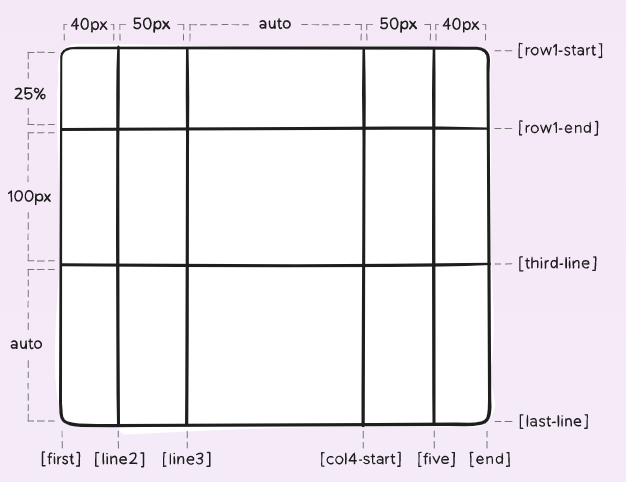

# A Complete Guide to Grid

https://css-tricks.com/snippets/css/complete-guide-grid/

## Important Terminology

### Grid Container
The element on which **display: grid** is applied. 

It’s the direct parent of all the grid items. 

In this example container is the grid container.

```html
<div class="container">
  <div class="item item-1"> </div>
  <div class="item item-2"> </div>
  <div class="item item-3"> </div>
</div>
```

### Grid Item
The children (i.e. direct descendants) of the grid container. Here the item elements are grid items, but sub-item isn’t.

```html
<div class="container">
  <div class="item"> </div>
  <div class="item">
    <p class="sub-item"> </p>
  </div>
  <div class="item"> </div>
</div>
```

### Grid Line
The dividing lines that make up the structure of the grid. 

They can be either vertical (“column grid lines”) or horizontal (“row grid lines”) and reside on either side of a row or column. 

Here the yellow line is an example of a column grid line.


### Grid Cell
The space between two adjacent row and two adjacent column grid lines. It’s a single “unit” of the grid.


### Grid Track
**The space between two adjacent grid lines**. You can think of them like the columns or rows of the grid. 

Here’s the grid track between the second and third row grid lines.


### Grid Area
The total space surrounded by four grid lines.


## The most powerful lines in Grid


## Grid Properties Table of Content


### Properties for the Parent (Grid Container)

#### display
- grid – The element behaves like a **block element** and lays out its content according to the grid model.
- inline-grid – The element behaves like an **inline element** and lays out its content according to the grid model.

```css
.container {
  display: grid | inline-grid;
}
```

#### grid-template-columns & grid-template-rows
Defines the columns and rows of the grid with a space-separated list of values. 

The values represent the track size, and the space between them represents the grid line.


```css
.container {
  grid-template-columns: 40px 50px auto 50px 40px;
  grid-template-rows: 25% 100px auto;
}

```
When you leave an empty space between the track values, the grid lines are automatically assigned positive and negative numbers:


But you can choose to explicitly name the lines. Note the bracket syntax for the line names:

```css
.container {
  grid-template-columns: [first] 40px [line2] 50px [line3] auto [col4-start] 50px [five] 40px [end];
  grid-template-rows: [row1-start] 25% [row1-end] 100px [third-line] auto [last-line];
}
```




The **fr unit** allows you to set the size of a track as a fraction of the free space of the grid container. For example, this will set each item to one third the width of the grid container:

```css
.container {
  grid-template-columns: 1fr 50px 1fr 1fr;
}
```

### grid-template-areas

he grid-template-areas CSS property specifies named grid areas.

```css
.item-a {
  grid-area: header;
}
.item-b {
  grid-area: main;
}
.item-c {
  grid-area: sidebar;
}
.item-d {
  grid-area: footer;
}

.container {
  display: grid;
  grid-template-columns: 50px 50px 50px 50px;
  grid-template-rows: auto;
  grid-template-areas: 
    "header header header header"
    "main main . sidebar"
    "footer footer footer footer";
}
```


