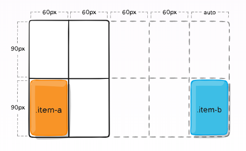
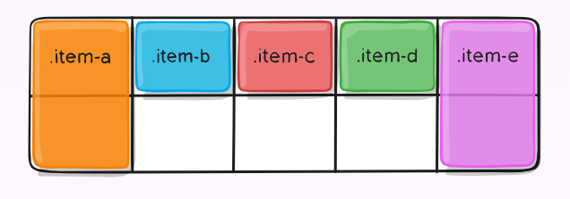

# A Complete Guide to Grid

https://css-tricks.com/snippets/css/complete-guide-grid/

## Important Terminology

### Grid Container
The element on which **display: grid** is applied. 

It’s the direct parent of all the grid items. 

In this example container is the grid container.

```html
<div class="container">
  <div class="item item-1"> </div>
  <div class="item item-2"> </div>
  <div class="item item-3"> </div>
</div>
```

### Grid Item
The children (i.e. direct descendants) of the grid container. Here the item elements are grid items, but sub-item isn’t.

```html
<div class="container">
  <div class="item"> </div>
  <div class="item">
    <p class="sub-item"> </p>
  </div>
  <div class="item"> </div>
</div>
```

### Grid Line
The dividing lines that make up the structure of the grid. 

They can be either vertical (“column grid lines”) or horizontal (“row grid lines”) and reside on either side of a row or column. 

Here the yellow line is an example of a column grid line.


### Grid Cell
The space between two adjacent row and two adjacent column grid lines. It’s a single “unit” of the grid.


### Grid Track
**The space between two adjacent grid lines**. You can think of them like the columns or rows of the grid. 

Here’s the grid track between the second and third row grid lines.


### Grid Area
The total space surrounded by four grid lines.


## The most powerful lines in Grid


## Grid Properties Table of Content


### Properties for the Parent (Grid Container)

#### display
- grid – The element behaves like a **block element** and lays out its content according to the grid model.
- inline-grid – The element behaves like an **inline element** and lays out its content according to the grid model.

```css
.container {
  display: grid | inline-grid;
}
```

#### grid-template-columns & grid-template-rows
Defines the columns and rows of the grid with a space-separated list of values. 

The values represent the track size, and the space between them represents the grid line.


```css
.container {
  grid-template-columns: 40px 50px auto 50px 40px;
  grid-template-rows: 25% 100px auto;
}

```
When you leave an empty space between the track values, the grid lines are automatically assigned positive and negative numbers:


But you can choose to explicitly name the lines. Note the bracket syntax for the line names:

```css
.container {
  grid-template-columns: [first] 40px [line2] 50px [line3] auto [col4-start] 50px [five] 40px [end];
  grid-template-rows: [row1-start] 25% [row1-end] 100px [third-line] auto [last-line];
}
```


The **fr unit** allows you to set the size of a track as a fraction of the free space of the grid container. For example, this will set each item to one third the width of the grid container:

```css
.container {
  grid-template-columns: 1fr 50px 1fr 1fr;
}
```

### grid-template-areas

he grid-template-areas CSS property specifies named grid areas.

```css
.item-a {
  grid-area: header;
}
.item-b {
  grid-area: main;
}
.item-c {
  grid-area: sidebar;
}
.item-d {
  grid-area: footer;
}

.container {
  display: grid;
  grid-template-columns: 50px 50px 50px 50px;
  grid-template-rows: auto;
  grid-template-areas: 
    "header header header header"
    "main main . sidebar"
    "footer footer footer footer";
}
```


### grid-template
A **shorthand** for setting grid-template-rows, grid-template-columns, and grid-template-areas in a single declaration.

### gap
- column-gap;
- row-gap;
- grid-column-gap;
- grid-row-gap


```css
.container {
  /* standard */
  column-gap: <line-size>;
  row-gap: <line-size>;

  /* old */
  grid-column-gap: <line-size>;
  grid-row-gap: <line-size>;
}
```

Example:
```css
.container {
  grid-template-columns: 100px 50px 100px;
  grid-template-rows: 80px auto 80px; 
  column-gap: 10px;
  row-gap: 15px;
}
```


### gap & grid-gap

A **shorthand** for row-gap and column-gap.

```css
.container {
  /* standard */
  gap: <grid-row-gap> <grid-column-gap>;

  /* old */
  grid-gap: <grid-row-gap> <grid-column-gap>;
}
```

### justify-items
The CSS justify-items property defines the **default justify-self for all items** of the box, giving them all a default way of justifying each box along the appropriate axis.

- start
- end
- center
- stretch

#### start
```css
.container {
  justify-items: start;
}
```


#### end


#### center


#### stretch


### align-items
Aligns grid items along the block (column) axis.


### justify-content
Sometimes the total size of your grid might be less than the size of its grid container. 

- start
- end
- center
- stretch
- space-around
- space-between
- space-evenly


### align-content
Sometimes the total size of your grid might be less than the size of its grid container. 

This property aligns the grid along the block (column) axis (as opposed to justify-content which aligns the grid along the inline (row) axis).

- start
- end
- center
- stretch
- space-around
- space-between
- space-evenly


### grid-auto-colomns & grid-auto-rows
The grid-auto-columns CSS property specifies the size of **an implicitly-created grid column track** or pattern of tracks.

什么是implicit grid

```css
.container {
    grid-template-columns: 60px 60px;
    grid-template-rows: 90px 90px;
}
```
This creates a 2 x 2 grid.


But now imagine you use grid-column and grid-row to position your grid items like this:
```css
.item-a {
    grid-column: 1 / 2;
    grid-row: 2 / 3;
}
.item-b {
    grid-column: 5 / 6;
    grid-row: 2 / 3;
}
```


We told .item-b to start on column line 5 and end at column line 6, **but we never defined a column line 5 or 6.**

We can use grid-auto-columns and grid-auto-rows to specify the widths of these implicit tracks:

主角终于出场了：
```css
.container {
    grid-auto-columns: 60px;
}
```



### grid-auto-flow
```css
.container {
    grid-auto-flow: row | column | row dense | column dense;
}
```

```html
<section class="container">
  <div class="item-a">item-a</div>
  <div class="item-b">item-b</div>
  <div class="item-c">item-c</div>
  <div class="item-d">item-d</div>
  <div class="item-e">item-e</div>
</section>
```

You define a grid with five columns and two rows, and set **grid-auto-flow to row (which is also the default)**:
```css
.container {
    display: grid;
    grid-template-columns: 60px 60px 60px 60px 60px;
    grid-template-rows: 30px 30px;
    grid-auto-flow: row;
}
.item-a {
    grid-column: 1;
    grid-row: 1 / 3;
}
.item-e {
    grid-column: 5;
    grid-row: 1 / 3;
}
```

Because we set grid-auto-flow to row, our grid will look like this.



If we instead set grid-auto-flow to column, item-b, item-c and item-d flow down the columns:
```css
.container {
    display: grid;
    grid-template-columns: 60px 60px 60px 60px 60px;
    grid-template-rows: 30px 30px;
    grid-auto-flow: column;
}
```


### grid
A shorthand for setting all of the following properties in a single declaration: grid-template-rows, grid-template-columns, grid-template-areas, grid-auto-rows, grid-auto-columns, and grid-auto-flow.


## Properties for the Children (Grid Items)
Note:
float, display: inline-block, display: table-cell, vertical-align and column-* properties **have no effect on a grid item**.

### grid-row/column-start/end
Determines a grid item’s location within the grid by referring to specific grid lines.

Values:
- \<line> – can be a number to refer to a numbered grid line, or a name to refer to a named grid line
- span \<number> – the item will span across the provided number of grid tracks
- span \<name> – the item will span across until it hits the next line with the provided name
- auto – indicates auto-placement, an automatic span, or a default span of one

#### line number
```css
.item-a {
    grid-column-start: 2;
    grid-column-end: five;
    grid-row-start: row1-start;
    grid-row-end: 3;
}
```


#### how do we use span?
```css
.item-b {
    grid-column-start: 1;
    grid-column-end: span col4-start;
    grid-row-start: 2;
    grid-row-end: span 2;
}
```


If no grid-column-end/grid-row-end is declared, **the item will span 1** track by default.

Items can overlap each other. You can use **z-index** to control their stacking order.

### grid-column & grid-row
Shorthand for grid-column-start + grid-column-end, and grid-row-start + grid-row-end, respectively.

### grid-area

Alternatively, this property can be used as an even shorter shorthand for grid-row-start + grid-column-start + grid-row-end + grid-column-end.

### justify-self & align-self
- start
- end
- center
- stretch

