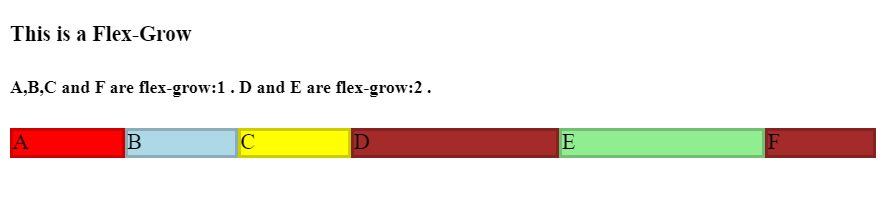
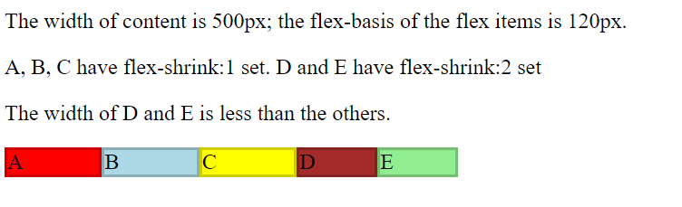

# flex

https://developer.mozilla.org/en-US/docs/Web/CSS/flex

The flex CSS property sets **how a flex item will grow or shrink to fit the space available in its flex container**. 

It is a shorthand for flex-grow, flex-shrink, and flex-basis.

## Syntax
```css
/* Keyword values */
flex: auto;
flex: initial;
flex: none;

/* One value, unitless number: flex-grow */
flex: 2;
/* the <flex-shrink> value is assumed to be 1 
and the <flex-basis> value is assumed to be 0 
*/

/* One value, width/height: flex-basis */
flex: 10em;
flex: 30%;
flex: min-content;

/* Two values: flex-grow | flex-basis */
flex: 1 30px;

/* Two values: flex-grow | flex-shrink */
flex: 2 2;

/* Three values: flex-grow | flex-shrink | flex-basis */
flex: 2 2 10%;

/* Global values */
flex: inherit;
flex: initial;
flex: unset;

```

## Values

### initial
The item is sized according to its width and height properties. It shrinks to its minimum size to fit the container, but does not grow to absorb any extra free space in the flex container. This is equivalent to setting **"flex: 0 1 auto"**.

### auto
The item is sized according to its width and height properties, but grows to absorb any extra free space in the flex container, and shrinks to its minimum size to fit the container. This is equivalent to setting **"flex: 1 1 auto"**.

### none
The item is sized according to its width and height properties. It is fully inflexible: it neither shrinks nor grows in relation to the flex container. This is equivalent to setting **"flex: 0 0 auto"**.

## flex-grow


## flex-shrink

```html
<!DOCTYPE html>
<html>
    <head>
        <meta charset="UTF-8">
        <style type="text/css">
            #content {
                display: flex;
                width: 500px;
            }

            #content div {
                flex-basis: 120px;
                border: 3px solid rgba(0,0,0,.2);
            }

            .box {
                flex-shrink: 1;
            }

            .box1 {
                /* 数字越大 shrink程度越大 */
                flex-shrink: 2;
            }

            .box2 {
                flex-shrink: 2;
            }
        </style>
    </head>

    <body>
        <p>The width of content is 500px; the flex-basis of the flex items is 120px.</p>
        <p>A, B, C have flex-shrink:1 set. D and E have flex-shrink:2 set</p>
        <p>The width of D and E is less than the others.</p>
        <div id="content">
            <div class="box" style="background-color:red;">A</div>
            <div class="box" style="background-color:lightblue;">B</div>
            <div class="box" style="background-color:yellow;">C</div>
            <div class="box1" style="background-color:brown;">D</div>
            <div class="box2" style="background-color:lightgreen;">E</div>
        </div>
    </body>
</html>
```

## flex-basis
The flex-basis CSS property sets the **initial main size** of a flex item. It sets the size of the **content box** unless otherwise set with box-sizing.

Originally, **flex-basis:auto** meant "look at my width or height property".
