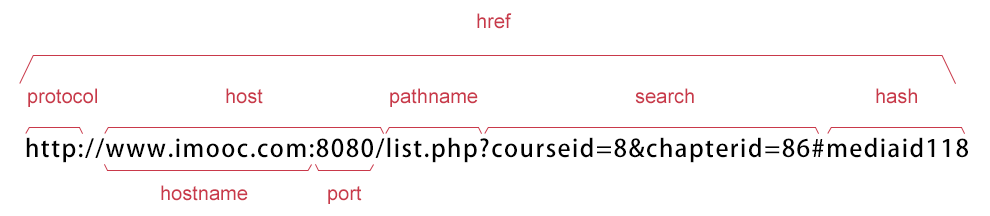

# BOM (Browser Object Model) Document Object Model (DOM) 

## window 对象

方法：
- alert()
- prompt(): 输入框
- confirm()
- open(): 打开新的浏览器窗口或查找一个已命名窗口
- close(): 关闭浏览器窗口
- print(): 打印当前窗口内容
- focus(): 把键盘焦点给予一个窗口
- blur(): 把键盘焦点从顶层窗口移开
- moveBy(): 可相对窗口的当前坐标把它移动指定的像素
- moveTo(): 把窗口的左上角移动到一个指定的坐标
- resizeBy(): 按照指定的像素调整窗口的大小
- resizeTo()
- scrollBy()
- scrollTo(): 把内容滚动到指定的坐标
- setInterval(): 每隔指定的事件执行代码
- setTimeout(): 在指定的延迟时间后来执行代码
- clearInterval(): 取消setInterval()的设置
- clearTimeout()


### open()
```javascript
function openNewPage() {
        window.open();
}
```

### javascript timer
#### setInterval()
```
setInterval(代码,交互时间);
```
1. 代码：要调用的函数或要执行的代码串。
2. 交互时间：周期性执行或调用表达式之间的时间间隔，以毫秒计。

```javascript
var attimeId = setInterval(clock, 1000);  // 这里返回的是id
function clock() {
    var time = new Date();          
    attime = time.toLocaleTimeString();     // 获取当前时间;
    document.getElementById("clock").value = attime;
}

// clearInterval(id_of_setInterval)
clearInterval(attimeId);
```

#### setTimeout()
```html
<!DOCTYPE HTML>
<html>
<head>
<meta http-equiv="Content-Type" content="text/html; charset=utf-8">
<title>计时器</title>
<script type="text/javascript">
var num = 0;
function startCount() {
    document.getElementById('count').value = num;
    num = num + 1;
    setTimeout("startCount()", 1000);
}
</script>
</head>
<body>
<form>
<input type="text" id="count" onClick="startCount()"/>
</form>
</body>
</html>
```

clearTimeout(id)同理。

### History 对象

history对象记录了用户曾经浏览过的页面(URL)，并可以实现浏览器前进与后退相似导航的功能。

```javascript
// 获取浏览器历史列表中的URL数量
var HL = window.history.length;
document.write(HL);
```


- back(): 加载history列表的前一个URL
- forward(): 加载history列表的下一个URL
- go(): 加载hostory中的某个具体的页面
- back()相当于go(-1)

### Location 对象
location用于获取或设置窗体的URL，并且可以用于解析URL。


```javascript
var url = window.location.href;
document.write(url);
```

- assign(): 加载新的文档。
- reload(): 重新加载当前文档。
- replace(): 用新的文档替代当前文档。


### Navigator对象
Navigator 对象包含有关浏览器的信息，通常用于检测浏览器与操作系统的版本。

```javascript
var browser = navigator.appName;
var b_version = navigator.appVersion;
var plat = navigator.platform;
var userAgent = navigator.userAgent;
document.write("Browser name"+browser);
document.write("<br>");
document.write("Browser version"+b_version);
document.write("<br>");
document.write("Platform"+plat);
document.write("<br>");
document.write("UserAgent"+userAgent);
```
Result:
```
Browser nameNetscape
Browser version5.0 (Windows NT 10.0; Win64; x64) AppleWebKit/537.36 (KHTML, like Gecko) Chrome/81.0.4044.138 Safari/537.36
PlatformWin32
UserAgentMozilla/5.0 (Windows NT 10.0; Win64; x64) AppleWebKit/537.36 (KHTML, like Gecko) Chrome/81.0.4044.138 Safari/537.36
```

### screen对象
```
window.screen.属性
```

- availHeight
- availWidth
- colorDepth
- pixelDepth
- height
- width

```
屏幕宽度：1920px
屏幕高度：1080px

// 隐藏任务栏就能用满
可用宽度：1858px
可用高度：1080px
```