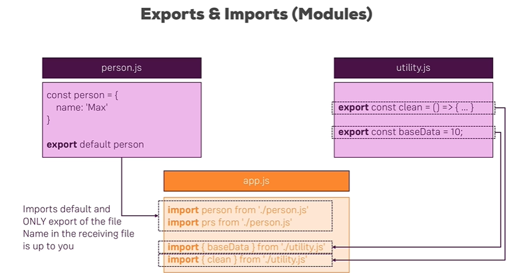
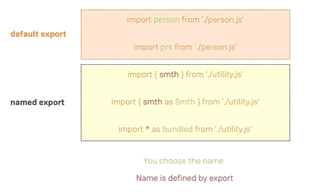
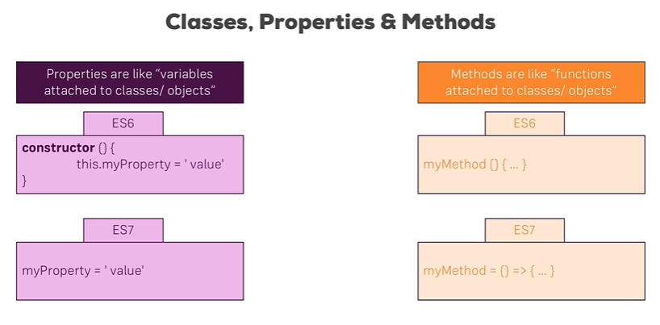

# Next Generation Javascript Features

## let and const

多用let和const.

The const declaration creates a read-only reference to a value. **It does not mean the value it holds is immutable**—just that the variable identifier cannot be reassigned. For instance, in the case where the content is an object, this means the object's contents (e.g., its properties) can be altered.

## Exports & Imports (Modules)





## Classes
```javascript
class Human {
    constructor() {
        this.gender = 'male';
    }
}

class Person extends Human {
    constructor() {
        super();
        this.name = 'Max';
    }

    printMyName() {
        console.log(this.name);
    }
}

const person = new Person();

person.printMyName();
```



```javascript
class Human {
    gender = "nale";
    printGender = () => {
        console.log(this.gender);
    }
}

class Person extends Human {
    name = "Max";
    gender = "female";

    printMyName = () => {
        console.log(this.name);
    }
}
```

## How to deep copy an instance of a class
```javascript
const person = {
    name: "max"
};

const secondPerson = {
    ...person
};

```


