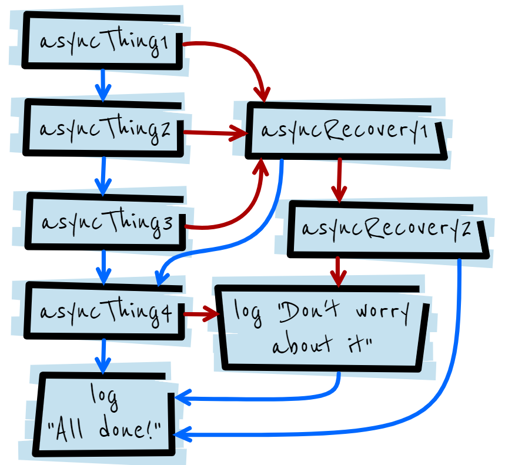

# Promises

The **Promise object** represents the eventual completion (or failure) of an asynchronous operation, and its resulting value.


## Reference
https://developer.mozilla.org/en-US/docs/Web/JavaScript/Guide/Using_promises

https://developer.mozilla.org/en-US/docs/Web/JavaScript/Reference/Global_Objects/Promise

https://developers.google.com/web/fundamentals/primers/promises

## Description
A Promise is a proxy for **a value not necessarily known when the promise is created**. It allows you to associate handlers with an asynchronous action's eventual success value or failure reason.

This lets asynchronous methods return values like synchronous methods: instead of immediately returning the final value, the asynchronous method returns a promise to supply the value at some point in the future.

Essentially, a promise is a returned object to which you attach callbacks, instead of passing callbacks into a function.

Imagine a function, createAudioFileAsync(), which asynchronously generates a sound file given a configuration record and two callback functions, one called if the audio file is successfully created, and the other called if an error occurs.

Here's some code that uses createAudioFileAsync():

```javascript
function successCallback(result) {
  console.log("Audio file ready at URL: " + result);
}

function failureCallback(error) {
  console.log("Error generating audio file: " + error);
}

createAudioFileAsync(audioSettings, successCallback, failureCallback);
```

Modern functions that return a promise, you can attach your callbacks to instead:

If createAudioFileAsync() were rewritten to return a promise, using it could be as simple as this:

```javascript
createAudioFileAsync(audioSettings).then(successCallback, failureCallback);
```

```javascript
const promise = createAudioFileAsync(audioSettings); 
promise.then(successCallback, failureCallback);
```

## A promise comes with some guarantees
- Callbacks will never be called before the completion of the current run of the JavaScript event loop.
- Callbacks added with then() even after the success or failure of the asynchronous operation, will be called, as above.
- Multiple callbacks may be added by calling then() several times. Each callback is executed one after another, in the order in which they were inserted.

One of the great things about using promises is **chaining**.


## Chaining
A common need is to execute two or more asynchronous operations back to back, where each subsequent operation starts when the previous operation succeeds, with the result from the previous step. We accomplish this by creating a promise chain.

**Here's the magic: the then() function returns a new promise, different from the original:**

.then()函数和.catch()函数都是返回一个promise对象。
```javascript
const promise1 = doSomething();
const promise2 = promise1.then(successCallback, failureCallback);
```
This second promise (promise2) represents **the completion not just of doSomething(), but also of the successCallback or failureCallback you passed in**, which can be other asynchronous functions returning a promise.


在过去的时光中，人们总是做这些很难受的事情：
用嵌套的方法实现多个异步操作的串联。
```javascript
request('http://www.somepage.com', function (firstError, firstResponse, firstBody) {
    if(firstError){
        // Handle error.
    }
    else {
        request(`http://www.somepage.com/${firstBody.someValue}`, function (secondError, secondResponse, secondBody) {
            if(secondError){
                // Handle error.
            }
            else {
                // Use secondBody for something
            }
        });
    }
});
```

With modern functions, we attach our callbacks to the returned promises instead, forming a promise chain:
```javascript
doSomething()
.then(function(result) {
  return doSomethingElse(result);
})
.then(function(newResult) {
  return doThirdThing(newResult);
})
.then(function(finalResult) {
  console.log('Got the final result: ' + finalResult);
})
.catch(failureCallback);
```
The arguments to then are optional, and catch(failureCallback) is short for then(null, failureCallback). You might see this expressed with arrow functions instead:

```javascript
doSomething()
.then(result => doSomethingElse(result))
.then(newResult => doThirdThing(newResult))
.then(finalResult => {
  console.log(`Got the final result: ${finalResult}`);
})
.catch(failureCallback);
```
**Important: Always return results,** otherwise callbacks won't catch the result of a previous promise (with arrow functions () => x is short for () => { return x; }).

### Chaining after a catch
**It's possible to chain after a failure, i.e. a catch**, which is useful to accomplish new actions even after an action failed in the chain. Read the following example:
```javascript
new Promise((resolve, reject) => {
    console.log('Initial')
    resolve();
})
.then(() => {
    throw new Error('Something failed');
        
    console.log('Do this');
})
.catch(() => {
    console.error('Do that');
})
.then(() => {
    console.log('Do this, no matter what happened before');
});
```
#### Basic syntax
```javascript
new Promise( (resolve, reject) => { 
        /* dosomething */ resolve();})
.then(() => {
    /* do something else*/
});
```

This will output the following text:
```
Initial
Do that
Do this, no matter what happened before
```

## Error propagation

```javascript
doSomething()
.then(result => doSomethingElse(result))
.then(newResult => doThirdThing(newResult))
.then(finalResult => console.log(`Got the final result: ${finalResult}`))
.catch(failureCallback);
```

```javascript
try {
  const result = syncDoSomething();
  const newResult = syncDoSomethingElse(result);
  const finalResult = syncDoThirdThing(newResult);
  console.log(`Got the final result: ${finalResult}`);
} catch(error) {
  failureCallback(error);
}
```

这个看第21章-Async/await.
```javascript
async function foo() {
  try {
    const result = await doSomething();
    const newResult = await doSomethingElse(result);
    const finalResult = await doThirdThing(newResult);
    console.log(`Got the final result: ${finalResult}`);
  } catch(error) {
    failureCallback(error);
  }
}
```


```javascript
asyncThing1().then(function() {
  return asyncThing2();
}).then(function() {
  return asyncThing3();
}).catch(function(err) {
  return asyncRecovery1();
}).then(function() {
  return asyncThing4();
}, function(err) {
  return asyncRecovery2();
}).catch(function(err) {
  console.log("Don't worry about it");
}).then(function() {
  console.log("All done!");
})
```



## Timing
To avoid surprises, functions passed to then() will never be called synchronously, even with an already-resolved promise:

resolve()后面的.then()不会被同步执行。

```javascript
Promise.resolve().then(() => console.log(2));
console.log(1); // 1, 2
```
Instead of running immediately, the passed-in function is put on a microtask queue, which means it runs later when the queue is emptied at the end of the current run of the JavaScript event loop, i.e. pretty soon:
```javascript
const wait = ms => new Promise(resolve => setTimeout(resolve, ms));

wait().then(() => console.log(4));
Promise.resolve().then(() => console.log(2)).then(() => console.log(3));
console.log(1); // 1, 2, 3, 4
```

