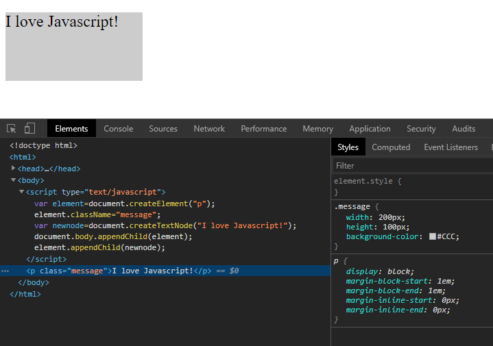
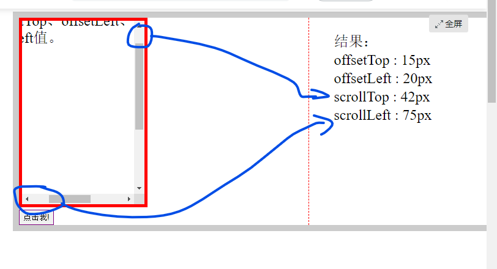

# DOM (Document Object Model)

HTML文档可以说由节点构成的集合，DOM节点有:

1. 元素节点：\<html>、\<body>、\<p>等都是元素节点，即标签。
2. 文本节点:向用户展示的内容，如\<li>...\</li>中的JavaScript、DOM、CSS等文本。
3. 属性节点:元素属性，如<a>标签的链接属性href="http://www.imooc.com"。

节点属性：
- nodeName: 
- nodeType: 返回整数，代表给定节点的类型
- nodeValue: 

遍历节点树：
- childNodes: 返回一个数组
- firstChild:
- lastChild:
- parentNode:
- nextSibling
- previousSibling

DOM操作：
- document.createElement(element): 创建一个新的元素节点
- document.createTextNode(): 创建一个包含着给定文本的新文本节点
- appendChild():
- insertBefore()
- removeChild()
- replaceChild()

- getElementById()
- getElementsByName()
- getElementsByTagName()

## getAttribute(name) and setAttribute(name,value)
```html
<!DOCTYPE HTML>
<html>
<head>
<meta http-equiv="Content-Type" content="text/html; charset=utf-8">
<title>getAttribute()</title>
</head>
<body>   
<p id="intro">课程列表</p>  
    <ul>  
        <li title="第1个li">HTML</li>  
        <li>CSS</li>  
        <li title="第3个li">JavaScript</li>  
        <li title="第4个li">Jquery</li>  
        <li>Html5</li>  
    </ul>  
<p>以下为获取的不为空的li标签title值:</p>
<script type="text/javascript">
    var con = document.getElementsByTagName("li");
    for (var i=0; i< con.length;i++){
      var text = con[i].getAttribute("title");
      if(text!=null) {
        document.write(text+"<br>");
      }
    } 
 </script> 
</body>
</html>
```

## 节点属性
一、nodeName 属性: 节点的名称，是只读的。

1. 元素节点的 nodeName 与标签名相同
2. 属性节点的 nodeName 是属性的名称
3. 文本节点的 nodeName 永远是 #text
4. 文档节点的 nodeName 永远是 #document

二、nodeValue 属性：节点的值

1. 元素节点的 nodeValue 是 undefined 或 null
2. 文本节点的 nodeValue 是文本自身
3. 属性节点的 nodeValue 是属性的值

三、nodeType 属性: 节点的类型，是只读的。以下常用的几种结点类型:

元素类型    节点类型

  元素          1

  属性          2

  文本          3

  注释          8

  文档          9

```html
<!DOCTYPE HTML>
<html>
<head>
<meta http-equiv="Content-Type" content="text/html; charset=utf-8">
<title>节点属性</title>
</head>
<body>
  <ul>
     <li>javascript</li>
     <li>HTML/CSS</li>
     <li>jQuery</li>     
  </ul>
  <script type="text/javascript">
        var lis = document.getElementsByTagName("li");
        for ( var i = 0; i < lis.length; i++ ) {
            document.write(lis[i].nodeName + "<br>");
            document.write(lis[i].nodeValue + "<br>");
            document.write(lis[i].nodeType + "<br>");
        }
  </script>
</body>
</html>
```

Result:
```
LI
null
1
LI
null
1
LI
null
1
```

```html
<!DOCTYPE HTML>
<html>
<head>
<meta http-equiv="Content-Type" content="text/html; charset=utf-8">
<title>无标题文档</title>
</head>
<body>
<div>
  javascript  
  <p>javascript</p>
  <div>jQuery</div>
  <h5>PHP</h5>
</div>
<script type="text/javascript">
var x = document.getElementsByTagName("div")[0].childNodes;
for ( var i = 0;i < x.length; i++ ) {
    document.write("第" + (i+1) + "个节点的名称是：" + x[i].nodeName + "<br  />"); 
    document.write("第" + (i+1) + "个节点的值是：" + x[i].nodeValue + "<br  />"); 
    document.write("第" + (i+1) + "个节点的属性是：" + x[i].nodeType + "<br  />");
    document.write("<br  />");
} 
</script>
</body>
</html>
```

Result:
```
第1个节点的名称是：#text
第1个节点的值是： javascript
第1个节点的属性是：3

第2个节点的名称是：P
第2个节点的值是：null
第2个节点的属性是：1

第3个节点的名称是：#text
第3个节点的值是：
第3个节点的属性是：3

第4个节点的名称是：DIV
第4个节点的值是：null
第4个节点的属性是：1

第5个节点的名称是：#text
第5个节点的值是：
第5个节点的属性是：3

第6个节点的名称是：H5
第6个节点的值是：null
第6个节点的属性是：1

第7个节点的名称是：#text
第7个节点的值是：
第7个节点的属性是：3
```

节点之间的空白符，在firefox、chrome、opera、safari浏览器是文本节点，所以IE是3，其它浏览器是7，如下图所示:
```html
<ul>空白节点
    <li>hello1</li> 空白节点
    <li>hello2</li> 空白节点
</ul>

<ul><li>hello1</li> 空白节点
    <li>hello2</li></ul>
```

如果无此节点，则该属性返回 null.

**解决方法: 判断是不是nodeType==3**

## appendChild(newNode)
```html
<!DOCTYPE HTML>
<html>
<head>
<meta http-equiv="Content-Type" content="text/html; charset=utf-8">
<title>无标题文档</title>
</head>
<body>

<ul id="test">
  <li>JavaScript</li>
  <li>HTML</li>
</ul> 
 
<script type="text/javascript">

var otest = document.getElementById("test");  
var newcode = document.createElement("li");
newcode.innerHTML = "PHP";
otest.appendChild(newcode);
 
</script> 

</body>
</html>
```

Result:
```
JavaScript
HTML
PHP
```

## insertBefore(newnode, node)
```html
<!DOCTYPE HTML>
<html>
<head>
<meta http-equiv="Content-Type" content="text/html; charset=utf-8">
<title>无标题文档</title>
</head>
<body>

<ul id="test"><li>JavaScript</li><li>HTML</li></ul> 
 
<script type="text/javascript">

var otest = document.getElementById("test");  
var newnode=document.createElement("li");
newnode.innerHTML="php";
otest.insertBefore(newnode,otest.lastChild);
  
</script> 

</body>
</html>
```


Result:
```
JavaScript
php
HTML
```

## removeChild(node)

```html
<!DOCTYPE HTML>
<html>
<head>
<meta http-equiv="Content-Type" content="text/html; charset=utf-8">
<title>无标题文档</title>
</head>

<body>
<div id="content">
  <h1>html</h1>
  <h1>php</h1>
  <h1>javascript</h1>
  <h1>jquery</h1>
  <h1>java</h1>
</div>

<script type="text/javascript">
function clearText() {
    var content = document.getElementById("content");
    // 在此完成该函数
    for ( var i = 0; i < content.childNodes.length; i++ ) {
        if( content.childNodes[i].nodeType != 1 ) {   
            continue;  
        }
        else {
            var temp = content.childNodes[i];
            content.removeChild(temp);
            temp = null;    // 在内存中清除掉这个节点
        }
    }
}
</script>

<button onclick="clearText()">清除节点内容</button>

</body>
</html>
```

## createElement("tagName") and createTextNode("string")

```html
<!DOCTYPE HTML>
<html>
<head>
<meta http-equiv="Content-Type" content="text/html; charset=utf-8">
<title>无标题文档</title>
<style type="text/css">

.message{    
	width:200px;
	height:100px;
	background-color:#CCC;}
	
</style>
</head>
<body>
<script type="text/javascript">
var element=document.createElement("p");
element.className="message";
var newnode=document.createTextNode("I love Javascript!");
document.body.appendChild(element);
element.appendChild(newnode);
</script> 

</body>
</html>
```



## 浏览器窗口可视区域大小

获得浏览器窗口的尺寸（浏览器的视口，不包括工具栏和滚动条）的方法:

一、对于IE9+、Chrome、Firefox、Opera 以及 Safari：

•  window.innerHeight - 浏览器窗口的内部高度

•  window.innerWidth - 浏览器窗口的内部宽度

二、对于 Internet Explorer 8、7、6、5：

•  document.documentElement.clientHeight表示HTML文档所在窗口的当前高度。

•  document.documentElement.clientWidth表示HTML文档所在窗口的当前宽度。

或者

Document对象的body属性对应HTML文档的<body>标签

•  document.body.clientHeight

•  document.body.clientWidth

在不同浏览器都实用的 JavaScript 方案：
```javascript
var w= document.documentElement.clientWidth
      || document.body.clientWidth;
var h= document.documentElement.clientHeight
      || document.body.clientHeight;
```

## 网页内容的高度和宽度
大于等于clientHeight和clientWidth

网页尺寸scrollHeight
scrollHeight和scrollWidth，获取网页内容高度和宽度。

一、针对IE、Opera:

scrollHeight 是网页内容实际高度，可以小于 clientHeight。

二、针对NS、FF:

scrollHeight 是网页内容高度，不过最小值是 clientHeight。也就是说网页内容实际高度小于 clientHeight 时，scrollHeight 返回 clientHeight 。

三、浏览器兼容性
```javascript
var w=document.documentElement.scrollWidth
   || document.body.scrollWidth;
var h=document.documentElement.scrollHeight
   || document.body.scrollHeight;
```

## offsetHeight和offsetWidth，获取网页内容高度和宽度(包括滚动条等边线，会随窗口的显示大小改变)。

一、值

offsetHeight = clientHeight + 滚动条 + 边框。

二、浏览器兼容性
```javascript
var w= document.documentElement.offsetWidth
    || document.body.offsetWidth;
var h= document.documentElement.offsetHeight
    || document.body.offsetHeight;
```

## 网页卷去的距离与偏移量

scrollLeft:设置或获取位于给定对象左边界与窗口中目前可见内容的最左端之间的距离 ，即左边灰色的内容。

scrollTop:设置或获取位于对象最顶端与窗口中可见内容的最顶端之间的距离 ，即上边灰色的内容。

offsetLeft:获取指定对象相对于版面或由 offsetParent 属性指定的父坐标的计算左侧位置 。

offsetTop:获取指定对象相对于版面或由 offsetParent 属性指定的父坐标的计算顶端位置 。

注意:

1. 区分大小写

2. offsetParent：布局中设置postion属性(Relative、Absolute、fixed)的父容器，从最近的父节点开始，一层层向上找，直到HTML的body。


```html
<!DOCTYPE HTML>
<head>
<meta http-equiv="Content-Type" content="text/html; charset=utf-8">
<script type="text/javascript">
    function req(){
          var div = document.getElementById("div1");
          document.getElementById("li1").innerHTML = (div.offsetTop)+"px";//div1距离屏幕顶部的距离
          document.getElementById("li2").innerHTML = (div.offsetLeft)+"px";//div1距离屏幕左部的距离
          document.getElementById("li3").innerHTML = (div.scrollTop)+"px";//div1纵向滚动条滚动的距离
          document.getElementById("li4").innerHTML = (div.scrollLeft)+"px";//div1横向滚动条滚动的距离
     }
</script>
</head>
<body style="border:10px solid #ccc;padding:0px 0px;margin:5px 10px">
    <div style="width:60%;border-right:1px dashed red;float:left;">
        <div style="float:left;">
            <div id="div1" style="border:5px red solid;height:300px;width:200px;overflow:auto">
                <div style="height:500px;width:400px">请调整横竖滚动条后，点击按钮后查看offsetTop、offsetLeft、scrollTop、scrollLeft值。</div>
            </div>
            <input type="button" value="点击我!" onclick="req()" style="border: 1px solid purple;height: 25px;"/>
        </div>
        
    </div>
    <div style="width:30%;float:left;">
        <ul style="list-style-type: none; line-height:30px;">结果：
            <li>offsetTop : <span id="li1"></span></li>
            <li>offsetLeft : <span id="li2"></span></li>
            <li> scrollTop : <span id="li3"></span></li>
            <li>scrollLeft : <span id="li4"></span></li>
        </ul>
        
    </div>
    <div style="clear:both;"></div>    
</body>
</html>
```


