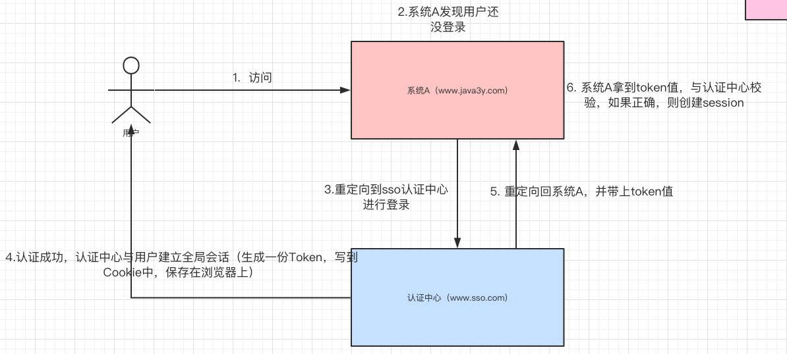

# SSO Single Sign On
例如，我登录了支付宝，我就相当于自动登录了淘宝和天猫。

单点登录就是在多个系统中，用户只需一次登录，各个系统即可感知该用户已经登录。

参考：https://juejin.im/post/6844903845424971783

## 为什么需要单点登录
单系统过于庞大，把但系统拆分成多个子系统。
- 登录更能
- 订单功能
- 物流功能
- 推送功能
- 购物车功能
- 客服功能

## 单系统登录流程
- 登录：用户信息保存在Session对象中
    - 如果在Session对象中能查到，说明已经登录
    - 如果查不到，说明没登录
- 注销（退出登录）：从Session中删除用户的信息
- 记住我：关掉浏览器后，重新打开还能保持登录状态：配合cookie使用

## 多系统登录产生的额外工作

### Session不共享问题
单系统登录功能主要是用Session保存用户信息来实现的，但我们清楚的是：多系统即可能有多个Tomcat，而Session是依赖当前系统的Tomcat，所以系统A的Session和系统B的Session是不共享的。

#### 推荐方案
把Session数据放在Redis中（使用Redis模拟Session）

#### 其他方案
- Tomcat集群Session全局复制（集群内每个tomcat的session完全同步）【会影响集群的性能呢，不建议】
- 根据请求的IP进行Hash映射到对应的机器上（这就相当于请求的IP一直会访问同一个服务器）【如果服务器宕机了，会丢失了一大部分Session的数据，不建议】

### Cookie跨域问题
- 服务端将Cookie写到客户端后，客户端对Cookie进行解析，将Token解析出来，此后请求都把这个Token带上就行了
- 多个域名共享Cookie，在写到客户端的时候设置Cookie的domain。
- 将Token保存在SessionStroage中（不依赖Cookie就没有跨域的问题了）

## CAS （Central Authentication Service）

