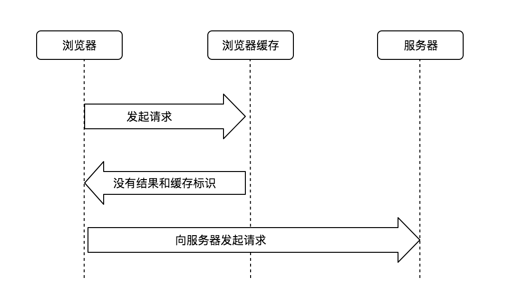
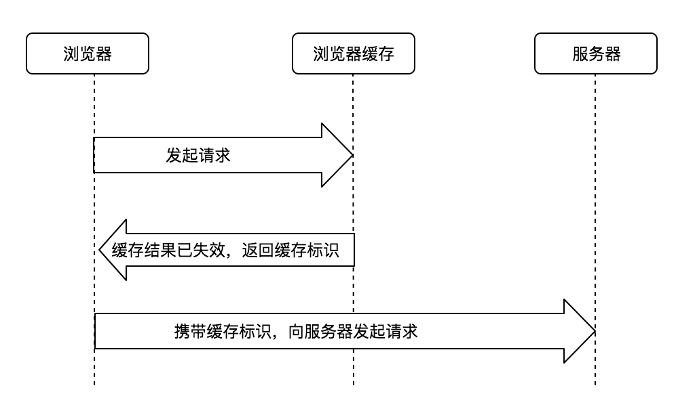
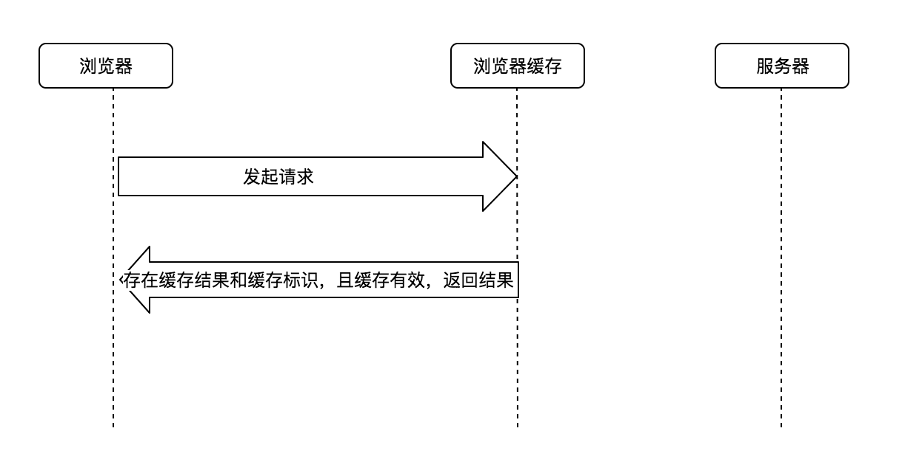
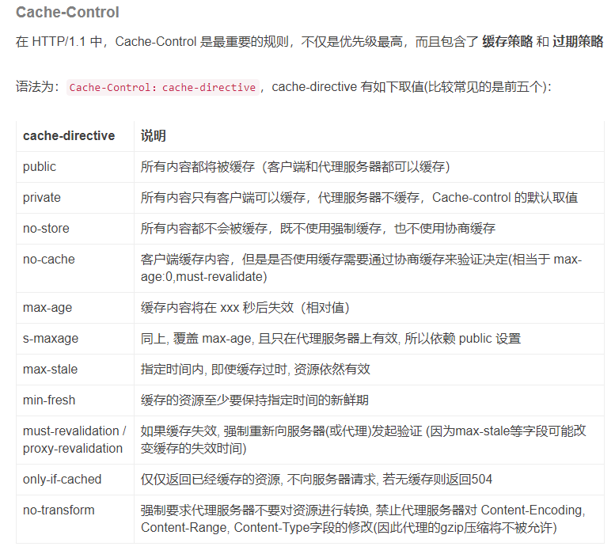
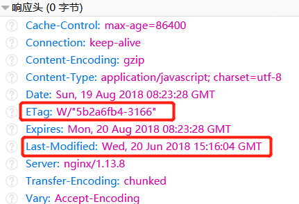
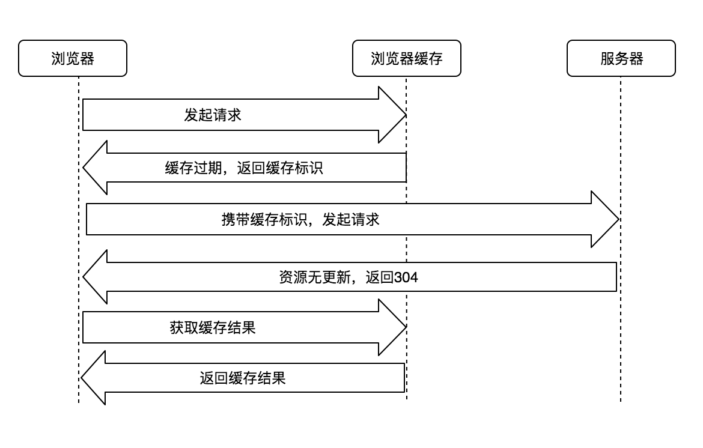
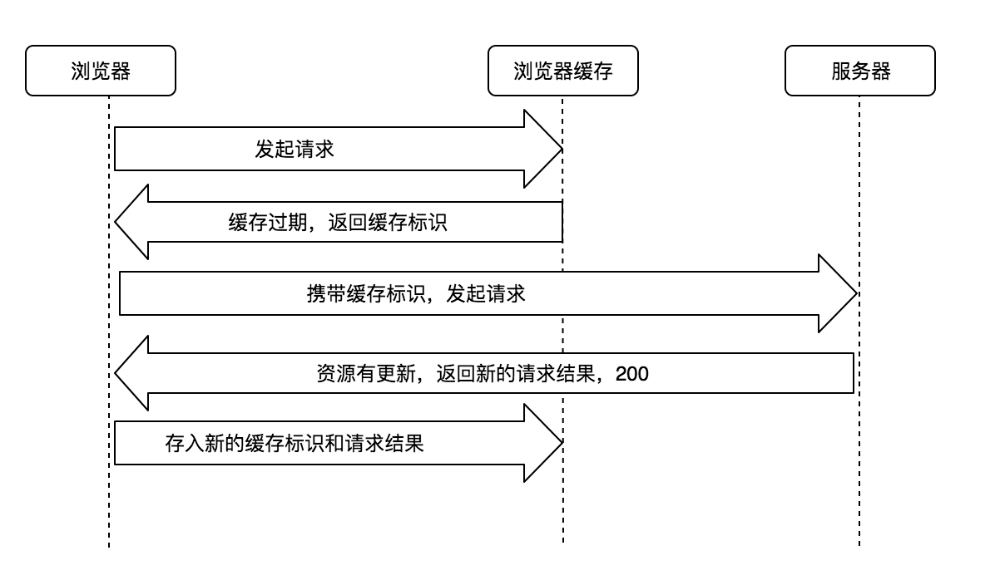
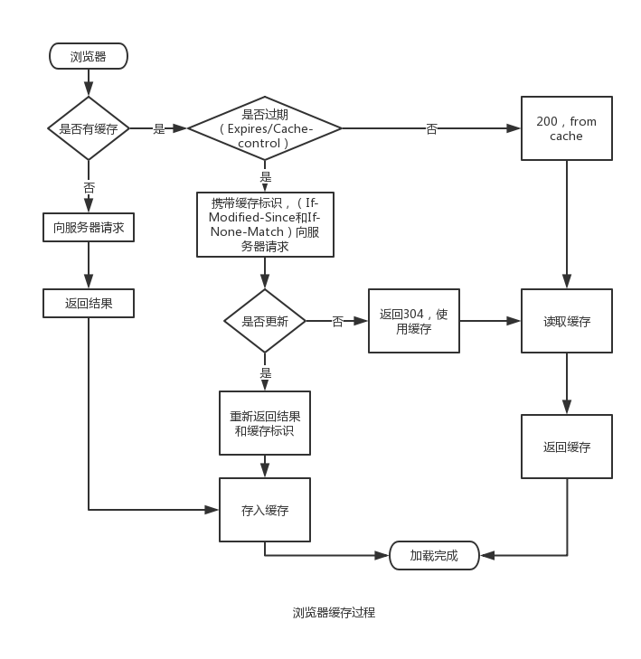

# 浏览器缓存机制

https://developer.mozilla.org/en-US/docs/Web/HTTP/Caching

https://blog.hhking.cn/2018/08/10/browser-cache/

## 缓存的作用
- 减少网络带宽消耗
- 缓解服务器压力
- 减少网络延迟，加快网页打开速度

相关http响应头：
```
Cache-control: no-store
Cache-control: no-cache
Cache-Control: private
Cache-Control: public
Cache-Control: max-age=31536000
Cache-Control: must-revalidate
```

## 缓存的大致过程如下：

- 浏览器向服务器发起请求时，会先在浏览器缓存中查找该请求的结果和缓存标识，判断是否需要向服务器发起请求；
- 拿到请求结果，会根据响应报文中 HTTP 头的缓存标识，决定是否缓存请求结果；
- 浏览器每次拿到返回的请求结果都会将该结果和缓存标识存入浏览器缓存中；

**根据是否需要向服务器重新发起 HTTP 请求将缓存过程分成：强制缓存和协商缓存。**

### 强制缓存过程
强制缓存阶段：在浏览器缓存中查找请求结果和缓存标识，并根据该结果的缓存规则来决定是否使用该缓存结果的过程。

#### 情况1
没有查找到请求结果和缓存标识，则强制缓存失效，这时浏览器向服务器发起 HTTP 请求(第一次发起请求就属于这种情况)



#### 情况2
存在缓存标识，但是缓存已失效，则强制缓存不命中，这时使用协商缓存。



#### 情况3
存在缓存结果和缓存标识，缓存结果有效，则命中强制缓存，直接返回缓存结果。



### 缓存有效期
在强制缓存过程中，怎么判断缓存是否有效（也就是上面的情况 2 和 3）？
控制强制缓存的是响应报文中 HTTP 头的 Pragma、 Expires 和 Cache-Control 字段，其中 Cache-control 优先级最高。



#### Pragma
Pragma 是 http/1.0 字段, 通常设置为 Pragma:no-cache, 作用同 Cache-Control:no-cache. 为了向下兼容有些网站会加上这个配置；

#### Expires
Expires 是 HTTP/1.0 (现在浏览器默认使用的是 HTTP/1.1)控制网页缓存的字段，指定缓存到期的 GMT(格林尼治时间) 的**绝对时间**。

但是：响应报文中 Expires 所定义的缓存时间是相对服务器上的时间而言的，如果客户端的时间和服务端的时间不一致（比如用户自己修改了客户端时间），缓存时间就没有意义了。
为了解决这个问题，于是 HTTP/1.1 新增了 Cache-control 来定义缓存过期时间。

#### 启发式缓存
如果 Expires, Cache-Control: max-age, 或 Cache-Control:s-maxage 都没有在响应头中出现, 并且也没有其它缓存的设置, 那么浏览器默认会采用一个启发式的算法:
通常会取响应头的两个时间字段相减 Date - Last-Modified 值的 10% 作为缓存时间。

#### from memory cache/from disk cache
在 chrome 开发者工具 Network 中，我们经常会看到 200 from memory cache 或者 from disk cache ，这两个表示强制缓存成功。

- from memory cache (从内存中获取/一般缓存更新频率较高的js、图片、字体等资源)

- from disk cache (从磁盘中获取/一般缓存更新频率较低的js、css等资源)

### 协商缓存
当强制缓存未命中(缓存过期)，浏览器携带缓存标识继续向服务器发起请求，服务器根据缓存标识决定是否使用缓存，这就是 协商缓存。

协商缓存的执行流程是这样的：当浏览器第一次向服务器发送请求时，会在响应头中返回协商缓存的头属性：ETag和Last-Modified,其中ETag返回的是一个hash值，Last-Modified返回的是GMT格式的最后修改时间。然后浏览器在第二次发送请求的时候，会在请求头中带上与ETag对应的If-Not-Match，其值就是响应头中返回的ETag的值，Last-Modified对应的If-Modified-Since。服务器在接收到这两个参数后会做比较，如果返回的是304状态码，则说明请求的资源没有修改，浏览器可以直接在缓存中取数据，否则，服务器会直接返回数据。



1. 命中协商缓存，304



2. 未命中协商缓存，200



## Summary

