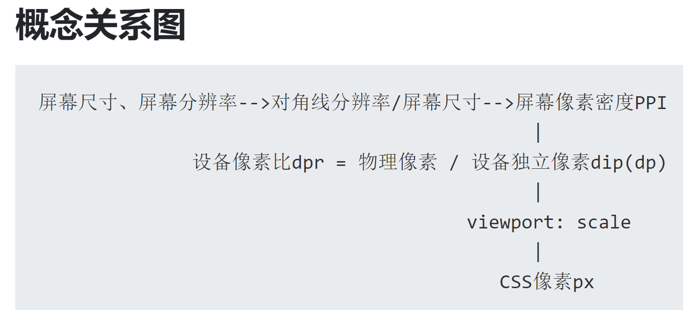
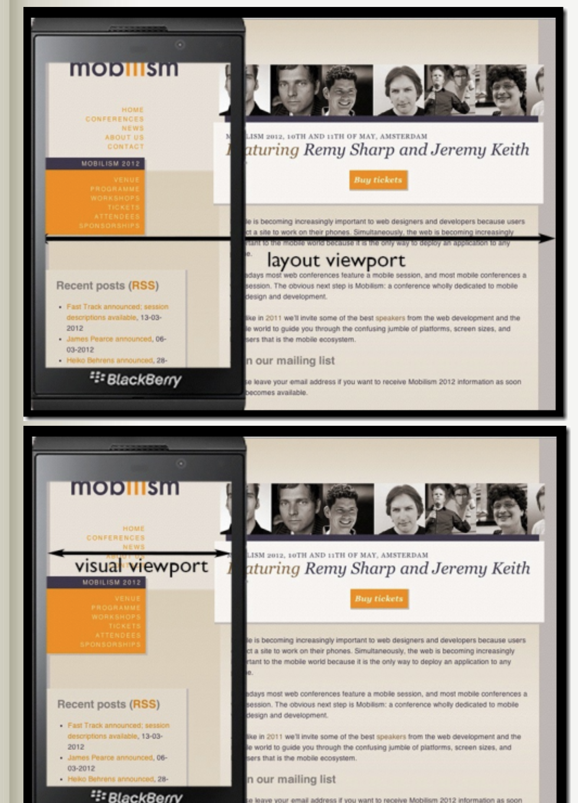

# 移动端适配

https://www.cnblogs.com/2050/p/3877280.html
https://www.cnblogs.com/yelongsan/p/7975580.html
https://segmentfault.com/a/1190000008767416

## CSS的1px并不等于硬件的1px

在移动端浏览器中以及某些桌面浏览器中，window对象有一个devicePixelRatio属性，它的官方的定义为：设备物理像素和设备独立像素的比例，也就是 devicePixelRatio = 物理像素 / 独立像素。css中的px就可以看做是设备的独立像素，所以通过devicePixelRatio，我们可以知道该设备上一个css像素代表多少个物理像素。例如，**在Retina屏的iphone上，devicePixelRatio的值为2，也就是说1个CSS像素相当于2个物理像素（在不缩放的情况下）。**

CSS像素成为设备无关像素（独立像素device-independent pixel)简称DIP(dp).



MDN: 建议以阅读者在一臂距离处观察到的像素密度为96 dpi的设备上的一个像素作为参考像素。

## Viewport
Apple 在 Safari iOS 中引入了“viewport meta 标签”，让Web开发人员控制视口的大小和比例。很多其他移动浏览器现在也支持此标签，但它不属于 Web 标准。



ideal viewport并没有一个固定的尺寸，不同的设备拥有有不同的ideal viewport。所有的iphone的ideal viewport宽度都是320px，无论它的屏幕宽度是320还是640，也就是说，在iphone中，css中的320px就代表iphone屏幕的宽度。

## meta标签
```html
<meta
      name="viewport"
      content="width=device-width, initial-scale=1.0, user-scalable=no"
    />
```

- width是用来控制viewport宽度的，如果大于device-width，就会出现横向滚动条。
- user-scalable=no用户不能缩放
- initial-scale 设置页面的初始缩放值，为一个数字，可以带小数
- minimum-scale 允许用户的最小缩放值，为一个数字，可以带小数
- maximum-scale 允许用户的最大缩放值，为一个数字，可以带小数
      
## CSS 3 媒体查询 media queries


## 淘宝触屏版以flex弹性盒子布局,实现移动端适配
配合calc和vw

flex-wrap: wrap
